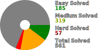

# Daily Leetcode in C++

My daily challenge on leetcode since 2021/09/06.

## Questions List

  
### 1 ~ 250

|</>|#|Solution Title|Difficulty|
|--:|--:|:--|:--|
|[📎](src/q_1_50/q0001.hpp) [📝](src/q_1_50/q0001_unittest.hpp)|1|[Two Sum](https://leetcode.com/problems/two-sum/)|Easy|
|[📎](src/q_1_50/q0002.hpp) [📝](src/q_1_50/q0002_unittest.hpp)|2|[Add Two Numbers](https://leetcode.com/problems/add-two-numbers/)|Medium|
|[📎](src/q_1_50/q0003.hpp) [📝](src/q_1_50/q0003_unittest.hpp)|3|[Longest Substring Without Repeating Characters](https://leetcode.com/problems/longest-substring-without-repeating-characters/)|Medium|
|[📎](src/q_1_50/q0004.hpp) [📝](src/q_1_50/q0004_unittest.hpp)|4|[Median of Two Sorted Arrays](https://leetcode.com/problems/median-of-two-sorted-arrays/)|Hard|
|[📎](src/q_1_50/q0005.hpp) [📝](src/q_1_50/q0005_unittest.hpp)|5|[Longest Palindromic Substring](https://leetcode.com/problems/longest-palindromic-substring/)|Medium|
|[📎](src/q_1_50/q0006.hpp) [📝](src/q_1_50/q0006_unittest.hpp)|6|[Zigzag Conversion](https://leetcode.com/problems/zigzag-conversion/)|Medium|
|[📎](src/q_1_50/q0007.hpp) [📝](src/q_1_50/q0007_unittest.hpp)|7|[Reverse Integer](https://leetcode.com/problems/reverse-integer/)|Medium|
|[📎](src/q_1_50/q0008.hpp) [📝](src/q_1_50/q0008_unittest.hpp)|8|[String to Integer (atoi)](https://leetcode.com/problems/string-to-integer-atoi/)|Medium|
|[📎](src/q_1_50/q0009.hpp) [📝](src/q_1_50/q0009_unittest.hpp)|9|[Palindrome Number](https://leetcode.com/problems/palindrome-number/)|Easy|
|[📎](src/q_1_50/q0010.hpp) [📝](src/q_1_50/q0010_unittest.hpp)|10|[Regular Expression Matching](https://leetcode.com/problems/regular-expression-matching/)|Hard|
|[📎](src/q_1_50/q0011.hpp) [📝](src/q_1_50/q0011_unittest.hpp)|11|[Container With Most Water](https://leetcode.com/problems/container-with-most-water/)|Medium|
|[📎](src/q_1_50/q0012.hpp) [📝](src/q_1_50/q0012_unittest.hpp)|12|[Integer to Roman](https://leetcode.com/problems/integer-to-roman/)|Medium|
|[📎](src/q_1_50/q0013.hpp) [📝](src/q_1_50/q0013_unittest.hpp)|13|[Roman to Integer](https://leetcode.com/problems/roman-to-integer/)|Easy|
|[📎](src/q_1_50/q0014.hpp) [📝](src/q_1_50/q0014_unittest.hpp)|14|[Longest Common Prefix](https://leetcode.com/problems/longest-common-prefix/)|Easy|
|[📎](src/q_1_50/q0015.hpp) [📝](src/q_1_50/q0015_unittest.hpp)|15|[3Sum](https://leetcode.com/problems/3sum/)|Medium|
|[📎](src/q_1_50/q0016.hpp) [📝](src/q_1_50/q0016_unittest.hpp)|16|[3Sum Closest](https://leetcode.com/problems/3sum-closest/)|Medium|
|[📎](src/q_1_50/q0017.hpp) [📝](src/q_1_50/q0017_unittest.hpp)|17|[Letter Combinations of a Phone Number](https://leetcode.com/problems/letter-combinations-of-a-phone-number/)|Medium|
|[📎](src/q_1_50/q0018.hpp) [📝](src/q_1_50/q0018_unittest.hpp)|18|[4Sum](https://leetcode.com/problems/4sum/)|Medium|
|[📎](src/q_1_50/q0019.hpp) [📝](src/q_1_50/q0019_unittest.hpp)|19|[Remove Nth Node From End of List](https://leetcode.com/problems/remove-nth-node-from-end-of-list/)|Medium|
|[📎](src/q_1_50/q0020.hpp) [📝](src/q_1_50/q0020_unittest.hpp)|20|[Valid Parentheses](https://leetcode.com/problems/valid-parentheses/)|Easy|
|[📎](src/q_1_50/q0021.hpp) [📝](src/q_1_50/q0021_unittest.hpp)|21|[Merge Two Sorted Lists](https://leetcode.com/problems/merge-two-sorted-lists/)|Easy|
|[📎](src/q_1_50/q0022.hpp) [📝](src/q_1_50/q0022_unittest.hpp)|22|[Generate Parentheses](https://leetcode.com/problems/generate-parentheses/)|Medium|
|[📎](src/q_1_50/q0023.hpp) [📝](src/q_1_50/q0023_unittest.hpp)|23|[Merge k Sorted Lists](https://leetcode.com/problems/merge-k-sorted-lists/)|Hard|
|[📎](src/q_1_50/q0024.hpp) [📝](src/q_1_50/q0024_unittest.hpp)|24|[Swap Nodes in Pairs](https://leetcode.com/problems/swap-nodes-in-pairs/)|Medium|
|[📎](src/q_1_50/q0025.hpp) [📝](src/q_1_50/q0025_unittest.hpp)|25|[Reverse Nodes in k-Group](https://leetcode.com/problems/reverse-nodes-in-k-group/)|Hard|
|[📎](src/q_1_50/q0026.hpp) [📝](src/q_1_50/q0026_unittest.hpp)|26|[Remove Duplicates from Sorted Array](https://leetcode.com/problems/remove-duplicates-from-sorted-array/)|Easy|
|[📎](src/q_1_50/q0027.hpp) [📝](src/q_1_50/q0027_unittest.hpp)|27|[Remove Element](https://leetcode.com/problems/remove-element/)|Easy|
|[📎](src/q_1_50/q0028.hpp) [📝](src/q_1_50/q0028_unittest.hpp)|28|[Implement strStr()](https://leetcode.com/problems/implement-strstr/)|Easy|
|[📎](src/q_1_50/q0029.hpp) [📝](src/q_1_50/q0029_unittest.hpp)|29|[Divide Two Integers](https://leetcode.com/problems/divide-two-integers/)|Medium|
||30|[Substring with Concatenation of All Words](https://leetcode.com/problems/substring-with-concatenation-of-all-words/)|Hard|
|[📎](src/q_1_50/q0031.hpp) [📝](src/q_1_50/q0031_unittest.hpp)|31|[Next Permutation](https://leetcode.com/problems/next-permutation/)|Medium|
||32|[Longest Valid Parentheses](https://leetcode.com/problems/longest-valid-parentheses/)|Hard|
|[📎](src/q_1_50/q0033.hpp) [📝](src/q_1_50/q0033_unittest.hpp)|33|[Search in Rotated Sorted Array](https://leetcode.com/problems/search-in-rotated-sorted-array/)|Medium|
|[📎](src/q_1_50/q0034.hpp) [📝](src/q_1_50/q0034_unittest.hpp)|34|[Find First and Last Position of Element in Sorted Array](https://leetcode.com/problems/find-first-and-last-position-of-element-in-sorted-array/)|Medium|
|[📎](src/q_1_50/q0035.hpp) [📝](src/q_1_50/q0035_unittest.hpp)|35|[Search Insert Position](https://leetcode.com/problems/search-insert-position/)|Easy|
|[📎](src/q_1_50/q0036.hpp) [📝](src/q_1_50/q0036_unittest.hpp)|36|[Valid Sudoku](https://leetcode.com/problems/valid-sudoku/)|Medium|
|[📎](src/q_1_50/q0037.hpp) [📝](src/q_1_50/q0037_unittest.hpp)|37|[Sudoku Solver](https://leetcode.com/problems/sudoku-solver/)|Hard|
||38|[Count and Say](https://leetcode.com/problems/count-and-say/)|Medium|
|[📎](src/q_1_50/q0039.hpp) [📝](src/q_1_50/q0039_unittest.hpp)|39|[Combination Sum](https://leetcode.com/problems/combination-sum/)|Medium|
|[📎](src/q_1_50/q0040.hpp) [📝](src/q_1_50/q0040_unittest.hpp)|40|[Combination Sum II](https://leetcode.com/problems/combination-sum-ii/)|Medium|
||41|[First Missing Positive](https://leetcode.com/problems/first-missing-positive/)|Hard|
|[📎](src/q_1_50/q0042.hpp) [📝](src/q_1_50/q0042_unittest.hpp)|42|[Trapping Rain Water](https://leetcode.com/problems/trapping-rain-water/)|Hard|
|[📎](src/q_1_50/q0043.hpp) [📝](src/q_1_50/q0043_unittest.hpp)|43|[Multiply Strings](https://leetcode.com/problems/multiply-strings/)|Medium|
||44|[Wildcard Matching](https://leetcode.com/problems/wildcard-matching/)|Hard|
|[📎](src/q_1_50/q0045.hpp) [📝](src/q_1_50/q0045_unittest.hpp)|45|[Jump Game II](https://leetcode.com/problems/jump-game-ii/)|Medium|
|[📎](src/q_1_50/q0046.hpp) [📝](src/q_1_50/q0046_unittest.hpp)|46|[Permutations](https://leetcode.com/problems/permutations/)|Medium|
|[📎](src/q_1_50/q0047.hpp) [📝](src/q_1_50/q0047_unittest.hpp)|47|[Permutations II](https://leetcode.com/problems/permutations-ii/)|Medium|
|[📎](src/q_1_50/q0048.hpp) [📝](src/q_1_50/q0048_unittest.hpp)|48|[Rotate Image](https://leetcode.com/problems/rotate-image/)|Medium|
|[📎](src/q_1_50/q0049.hpp) [📝](src/q_1_50/q0049_unittest.hpp)|49|[Group Anagrams](https://leetcode.com/problems/group-anagrams/)|Medium|
|[📎](src/q_1_50/q0050.hpp) [📝](src/q_1_50/q0050_unittest.hpp)|50|[Pow(x, n)](https://leetcode.com/problems/powx-n/)|Medium|
||51|[N-Queens](https://leetcode.com/problems/n-queens/)|Hard|
||52|[N-Queens II](https://leetcode.com/problems/n-queens-ii/)|Hard|
|[📎](src/q_51_100/q0053.hpp) [📝](src/q_51_100/q0053_unittest.hpp)|53|[Maximum Subarray](https://leetcode.com/problems/maximum-subarray/)|Easy|
|[📎](src/q_51_100/q0054.hpp) [📝](src/q_51_100/q0054_unittest.hpp)|54|[Spiral Matrix](https://leetcode.com/problems/spiral-matrix/)|Medium|
|[📎](src/q_51_100/q0055.hpp) [📝](src/q_51_100/q0055_unittest.hpp)|55|[Jump Game](https://leetcode.com/problems/jump-game/)|Medium|
|[📎](src/q_51_100/q0056.hpp) [📝](src/q_51_100/q0056_unittest.hpp)|56|[Merge Intervals](https://leetcode.com/problems/merge-intervals/)|Medium|
||57|[Insert Interval](https://leetcode.com/problems/insert-interval/)|Medium|
||58|[Length of Last Word](https://leetcode.com/problems/length-of-last-word/)|Easy|
|[📎](src/q_51_100/q0059.hpp) [📝](src/q_51_100/q0059_unittest.hpp)|59|[Spiral Matrix II](https://leetcode.com/problems/spiral-matrix-ii/)|Medium|
||60|[Permutation Sequence](https://leetcode.com/problems/permutation-sequence/)|Hard|
||61|[Rotate List](https://leetcode.com/problems/rotate-list/)|Medium|
|[📎](src/q_51_100/q0062.hpp) [📝](src/q_51_100/q0062_unittest.hpp)|62|[Unique Paths](https://leetcode.com/problems/unique-paths/)|Medium|
|[📎](src/q_51_100/q0063.hpp) [📝](src/q_51_100/q0063_unittest.hpp)|63|[Unique Paths II](https://leetcode.com/problems/unique-paths-ii/)|Medium|
|[📎](src/q_51_100/q0064.hpp) [📝](src/q_51_100/q0064_unittest.hpp)|64|[Minimum Path Sum](https://leetcode.com/problems/minimum-path-sum/)|Medium|
||65|[Valid Number](https://leetcode.com/problems/valid-number/)|Hard|
||66|[Plus One](https://leetcode.com/problems/plus-one/)|Easy|
||67|[Add Binary](https://leetcode.com/problems/add-binary/)|Easy|
||68|[Text Justification](https://leetcode.com/problems/text-justification/)|Hard|
||69|[Sqrt(x)](https://leetcode.com/problems/sqrtx/)|Easy|
|[📎](src/q_51_100/q0070.hpp) [📝](src/q_51_100/q0070_unittest.hpp)|70|[Climbing Stairs](https://leetcode.com/problems/climbing-stairs/)|Easy|
||71|[Simplify Path](https://leetcode.com/problems/simplify-path/)|Medium|
|[📎](src/q_51_100/q0072.hpp) [📝](src/q_51_100/q0072_unittest.hpp)|72|[Edit Distance](https://leetcode.com/problems/edit-distance/)|Hard|
||73|[Set Matrix Zeroes](https://leetcode.com/problems/set-matrix-zeroes/)|Medium|
|[📎](src/q_51_100/q0074.hpp) [📝](src/q_51_100/q0074_unittest.hpp)|74|[Search a 2D Matrix](https://leetcode.com/problems/search-a-2d-matrix/)|Medium|
|[📎](src/q_51_100/q0075.hpp) [📝](src/q_51_100/q0075_unittest.hpp)|75|[Sort Colors](https://leetcode.com/problems/sort-colors/)|Medium|
||76|[Minimum Window Substring](https://leetcode.com/problems/minimum-window-substring/)|Hard|
|[📎](src/q_51_100/q0077.hpp) [📝](src/q_51_100/q0077_unittest.hpp)|77|[Combinations](https://leetcode.com/problems/combinations/)|Medium|
|[📎](src/q_51_100/q0078.hpp) [📝](src/q_51_100/q0078_unittest.hpp)|78|[Subsets](https://leetcode.com/problems/subsets/)|Medium|
|[📎](src/q_51_100/q0079.hpp) [📝](src/q_51_100/q0079_unittest.hpp)|79|[Word Search](https://leetcode.com/problems/word-search/)|Medium|
||80|[Remove Duplicates from Sorted Array II](https://leetcode.com/problems/remove-duplicates-from-sorted-array-ii/)|Medium|
||81|[Search in Rotated Sorted Array II](https://leetcode.com/problems/search-in-rotated-sorted-array-ii/)|Medium|
|[📎](src/q_51_100/q0082.hpp) [📝](src/q_51_100/q0082_unittest.hpp)|82|[Remove Duplicates from Sorted List II](https://leetcode.com/problems/remove-duplicates-from-sorted-list-ii/)|Medium|
|[📎](src/q_51_100/q0083.hpp) [📝](src/q_51_100/q0083_unittest.hpp)|83|[Remove Duplicates from Sorted List](https://leetcode.com/problems/remove-duplicates-from-sorted-list/)|Easy|
||84|[Largest Rectangle in Histogram](https://leetcode.com/problems/largest-rectangle-in-histogram/)|Hard|
||85|[Maximal Rectangle](https://leetcode.com/problems/maximal-rectangle/)|Hard|
||86|[Partition List](https://leetcode.com/problems/partition-list/)|Medium|
||87|[Scramble String](https://leetcode.com/problems/scramble-string/)|Hard|
|[📎](src/q_51_100/q0088.hpp) [📝](src/q_51_100/q0088_unittest.hpp)|88|[Merge Sorted Array](https://leetcode.com/problems/merge-sorted-array/)|Easy|
||89|[Gray Code](https://leetcode.com/problems/gray-code/)|Medium|
|[📎](src/q_51_100/q0090.hpp) [📝](src/q_51_100/q0090_unittest.hpp)|90|[Subsets II](https://leetcode.com/problems/subsets-ii/)|Medium|
|[📎](src/q_51_100/q0091.hpp) [📝](src/q_51_100/q0091_unittest.hpp)|91|[Decode Ways](https://leetcode.com/problems/decode-ways/)|Medium|
||92|[Reverse Linked List II](https://leetcode.com/problems/reverse-linked-list-ii/)|Medium|
|[📎](src/q_51_100/q0093.hpp) [📝](src/q_51_100/q0093_unittest.hpp)|93|[Restore IP Addresses](https://leetcode.com/problems/restore-ip-addresses/)|Medium|
|[📎](src/q_51_100/q0094.hpp) [📝](src/q_51_100/q0094_unittest.hpp)|94|[Binary Tree Inorder Traversal](https://leetcode.com/problems/binary-tree-inorder-traversal/)|Easy|
||95|[Unique Binary Search Trees II](https://leetcode.com/problems/unique-binary-search-trees-ii/)|Medium|
|[📎](src/q_51_100/q0096.hpp) [📝](src/q_51_100/q0096_unittest.hpp)|96|[Unique Binary Search Trees](https://leetcode.com/problems/unique-binary-search-trees/)|Medium|
||97|[Interleaving String](https://leetcode.com/problems/interleaving-string/)|Medium|
|[📎](src/q_51_100/q0098.hpp) [📝](src/q_51_100/q0098_unittest.hpp)|98|[Validate Binary Search Tree](https://leetcode.com/problems/validate-binary-search-tree/)|Medium|
||99|[Recover Binary Search Tree](https://leetcode.com/problems/recover-binary-search-tree/)|Medium|
||100|[Same Tree](https://leetcode.com/problems/same-tree/)|Easy|
|[📎](src/q_101_150/q0101.hpp) [📝](src/q_101_150/q0101_unittest.hpp)|101|[Symmetric Tree](https://leetcode.com/problems/symmetric-tree/)|Easy|
|[📎](src/q_101_150/q0102.hpp) [📝](src/q_101_150/q0102_unittest.hpp)|102|[Binary Tree Level Order Traversal](https://leetcode.com/problems/binary-tree-level-order-traversal/)|Medium|
|[📎](src/q_101_150/q0103.hpp) [📝](src/q_101_150/q0103_unittest.hpp)|103|[Binary Tree Zigzag Level Order Traversal](https://leetcode.com/problems/binary-tree-zigzag-level-order-traversal/)|Medium|
|[📎](src/q_101_150/q0104.hpp) [📝](src/q_101_150/q0104_unittest.hpp)|104|[Maximum Depth of Binary Tree](https://leetcode.com/problems/maximum-depth-of-binary-tree/)|Easy|
|[📎](src/q_101_150/q0105.hpp) [📝](src/q_101_150/q0105_unittest.hpp)|105|[Construct Binary Tree from Preorder and Inorder Traversal](https://leetcode.com/problems/construct-binary-tree-from-preorder-and-inorder-traversal/)|Medium|
|[📎](src/q_101_150/q0106.hpp) [📝](src/q_101_150/q0106_unittest.hpp)|106|[Construct Binary Tree from Inorder and Postorder Traversal](https://leetcode.com/problems/construct-binary-tree-from-inorder-and-postorder-traversal/)|Medium|
||107|[Binary Tree Level Order Traversal II](https://leetcode.com/problems/binary-tree-level-order-traversal-ii/)|Medium|
|[📎](src/q_101_150/q0108.hpp) [📝](src/q_101_150/q0108_unittest.hpp)|108|[Convert Sorted Array to Binary Search Tree](https://leetcode.com/problems/convert-sorted-array-to-binary-search-tree/)|Easy|
||109|[Convert Sorted List to Binary Search Tree](https://leetcode.com/problems/convert-sorted-list-to-binary-search-tree/)|Medium|
|[📎](src/q_101_150/q0110.hpp) [📝](src/q_101_150/q0110_unittest.hpp)|110|[Balanced Binary Tree](https://leetcode.com/problems/balanced-binary-tree/)|Easy|
|[📎](src/q_101_150/q0111.hpp) [📝](src/q_101_150/q0111_unittest.hpp)|111|[Minimum Depth of Binary Tree](https://leetcode.com/problems/minimum-depth-of-binary-tree/)|Easy|
|[📎](src/q_101_150/q0112.hpp) [📝](src/q_101_150/q0112_unittest.hpp)|112|[Path Sum](https://leetcode.com/problems/path-sum/)|Easy|
|[📎](src/q_101_150/q0113.hpp) [📝](src/q_101_150/q0113_unittest.hpp)|113|[Path Sum II](https://leetcode.com/problems/path-sum-ii/)|Medium|
|[📎](src/q_101_150/q0114.hpp) [📝](src/q_101_150/q0114_unittest.hpp)|114|[Flatten Binary Tree to Linked List](https://leetcode.com/problems/flatten-binary-tree-to-linked-list/)|Medium|
|[📎](src/q_101_150/q0115.hpp) [📝](src/q_101_150/q0115_unittest.hpp)|115|[Distinct Subsequences](https://leetcode.com/problems/distinct-subsequences/)|Hard|
|[📎](src/q_101_150/q0116.hpp) [📝](src/q_101_150/q0116_unittest.hpp)|116|[Populating Next Right Pointers in Each Node](https://leetcode.com/problems/populating-next-right-pointers-in-each-node/)|Medium|
|[📎](src/q_101_150/q0117.hpp) [📝](src/q_101_150/q0117_unittest.hpp)|117|[Populating Next Right Pointers in Each Node II](https://leetcode.com/problems/populating-next-right-pointers-in-each-node-ii/)|Medium|
|[📎](src/q_101_150/q0118.hpp) [📝](src/q_101_150/q0118_unittest.hpp)|118|[Pascal's Triangle](https://leetcode.com/problems/pascals-triangle/)|Easy|
|[📎](src/q_101_150/q0119.hpp) [📝](src/q_101_150/q0119_unittest.hpp)|119|[Pascal's Triangle II](https://leetcode.com/problems/pascals-triangle-ii/)|Easy|
|[📎](src/q_101_150/q0120.hpp) [📝](src/q_101_150/q0120_unittest.hpp)|120|[Triangle](https://leetcode.com/problems/triangle/)|Medium|
|[📎](src/q_101_150/q0121.hpp) [📝](src/q_101_150/q0121_unittest.hpp)|121|[Best Time to Buy and Sell Stock](https://leetcode.com/problems/best-time-to-buy-and-sell-stock/)|Easy|
|[📎](src/q_101_150/q0122.hpp) [📝](src/q_101_150/q0122_unittest.hpp)|122|[Best Time to Buy and Sell Stock II](https://leetcode.com/problems/best-time-to-buy-and-sell-stock-ii/)|Medium|
|[📎](src/q_101_150/q0123.hpp) [📝](src/q_101_150/q0123_unittest.hpp)|123|[Best Time to Buy and Sell Stock III](https://leetcode.com/problems/best-time-to-buy-and-sell-stock-iii/)|Hard|
||124|[Binary Tree Maximum Path Sum](https://leetcode.com/problems/binary-tree-maximum-path-sum/)|Hard|
||125|[Valid Palindrome](https://leetcode.com/problems/valid-palindrome/)|Easy|
||126|[Word Ladder II](https://leetcode.com/problems/word-ladder-ii/)|Hard|
||127|[Word Ladder](https://leetcode.com/problems/word-ladder/)|Hard|
||128|[Longest Consecutive Sequence](https://leetcode.com/problems/longest-consecutive-sequence/)|Medium|
|[📎](src/q_101_150/q0129.hpp) [📝](src/q_101_150/q0129_unittest.hpp)|129|[Sum Root to Leaf Numbers](https://leetcode.com/problems/sum-root-to-leaf-numbers/)|Medium|
|[📎](src/q_101_150/q0130.hpp) [📝](src/q_101_150/q0130_unittest.hpp)|130|[Surrounded Regions](https://leetcode.com/problems/surrounded-regions/)|Medium|
||131|[Palindrome Partitioning](https://leetcode.com/problems/palindrome-partitioning/)|Medium|
||132|[Palindrome Partitioning II](https://leetcode.com/problems/palindrome-partitioning-ii/)|Hard|
||133|[Clone Graph](https://leetcode.com/problems/clone-graph/)|Medium|
||134|[Gas Station](https://leetcode.com/problems/gas-station/)|Medium|
||135|[Candy](https://leetcode.com/problems/candy/)|Hard|
|[📎](src/q_101_150/q0136.hpp) [📝](src/q_101_150/q0136_unittest.hpp)|136|[Single Number](https://leetcode.com/problems/single-number/)|Easy|
||137|[Single Number II](https://leetcode.com/problems/single-number-ii/)|Medium|
||138|[Copy List with Random Pointer](https://leetcode.com/problems/copy-list-with-random-pointer/)|Medium|
|[📎](src/q_101_150/q0139.hpp) [📝](src/q_101_150/q0139_unittest.hpp)|139|[Word Break](https://leetcode.com/problems/word-break/)|Medium|
||140|[Word Break II](https://leetcode.com/problems/word-break-ii/)|Hard|
|[📎](src/q_101_150/q0141.hpp) [📝](src/q_101_150/q0141_unittest.hpp)|141|[Linked List Cycle](https://leetcode.com/problems/linked-list-cycle/)|Easy|
|[📎](src/q_101_150/q0142.hpp) [📝](src/q_101_150/q0142_unittest.hpp)|142|[Linked List Cycle II](https://leetcode.com/problems/linked-list-cycle-ii/)|Medium|
|[📎](src/q_101_150/q0143.hpp) [📝](src/q_101_150/q0143_unittest.hpp)|143|[Reorder List](https://leetcode.com/problems/reorder-list/)|Medium|
|[📎](src/q_101_150/q0144.hpp) [📝](src/q_101_150/q0144_unittest.hpp)|144|[Binary Tree Preorder Traversal](https://leetcode.com/problems/binary-tree-preorder-traversal/)|Easy|
|[📎](src/q_101_150/q0145.hpp) [📝](src/q_101_150/q0145_unittest.hpp)|145|[Binary Tree Postorder Traversal](https://leetcode.com/problems/binary-tree-postorder-traversal/)|Easy|
||146|[LRU Cache](https://leetcode.com/problems/lru-cache/)|Medium|
||147|[Insertion Sort List](https://leetcode.com/problems/insertion-sort-list/)|Medium|
|[📎](src/q_101_150/q0148.hpp) [📝](src/q_101_150/q0148_unittest.hpp)|148|[Sort List](https://leetcode.com/problems/sort-list/)|Medium|
|[📎](src/q_101_150/q0149.hpp) [📝](src/q_101_150/q0149_unittest.hpp)|149|[Max Points on a Line](https://leetcode.com/problems/max-points-on-a-line/)|Hard|
||150|[Evaluate Reverse Polish Notation](https://leetcode.com/problems/evaluate-reverse-polish-notation/)|Medium|
|[📎](src/q_151_200/q0151.hpp) [📝](src/q_151_200/q0151_unittest.hpp)|151|[Reverse Words in a String](https://leetcode.com/problems/reverse-words-in-a-string/)|Medium|
|[📎](src/q_151_200/q0152.hpp) [📝](src/q_151_200/q0152_unittest.hpp)|152|[Maximum Product Subarray](https://leetcode.com/problems/maximum-product-subarray/)|Medium|
|[📎](src/q_151_200/q0153.hpp) [📝](src/q_151_200/q0153_unittest.hpp)|153|[Find Minimum in Rotated Sorted Array](https://leetcode.com/problems/find-minimum-in-rotated-sorted-array/)|Medium|
|[📎](src/q_151_200/q0154.hpp) [📝](src/q_151_200/q0154_unittest.hpp)|154|[Find Minimum in Rotated Sorted Array II](https://leetcode.com/problems/find-minimum-in-rotated-sorted-array-ii/)|Hard|
|[📎](src/q_151_200/q0155.hpp) [📝](src/q_151_200/q0155_unittest.hpp)|155|[Min Stack](https://leetcode.com/problems/min-stack/)|Easy|
|🔒|156|[Binary Tree Upside Down](https://leetcode.com/problems/binary-tree-upside-down/)|Medium|
|🔒|157|[Read N Characters Given Read4](https://leetcode.com/problems/read-n-characters-given-read4/)|Easy|
|🔒|158|[Read N Characters Given read4 II - Call Multiple Times](https://leetcode.com/problems/read-n-characters-given-read4-ii-call-multiple-times/)|Hard|
|🔒|159|[Longest Substring with At Most Two Distinct Characters](https://leetcode.com/problems/longest-substring-with-at-most-two-distinct-characters/)|Medium|
|[📎](src/q_151_200/q0160.hpp) [📝](src/q_151_200/q0160_unittest.hpp)|160|[Intersection of Two Linked Lists](https://leetcode.com/problems/intersection-of-two-linked-lists/)|Easy|
|🔒|161|[One Edit Distance](https://leetcode.com/problems/one-edit-distance/)|Medium|
|[📎](src/q_151_200/q0162.hpp) [📝](src/q_151_200/q0162_unittest.hpp)|162|[Find Peak Element](https://leetcode.com/problems/find-peak-element/)|Medium|
|🔒|163|[Missing Ranges](https://leetcode.com/problems/missing-ranges/)|Easy|
||164|[Maximum Gap](https://leetcode.com/problems/maximum-gap/)|Hard|
||165|[Compare Version Numbers](https://leetcode.com/problems/compare-version-numbers/)|Medium|
||166|[Fraction to Recurring Decimal](https://leetcode.com/problems/fraction-to-recurring-decimal/)|Medium|
|[📎](src/q_151_200/q0167.hpp) [📝](src/q_151_200/q0167_unittest.hpp)|167|[Two Sum II - Input Array Is Sorted](https://leetcode.com/problems/two-sum-ii-input-array-is-sorted/)|Easy|
||168|[Excel Sheet Column Title](https://leetcode.com/problems/excel-sheet-column-title/)|Easy|
|[📎](src/q_151_200/q0169.hpp) [📝](src/q_151_200/q0169_unittest.hpp)|169|[Majority Element](https://leetcode.com/problems/majority-element/)|Easy|
|🔒|170|[Two Sum III - Data structure design](https://leetcode.com/problems/two-sum-iii-data-structure-design/)|Easy|
||171|[Excel Sheet Column Number](https://leetcode.com/problems/excel-sheet-column-number/)|Easy|
||172|[Factorial Trailing Zeroes](https://leetcode.com/problems/factorial-trailing-zeroes/)|Medium|
|[📎](src/q_151_200/q0173.hpp) [📝](src/q_151_200/q0173_unittest.hpp)|173|[Binary Search Tree Iterator](https://leetcode.com/problems/binary-search-tree-iterator/)|Medium|
|[📎](src/q_151_200/q0174.hpp) [📝](src/q_151_200/q0174_unittest.hpp)|174|[Dungeon Game](https://leetcode.com/problems/dungeon-game/)|Hard|
||175|[Combine Two Tables](https://leetcode.com/problems/combine-two-tables/)|Easy|
||176|[Second Highest Salary](https://leetcode.com/problems/second-highest-salary/)|Medium|
||177|[Nth Highest Salary](https://leetcode.com/problems/nth-highest-salary/)|Medium|
||178|[Rank Scores](https://leetcode.com/problems/rank-scores/)|Medium|
||179|[Largest Number](https://leetcode.com/problems/largest-number/)|Medium|
||180|[Consecutive Numbers](https://leetcode.com/problems/consecutive-numbers/)|Medium|
||181|[Employees Earning More Than Their Managers](https://leetcode.com/problems/employees-earning-more-than-their-managers/)|Easy|
||182|[Duplicate Emails](https://leetcode.com/problems/duplicate-emails/)|Easy|
||183|[Customers Who Never Order](https://leetcode.com/problems/customers-who-never-order/)|Easy|
||184|[Department Highest Salary](https://leetcode.com/problems/department-highest-salary/)|Medium|
||185|[Department Top Three Salaries](https://leetcode.com/problems/department-top-three-salaries/)|Hard|
|🔒|186|[Reverse Words in a String II](https://leetcode.com/problems/reverse-words-in-a-string-ii/)|Medium|
|[📎](src/q_151_200/q0187.hpp) [📝](src/q_151_200/q0187_unittest.hpp)|187|[Repeated DNA Sequences](https://leetcode.com/problems/repeated-dna-sequences/)|Medium|
||188|[Best Time to Buy and Sell Stock IV](https://leetcode.com/problems/best-time-to-buy-and-sell-stock-iv/)|Hard|
|[📎](src/q_151_200/q0189.hpp) [📝](src/q_151_200/q0189_unittest.hpp)|189|[Rotate Array](https://leetcode.com/problems/rotate-array/)|Medium|
|[📎](src/q_151_200/q0190.hpp) [📝](src/q_151_200/q0190_unittest.hpp)|190|[Reverse Bits](https://leetcode.com/problems/reverse-bits/)|Easy|
|[📎](src/q_151_200/q0191.hpp) [📝](src/q_151_200/q0191_unittest.hpp)|191|[Number of 1 Bits](https://leetcode.com/problems/number-of-1-bits/)|Easy|
||192|[Word Frequency](https://leetcode.com/problems/word-frequency/)|Medium|
||193|[Valid Phone Numbers](https://leetcode.com/problems/valid-phone-numbers/)|Easy|
||194|[Transpose File](https://leetcode.com/problems/transpose-file/)|Medium|
||195|[Tenth Line](https://leetcode.com/problems/tenth-line/)|Easy|
||196|[Delete Duplicate Emails](https://leetcode.com/problems/delete-duplicate-emails/)|Easy|
||197|[Rising Temperature](https://leetcode.com/problems/rising-temperature/)|Easy|
|[📎](src/q_151_200/q0198.hpp) [📝](src/q_151_200/q0198_unittest.hpp)|198|[House Robber](https://leetcode.com/problems/house-robber/)|Medium|
|[📎](src/q_151_200/q0199.hpp) [📝](src/q_151_200/q0199_unittest.hpp)|199|[Binary Tree Right Side View](https://leetcode.com/problems/binary-tree-right-side-view/)|Medium|
|[📎](src/q_151_200/q0200.hpp) [📝](src/q_151_200/q0200_unittest.hpp)|200|[Number of Islands](https://leetcode.com/problems/number-of-islands/)|Medium|
|[📎](src/q_201_250/q0201.hpp) [📝](src/q_201_250/q0201_unittest.hpp)|201|[Bitwise AND of Numbers Range](https://leetcode.com/problems/bitwise-and-of-numbers-range/)|Medium|
|[📎](src/q_201_250/q0202.hpp) [📝](src/q_201_250/q0202_unittest.hpp)|202|[Happy Number](https://leetcode.com/problems/happy-number/)|Easy|
|[📎](src/q_201_250/q0203.hpp) [📝](src/q_201_250/q0203_unittest.hpp)|203|[Remove Linked List Elements](https://leetcode.com/problems/remove-linked-list-elements/)|Easy|
||204|[Count Primes](https://leetcode.com/problems/count-primes/)|Medium|
||205|[Isomorphic Strings](https://leetcode.com/problems/isomorphic-strings/)|Easy|
|[📎](src/q_201_250/q0206.hpp) [📝](src/q_201_250/q0206_unittest.hpp)|206|[Reverse Linked List](https://leetcode.com/problems/reverse-linked-list/)|Easy|
||207|[Course Schedule](https://leetcode.com/problems/course-schedule/)|Medium|
|[📎](src/q_201_250/q0208.hpp) [📝](src/q_201_250/q0208_unittest.hpp)|208|[Implement Trie (Prefix Tree)](https://leetcode.com/problems/implement-trie-prefix-tree/)|Medium|
|[📎](src/q_201_250/q0209.hpp) [📝](src/q_201_250/q0209_unittest.hpp)|209|[Minimum Size Subarray Sum](https://leetcode.com/problems/minimum-size-subarray-sum/)|Medium|
||210|[Course Schedule II](https://leetcode.com/problems/course-schedule-ii/)|Medium|
||211|[Design Add and Search Words Data Structure](https://leetcode.com/problems/design-add-and-search-words-data-structure/)|Medium|
|[📎](src/q_201_250/q0212.hpp) [📝](src/q_201_250/q0212_unittest.hpp)|212|[Word Search II](https://leetcode.com/problems/word-search-ii/)|Hard|
|[📎](src/q_201_250/q0213.hpp) [📝](src/q_201_250/q0213_unittest.hpp)|213|[House Robber II](https://leetcode.com/problems/house-robber-ii/)|Medium|
||214|[Shortest Palindrome](https://leetcode.com/problems/shortest-palindrome/)|Hard|
|[📎](src/q_201_250/q0215.hpp) [📝](src/q_201_250/q0215_unittest.hpp)|215|[Kth Largest Element in an Array](https://leetcode.com/problems/kth-largest-element-in-an-array/)|Medium|
||216|[Combination Sum III](https://leetcode.com/problems/combination-sum-iii/)|Medium|
||217|[Contains Duplicate](https://leetcode.com/problems/contains-duplicate/)|Easy|
||218|[The Skyline Problem](https://leetcode.com/problems/the-skyline-problem/)|Hard|
||219|[Contains Duplicate II](https://leetcode.com/problems/contains-duplicate-ii/)|Easy|
||220|[Contains Duplicate III](https://leetcode.com/problems/contains-duplicate-iii/)|Medium|
|[📎](src/q_201_250/q0221.hpp) [📝](src/q_201_250/q0221_unittest.hpp)|221|[Maximal Square](https://leetcode.com/problems/maximal-square/)|Medium|
|[📎](src/q_201_250/q0222.hpp) [📝](src/q_201_250/q0222_unittest.hpp)|222|[Count Complete Tree Nodes](https://leetcode.com/problems/count-complete-tree-nodes/)|Medium|
||223|[Rectangle Area](https://leetcode.com/problems/rectangle-area/)|Medium|
|[📎](src/q_201_250/q0224.hpp) [📝](src/q_201_250/q0224_unittest.hpp)|224|[Basic Calculator](https://leetcode.com/problems/basic-calculator/)|Hard|
||225|[Implement Stack using Queues](https://leetcode.com/problems/implement-stack-using-queues/)|Easy|
|[📎](src/q_201_250/q0226.hpp) [📝](src/q_201_250/q0226_unittest.hpp)|226|[Invert Binary Tree](https://leetcode.com/problems/invert-binary-tree/)|Easy|
||227|[Basic Calculator II](https://leetcode.com/problems/basic-calculator-ii/)|Medium|
||228|[Summary Ranges](https://leetcode.com/problems/summary-ranges/)|Easy|
||229|[Majority Element II](https://leetcode.com/problems/majority-element-ii/)|Medium|
|[📎](src/q_201_250/q0230.hpp) [📝](src/q_201_250/q0230_unittest.hpp)|230|[Kth Smallest Element in a BST](https://leetcode.com/problems/kth-smallest-element-in-a-bst/)|Medium|
|[📎](src/q_201_250/q0231.hpp) [📝](src/q_201_250/q0231_unittest.hpp)|231|[Power of Two](https://leetcode.com/problems/power-of-two/)|Easy|
||232|[Implement Queue using Stacks](https://leetcode.com/problems/implement-queue-using-stacks/)|Easy|
||233|[Number of Digit One](https://leetcode.com/problems/number-of-digit-one/)|Hard|
||234|[Palindrome Linked List](https://leetcode.com/problems/palindrome-linked-list/)|Easy|
|[📎](src/q_201_250/q0235.hpp) [📝](src/q_201_250/q0235_unittest.hpp)|235|[Lowest Common Ancestor of a Binary Search Tree](https://leetcode.com/problems/lowest-common-ancestor-of-a-binary-search-tree/)|Easy|
|[📎](src/q_201_250/q0236.hpp) [📝](src/q_201_250/q0236_unittest.hpp)|236|[Lowest Common Ancestor of a Binary Tree](https://leetcode.com/problems/lowest-common-ancestor-of-a-binary-tree/)|Medium|
||237|[Delete Node in a Linked List](https://leetcode.com/problems/delete-node-in-a-linked-list/)|Easy|
|[📎](src/q_201_250/q0238.hpp) [📝](src/q_201_250/q0238_unittest.hpp)|238|[Product of Array Except Self](https://leetcode.com/problems/product-of-array-except-self/)|Medium|
||239|[Sliding Window Maximum](https://leetcode.com/problems/sliding-window-maximum/)|Hard|
|[📎](src/q_201_250/q0240.hpp) [📝](src/q_201_250/q0240_unittest.hpp)|240|[Search a 2D Matrix II](https://leetcode.com/problems/search-a-2d-matrix-ii/)|Medium|
||241|[Different Ways to Add Parentheses](https://leetcode.com/problems/different-ways-to-add-parentheses/)|Medium|
|[📎](src/q_201_250/q0242.hpp) [📝](src/q_201_250/q0242_unittest.hpp)|242|[Valid Anagram](https://leetcode.com/problems/valid-anagram/)|Easy|
|🔒|243|[Shortest Word Distance](https://leetcode.com/problems/shortest-word-distance/)|Easy|
|🔒|244|[Shortest Word Distance II](https://leetcode.com/problems/shortest-word-distance-ii/)|Medium|
|🔒|245|[Shortest Word Distance III](https://leetcode.com/problems/shortest-word-distance-iii/)|Medium|
|🔒|246|[Strobogrammatic Number](https://leetcode.com/problems/strobogrammatic-number/)|Easy|
|🔒|247|[Strobogrammatic Number II](https://leetcode.com/problems/strobogrammatic-number-ii/)|Medium|
|🔒|248|[Strobogrammatic Number III](https://leetcode.com/problems/strobogrammatic-number-iii/)|Hard|
|🔒|249|[Group Shifted Strings](https://leetcode.com/problems/group-shifted-strings/)|Medium|
|🔒|250|[Count Univalue Subtrees](https://leetcode.com/problems/count-univalue-subtrees/)|Medium|

  
### 251 ~ 500

|</>|#|Solution Title|Difficulty|
|--:|--:|:--|:--|
|🔒|251|[Flatten 2D Vector](https://leetcode.com/problems/flatten-2d-vector/)|Medium|
|🔒|252|[Meeting Rooms](https://leetcode.com/problems/meeting-rooms/)|Easy|
|🔒|253|[Meeting Rooms II](https://leetcode.com/problems/meeting-rooms-ii/)|Medium|
|🔒|254|[Factor Combinations](https://leetcode.com/problems/factor-combinations/)|Medium|
|🔒|255|[Verify Preorder Sequence in Binary Search Tree](https://leetcode.com/problems/verify-preorder-sequence-in-binary-search-tree/)|Medium|
|🔒|256|[Paint House](https://leetcode.com/problems/paint-house/)|Medium|
|[📎](src/q_251_300/q0257.hpp) [📝](src/q_251_300/q0257_unittest.hpp)|257|[Binary Tree Paths](https://leetcode.com/problems/binary-tree-paths/)|Easy|
|[📎](src/q_251_300/q0258.hpp) [📝](src/q_251_300/q0258_unittest.hpp)|258|[Add Digits](https://leetcode.com/problems/add-digits/)|Easy|
|🔒|259|[3Sum Smaller](https://leetcode.com/problems/3sum-smaller/)|Medium|
|[📎](src/q_251_300/q0260.hpp) [📝](src/q_251_300/q0260_unittest.hpp)|260|[Single Number III](https://leetcode.com/problems/single-number-iii/)|Medium|
|🔒|261|[Graph Valid Tree](https://leetcode.com/problems/graph-valid-tree/)|Medium|
||262|[Trips and Users](https://leetcode.com/problems/trips-and-users/)|Hard|
|[📎](src/q_251_300/q0263.hpp) [📝](src/q_251_300/q0263_unittest.hpp)|263|[Ugly Number](https://leetcode.com/problems/ugly-number/)|Easy|
|[📎](src/q_251_300/q0264.hpp) [📝](src/q_251_300/q0264_unittest.hpp)|264|[Ugly Number II](https://leetcode.com/problems/ugly-number-ii/)|Medium|
|🔒|265|[Paint House II](https://leetcode.com/problems/paint-house-ii/)|Hard|
|🔒|266|[Palindrome Permutation](https://leetcode.com/problems/palindrome-permutation/)|Easy|
|🔒|267|[Palindrome Permutation II](https://leetcode.com/problems/palindrome-permutation-ii/)|Medium|
||268|[Missing Number](https://leetcode.com/problems/missing-number/)|Easy|
|🔒|269|[Alien Dictionary](https://leetcode.com/problems/alien-dictionary/)|Hard|
|🔒|270|[Closest Binary Search Tree Value](https://leetcode.com/problems/closest-binary-search-tree-value/)|Easy|
|🔒|271|[Encode and Decode Strings](https://leetcode.com/problems/encode-and-decode-strings/)|Medium|
|🔒|272|[Closest Binary Search Tree Value II](https://leetcode.com/problems/closest-binary-search-tree-value-ii/)|Hard|
||273|[Integer to English Words](https://leetcode.com/problems/integer-to-english-words/)|Hard|
||274|[H-Index](https://leetcode.com/problems/h-index/)|Medium|
||275|[H-Index II](https://leetcode.com/problems/h-index-ii/)|Medium|
|🔒|276|[Paint Fence](https://leetcode.com/problems/paint-fence/)|Medium|
|🔒|277|[Find the Celebrity](https://leetcode.com/problems/find-the-celebrity/)|Medium|
||278|[First Bad Version](https://leetcode.com/problems/first-bad-version/)|Easy|
|[📎](src/q_251_300/q0279.hpp) [📝](src/q_251_300/q0279_unittest.hpp)|279|[Perfect Squares](https://leetcode.com/problems/perfect-squares/)|Medium|
|🔒|280|[Wiggle Sort](https://leetcode.com/problems/wiggle-sort/)|Medium|
|🔒|281|[Zigzag Iterator](https://leetcode.com/problems/zigzag-iterator/)|Medium|
|[📎](src/q_251_300/q0282.hpp) [📝](src/q_251_300/q0282_unittest.hpp)|282|[Expression Add Operators](https://leetcode.com/problems/expression-add-operators/)|Hard|
|[📎](src/q_251_300/q0283.hpp) [📝](src/q_251_300/q0283_unittest.hpp)|283|[Move Zeroes](https://leetcode.com/problems/move-zeroes/)|Easy|
||284|[Peeking Iterator](https://leetcode.com/problems/peeking-iterator/)|Medium|
|🔒|285|[Inorder Successor in BST](https://leetcode.com/problems/inorder-successor-in-bst/)|Medium|
|🔒|286|[Walls and Gates](https://leetcode.com/problems/walls-and-gates/)|Medium|
||287|[Find the Duplicate Number](https://leetcode.com/problems/find-the-duplicate-number/)|Medium|
|🔒|288|[Unique Word Abbreviation](https://leetcode.com/problems/unique-word-abbreviation/)|Medium|
||289|[Game of Life](https://leetcode.com/problems/game-of-life/)|Medium|
|[📎](src/q_251_300/q0290.hpp) [📝](src/q_251_300/q0290_unittest.hpp)|290|[Word Pattern](https://leetcode.com/problems/word-pattern/)|Easy|
|🔒|291|[Word Pattern II](https://leetcode.com/problems/word-pattern-ii/)|Medium|
||292|[Nim Game](https://leetcode.com/problems/nim-game/)|Easy|
|🔒|293|[Flip Game](https://leetcode.com/problems/flip-game/)|Easy|
|🔒|294|[Flip Game II](https://leetcode.com/problems/flip-game-ii/)|Medium|
||295|[Find Median from Data Stream](https://leetcode.com/problems/find-median-from-data-stream/)|Hard|
|🔒|296|[Best Meeting Point](https://leetcode.com/problems/best-meeting-point/)|Hard|
|[📎](src/q_251_300/q0297.hpp) [📝](src/q_251_300/q0297_unittest.hpp)|297|[Serialize and Deserialize Binary Tree](https://leetcode.com/problems/serialize-and-deserialize-binary-tree/)|Hard|
|🔒|298|[Binary Tree Longest Consecutive Sequence](https://leetcode.com/problems/binary-tree-longest-consecutive-sequence/)|Medium|
||299|[Bulls and Cows](https://leetcode.com/problems/bulls-and-cows/)|Medium|
|[📎](src/q_251_300/q0300.hpp) [📝](src/q_251_300/q0300_unittest.hpp)|300|[Longest Increasing Subsequence](https://leetcode.com/problems/longest-increasing-subsequence/)|Medium|
||301|[Remove Invalid Parentheses](https://leetcode.com/problems/remove-invalid-parentheses/)|Hard|
|🔒|302|[Smallest Rectangle Enclosing Black Pixels](https://leetcode.com/problems/smallest-rectangle-enclosing-black-pixels/)|Hard|
||303|[Range Sum Query - Immutable](https://leetcode.com/problems/range-sum-query-immutable/)|Easy|
|[📎](src/q_301_350/q0304.hpp) [📝](src/q_301_350/q0304_unittest.hpp)|304|[Range Sum Query 2D - Immutable](https://leetcode.com/problems/range-sum-query-2d-immutable/)|Medium|
|🔒|305|[Number of Islands II](https://leetcode.com/problems/number-of-islands-ii/)|Hard|
||306|[Additive Number](https://leetcode.com/problems/additive-number/)|Medium|
||307|[Range Sum Query - Mutable](https://leetcode.com/problems/range-sum-query-mutable/)|Medium|
|🔒|308|[Range Sum Query 2D - Mutable](https://leetcode.com/problems/range-sum-query-2d-mutable/)|Hard|
|[📎](src/q_301_350/q0309.hpp) [📝](src/q_301_350/q0309_unittest.hpp)|309|[Best Time to Buy and Sell Stock with Cooldown](https://leetcode.com/problems/best-time-to-buy-and-sell-stock-with-cooldown/)|Medium|
||310|[Minimum Height Trees](https://leetcode.com/problems/minimum-height-trees/)|Medium|
|🔒|311|[Sparse Matrix Multiplication](https://leetcode.com/problems/sparse-matrix-multiplication/)|Medium|
||312|[Burst Balloons](https://leetcode.com/problems/burst-balloons/)|Hard|
||313|[Super Ugly Number](https://leetcode.com/problems/super-ugly-number/)|Medium|
|🔒|314|[Binary Tree Vertical Order Traversal](https://leetcode.com/problems/binary-tree-vertical-order-traversal/)|Medium|
||315|[Count of Smaller Numbers After Self](https://leetcode.com/problems/count-of-smaller-numbers-after-self/)|Hard|
||316|[Remove Duplicate Letters](https://leetcode.com/problems/remove-duplicate-letters/)|Medium|
|🔒|317|[Shortest Distance from All Buildings](https://leetcode.com/problems/shortest-distance-from-all-buildings/)|Hard|
||318|[Maximum Product of Word Lengths](https://leetcode.com/problems/maximum-product-of-word-lengths/)|Medium|
||319|[Bulb Switcher](https://leetcode.com/problems/bulb-switcher/)|Medium|
|🔒|320|[Generalized Abbreviation](https://leetcode.com/problems/generalized-abbreviation/)|Medium|
||321|[Create Maximum Number](https://leetcode.com/problems/create-maximum-number/)|Hard|
|[📎](src/q_301_350/q0322.hpp) [📝](src/q_301_350/q0322_unittest.hpp)|322|[Coin Change](https://leetcode.com/problems/coin-change/)|Medium|
|🔒|323|[Number of Connected Components in an Undirected Graph](https://leetcode.com/problems/number-of-connected-components-in-an-undirected-graph/)|Medium|
||324|[Wiggle Sort II](https://leetcode.com/problems/wiggle-sort-ii/)|Medium|
|🔒|325|[Maximum Size Subarray Sum Equals k](https://leetcode.com/problems/maximum-size-subarray-sum-equals-k/)|Medium|
||326|[Power of Three](https://leetcode.com/problems/power-of-three/)|Easy|
||327|[Count of Range Sum](https://leetcode.com/problems/count-of-range-sum/)|Hard|
||328|[Odd Even Linked List](https://leetcode.com/problems/odd-even-linked-list/)|Medium|
||329|[Longest Increasing Path in a Matrix](https://leetcode.com/problems/longest-increasing-path-in-a-matrix/)|Hard|
||330|[Patching Array](https://leetcode.com/problems/patching-array/)|Hard|
||331|[Verify Preorder Serialization of a Binary Tree](https://leetcode.com/problems/verify-preorder-serialization-of-a-binary-tree/)|Medium|
||332|[Reconstruct Itinerary](https://leetcode.com/problems/reconstruct-itinerary/)|Hard|
|🔒|333|[Largest BST Subtree](https://leetcode.com/problems/largest-bst-subtree/)|Medium|
|[📎](src/q_301_350/q0334.hpp) [📝](src/q_301_350/q0334_unittest.hpp)|334|[Increasing Triplet Subsequence](https://leetcode.com/problems/increasing-triplet-subsequence/)|Medium|
||335|[Self Crossing](https://leetcode.com/problems/self-crossing/)|Hard|
||336|[Palindrome Pairs](https://leetcode.com/problems/palindrome-pairs/)|Hard|
||337|[House Robber III](https://leetcode.com/problems/house-robber-iii/)|Medium|
|[📎](src/q_301_350/q0338.hpp) [📝](src/q_301_350/q0338_unittest.hpp)|338|[Counting Bits](https://leetcode.com/problems/counting-bits/)|Easy|
|🔒|339|[Nested List Weight Sum](https://leetcode.com/problems/nested-list-weight-sum/)|Medium|
|🔒|340|[Longest Substring with At Most K Distinct Characters](https://leetcode.com/problems/longest-substring-with-at-most-k-distinct-characters/)|Medium|
||341|[Flatten Nested List Iterator](https://leetcode.com/problems/flatten-nested-list-iterator/)|Medium|
||342|[Power of Four](https://leetcode.com/problems/power-of-four/)|Easy|
|[📎](src/q_301_350/q0343.hpp) [📝](src/q_301_350/q0343_unittest.hpp)|343|[Integer Break](https://leetcode.com/problems/integer-break/)|Medium|
|[📎](src/q_301_350/q0344.hpp) [📝](src/q_301_350/q0344_unittest.hpp)|344|[Reverse String](https://leetcode.com/problems/reverse-string/)|Easy|
||345|[Reverse Vowels of a String](https://leetcode.com/problems/reverse-vowels-of-a-string/)|Easy|
|🔒|346|[Moving Average from Data Stream](https://leetcode.com/problems/moving-average-from-data-stream/)|Easy|
|[📎](src/q_301_350/q0347.hpp) [📝](src/q_301_350/q0347_unittest.hpp)|347|[Top K Frequent Elements](https://leetcode.com/problems/top-k-frequent-elements/)|Medium|
|🔒|348|[Design Tic-Tac-Toe](https://leetcode.com/problems/design-tic-tac-toe/)|Medium|
||349|[Intersection of Two Arrays](https://leetcode.com/problems/intersection-of-two-arrays/)|Easy|
|[📎](src/q_301_350/q0350.hpp) [📝](src/q_301_350/q0350_unittest.hpp)|350|[Intersection of Two Arrays II](https://leetcode.com/problems/intersection-of-two-arrays-ii/)|Easy|
|🔒|351|[Android Unlock Patterns](https://leetcode.com/problems/android-unlock-patterns/)|Medium|
||352|[Data Stream as Disjoint Intervals](https://leetcode.com/problems/data-stream-as-disjoint-intervals/)|Hard|
|🔒|353|[Design Snake Game](https://leetcode.com/problems/design-snake-game/)|Medium|
||354|[Russian Doll Envelopes](https://leetcode.com/problems/russian-doll-envelopes/)|Hard|
||355|[Design Twitter](https://leetcode.com/problems/design-twitter/)|Medium|
|🔒|356|[Line Reflection](https://leetcode.com/problems/line-reflection/)|Medium|
||357|[Count Numbers with Unique Digits](https://leetcode.com/problems/count-numbers-with-unique-digits/)|Medium|
|🔒|358|[Rearrange String k Distance Apart](https://leetcode.com/problems/rearrange-string-k-distance-apart/)|Hard|
|🔒|359|[Logger Rate Limiter](https://leetcode.com/problems/logger-rate-limiter/)|Easy|
|🔒|360|[Sort Transformed Array](https://leetcode.com/problems/sort-transformed-array/)|Medium|
|🔒|361|[Bomb Enemy](https://leetcode.com/problems/bomb-enemy/)|Medium|
|🔒|362|[Design Hit Counter](https://leetcode.com/problems/design-hit-counter/)|Medium|
||363|[Max Sum of Rectangle No Larger Than K](https://leetcode.com/problems/max-sum-of-rectangle-no-larger-than-k/)|Hard|
|🔒|364|[Nested List Weight Sum II](https://leetcode.com/problems/nested-list-weight-sum-ii/)|Medium|
||365|[Water and Jug Problem](https://leetcode.com/problems/water-and-jug-problem/)|Medium|
|🔒|366|[Find Leaves of Binary Tree](https://leetcode.com/problems/find-leaves-of-binary-tree/)|Medium|
||367|[Valid Perfect Square](https://leetcode.com/problems/valid-perfect-square/)|Easy|
|[📎](src/q_351_400/q0368.hpp) [📝](src/q_351_400/q0368_unittest.hpp)|368|[Largest Divisible Subset](https://leetcode.com/problems/largest-divisible-subset/)|Medium|
|🔒|369|[Plus One Linked List](https://leetcode.com/problems/plus-one-linked-list/)|Medium|
|🔒|370|[Range Addition](https://leetcode.com/problems/range-addition/)|Medium|
||371|[Sum of Two Integers](https://leetcode.com/problems/sum-of-two-integers/)|Medium|
||372|[Super Pow](https://leetcode.com/problems/super-pow/)|Medium|
||373|[Find K Pairs with Smallest Sums](https://leetcode.com/problems/find-k-pairs-with-smallest-sums/)|Medium|
|[📎](src/q_351_400/q0374.hpp) [📝](src/q_351_400/q0374_unittest.hpp)|374|[Guess Number Higher or Lower](https://leetcode.com/problems/guess-number-higher-or-lower/)|Easy|
||375|[Guess Number Higher or Lower II](https://leetcode.com/problems/guess-number-higher-or-lower-ii/)|Medium|
|[📎](src/q_351_400/q0376.hpp) [📝](src/q_351_400/q0376_unittest.hpp)|376|[Wiggle Subsequence](https://leetcode.com/problems/wiggle-subsequence/)|Medium|
|[📎](src/q_351_400/q0377.hpp) [📝](src/q_351_400/q0377_unittest.hpp)|377|[Combination Sum IV](https://leetcode.com/problems/combination-sum-iv/)|Medium|
||378|[Kth Smallest Element in a Sorted Matrix](https://leetcode.com/problems/kth-smallest-element-in-a-sorted-matrix/)|Medium|
|🔒|379|[Design Phone Directory](https://leetcode.com/problems/design-phone-directory/)|Medium|
|[📎](src/q_351_400/q0380.hpp) [📝](src/q_351_400/q0380_unittest.hpp)|380|[Insert Delete GetRandom O(1)](https://leetcode.com/problems/insert-delete-getrandom-o1/)|Medium|
||381|[Insert Delete GetRandom O(1) - Duplicates allowed](https://leetcode.com/problems/insert-delete-getrandom-o1-duplicates-allowed/)|Hard|
||382|[Linked List Random Node](https://leetcode.com/problems/linked-list-random-node/)|Medium|
|[📎](src/q_351_400/q0383.hpp) [📝](src/q_351_400/q0383_unittest.hpp)|383|[Ransom Note](https://leetcode.com/problems/ransom-note/)|Easy|
|[📎](src/q_351_400/q0384.hpp) [📝](src/q_351_400/q0384_unittest.hpp)|384|[Shuffle an Array](https://leetcode.com/problems/shuffle-an-array/)|Medium|
||385|[Mini Parser](https://leetcode.com/problems/mini-parser/)|Medium|
||386|[Lexicographical Numbers](https://leetcode.com/problems/lexicographical-numbers/)|Medium|
|[📎](src/q_351_400/q0387.hpp) [📝](src/q_351_400/q0387_unittest.hpp)|387|[First Unique Character in a String](https://leetcode.com/problems/first-unique-character-in-a-string/)|Easy|
||388|[Longest Absolute File Path](https://leetcode.com/problems/longest-absolute-file-path/)|Medium|
||389|[Find the Difference](https://leetcode.com/problems/find-the-difference/)|Easy|
||390|[Elimination Game](https://leetcode.com/problems/elimination-game/)|Medium|
||391|[Perfect Rectangle](https://leetcode.com/problems/perfect-rectangle/)|Hard|
|[📎](src/q_351_400/q0392.hpp) [📝](src/q_351_400/q0392_unittest.hpp)|392|[Is Subsequence](https://leetcode.com/problems/is-subsequence/)|Easy|
||393|[UTF-8 Validation](https://leetcode.com/problems/utf-8-validation/)|Medium|
||394|[Decode String](https://leetcode.com/problems/decode-string/)|Medium|
||395|[Longest Substring with At Least K Repeating Characters](https://leetcode.com/problems/longest-substring-with-at-least-k-repeating-characters/)|Medium|
||396|[Rotate Function](https://leetcode.com/problems/rotate-function/)|Medium|
||397|[Integer Replacement](https://leetcode.com/problems/integer-replacement/)|Medium|
||398|[Random Pick Index](https://leetcode.com/problems/random-pick-index/)|Medium|
||399|[Evaluate Division](https://leetcode.com/problems/evaluate-division/)|Medium|
||400|[Nth Digit](https://leetcode.com/problems/nth-digit/)|Medium|
||401|[Binary Watch](https://leetcode.com/problems/binary-watch/)|Easy|
||402|[Remove K Digits](https://leetcode.com/problems/remove-k-digits/)|Medium|
||403|[Frog Jump](https://leetcode.com/problems/frog-jump/)|Hard|
|[📎](src/q_401_450/q0404.hpp) [📝](src/q_401_450/q0404_unittest.hpp)|404|[Sum of Left Leaves](https://leetcode.com/problems/sum-of-left-leaves/)|Easy|
||405|[Convert a Number to Hexadecimal](https://leetcode.com/problems/convert-a-number-to-hexadecimal/)|Easy|
||406|[Queue Reconstruction by Height](https://leetcode.com/problems/queue-reconstruction-by-height/)|Medium|
||407|[Trapping Rain Water II](https://leetcode.com/problems/trapping-rain-water-ii/)|Hard|
|🔒|408|[Valid Word Abbreviation](https://leetcode.com/problems/valid-word-abbreviation/)|Easy|
|[📎](src/q_401_450/q0409.hpp) [📝](src/q_401_450/q0409_unittest.hpp)|409|[Longest Palindrome](https://leetcode.com/problems/longest-palindrome/)|Easy|
||410|[Split Array Largest Sum](https://leetcode.com/problems/split-array-largest-sum/)|Hard|
|🔒|411|[Minimum Unique Word Abbreviation](https://leetcode.com/problems/minimum-unique-word-abbreviation/)|Hard|
||412|[Fizz Buzz](https://leetcode.com/problems/fizz-buzz/)|Easy|
|[📎](src/q_401_450/q0413.hpp) [📝](src/q_401_450/q0413_unittest.hpp)|413|[Arithmetic Slices](https://leetcode.com/problems/arithmetic-slices/)|Medium|
||414|[Third Maximum Number](https://leetcode.com/problems/third-maximum-number/)|Easy|
|[📎](src/q_401_450/q0415.hpp) [📝](src/q_401_450/q0415_unittest.hpp)|415|[Add Strings](https://leetcode.com/problems/add-strings/)|Easy|
||416|[Partition Equal Subset Sum](https://leetcode.com/problems/partition-equal-subset-sum/)|Medium|
||417|[Pacific Atlantic Water Flow](https://leetcode.com/problems/pacific-atlantic-water-flow/)|Medium|
|🔒|418|[Sentence Screen Fitting](https://leetcode.com/problems/sentence-screen-fitting/)|Medium|
||419|[Battleships in a Board](https://leetcode.com/problems/battleships-in-a-board/)|Medium|
||420|[Strong Password Checker](https://leetcode.com/problems/strong-password-checker/)|Hard|
||421|[Maximum XOR of Two Numbers in an Array](https://leetcode.com/problems/maximum-xor-of-two-numbers-in-an-array/)|Medium|
|🔒|422|[Valid Word Square](https://leetcode.com/problems/valid-word-square/)|Easy|
||423|[Reconstruct Original Digits from English](https://leetcode.com/problems/reconstruct-original-digits-from-english/)|Medium|
||424|[Longest Repeating Character Replacement](https://leetcode.com/problems/longest-repeating-character-replacement/)|Medium|
|🔒|425|[Word Squares](https://leetcode.com/problems/word-squares/)|Hard|
|🔒|426|[Convert Binary Search Tree to Sorted Doubly Linked List](https://leetcode.com/problems/convert-binary-search-tree-to-sorted-doubly-linked-list/)|Medium|
||427|[Construct Quad Tree](https://leetcode.com/problems/construct-quad-tree/)|Medium|
|🔒|428|[Serialize and Deserialize N-ary Tree](https://leetcode.com/problems/serialize-and-deserialize-n-ary-tree/)|Hard|
||429|[N-ary Tree Level Order Traversal](https://leetcode.com/problems/n-ary-tree-level-order-traversal/)|Medium|
|[📎](src/q_401_450/q0430.hpp) [📝](src/q_401_450/q0430_unittest.hpp)|430|[Flatten a Multilevel Doubly Linked List](https://leetcode.com/problems/flatten-a-multilevel-doubly-linked-list/)|Medium|
|🔒|431|[Encode N-ary Tree to Binary Tree](https://leetcode.com/problems/encode-n-ary-tree-to-binary-tree/)|Hard|
||432|[All O`one Data Structure](https://leetcode.com/problems/all-oone-data-structure/)|Hard|
||433|[Minimum Genetic Mutation](https://leetcode.com/problems/minimum-genetic-mutation/)|Medium|
||434|[Number of Segments in a String](https://leetcode.com/problems/number-of-segments-in-a-string/)|Easy|
|[📎](src/q_401_450/q0435.hpp) [📝](src/q_401_450/q0435_unittest.hpp)|435|[Non-overlapping Intervals](https://leetcode.com/problems/non-overlapping-intervals/)|Medium|
||436|[Find Right Interval](https://leetcode.com/problems/find-right-interval/)|Medium|
|[📎](src/q_401_450/q0437.hpp) [📝](src/q_401_450/q0437_unittest.hpp)|437|[Path Sum III](https://leetcode.com/problems/path-sum-iii/)|Medium|
|[📎](src/q_401_450/q0438.hpp) [📝](src/q_401_450/q0438_unittest.hpp)|438|[Find All Anagrams in a String](https://leetcode.com/problems/find-all-anagrams-in-a-string/)|Medium|
|🔒|439|[Ternary Expression Parser](https://leetcode.com/problems/ternary-expression-parser/)|Medium|
||440|[K-th Smallest in Lexicographical Order](https://leetcode.com/problems/k-th-smallest-in-lexicographical-order/)|Hard|
|[📎](src/q_401_450/q0441.hpp) [📝](src/q_401_450/q0441_unittest.hpp)|441|[Arranging Coins](https://leetcode.com/problems/arranging-coins/)|Easy|
|[📎](src/q_401_450/q0442.hpp) [📝](src/q_401_450/q0442_unittest.hpp)|442|[Find All Duplicates in an Array](https://leetcode.com/problems/find-all-duplicates-in-an-array/)|Medium|
||443|[String Compression](https://leetcode.com/problems/string-compression/)|Medium|
|🔒|444|[Sequence Reconstruction](https://leetcode.com/problems/sequence-reconstruction/)|Medium|
||445|[Add Two Numbers II](https://leetcode.com/problems/add-two-numbers-ii/)|Medium|
|[📎](src/q_401_450/q0446.hpp) [📝](src/q_401_450/q0446_unittest.hpp)|446|[Arithmetic Slices II - Subsequence](https://leetcode.com/problems/arithmetic-slices-ii-subsequence/)|Hard|
||447|[Number of Boomerangs](https://leetcode.com/problems/number-of-boomerangs/)|Medium|
|[📎](src/q_401_450/q0448.hpp) [📝](src/q_401_450/q0448_unittest.hpp)|448|[Find All Numbers Disappeared in an Array](https://leetcode.com/problems/find-all-numbers-disappeared-in-an-array/)|Easy|
||449|[Serialize and Deserialize BST](https://leetcode.com/problems/serialize-and-deserialize-bst/)|Medium|
|[📎](src/q_401_450/q0450.hpp) [📝](src/q_401_450/q0450_unittest.hpp)|450|[Delete Node in a BST](https://leetcode.com/problems/delete-node-in-a-bst/)|Medium|
|[📎](src/q_451_500/q0451.hpp) [📝](src/q_451_500/q0451_unittest.hpp)|451|[Sort Characters By Frequency](https://leetcode.com/problems/sort-characters-by-frequency/)|Medium|
||452|[Minimum Number of Arrows to Burst Balloons](https://leetcode.com/problems/minimum-number-of-arrows-to-burst-balloons/)|Medium|
||453|[Minimum Moves to Equal Array Elements](https://leetcode.com/problems/minimum-moves-to-equal-array-elements/)|Medium|
||454|[4Sum II](https://leetcode.com/problems/4sum-ii/)|Medium|
||455|[Assign Cookies](https://leetcode.com/problems/assign-cookies/)|Easy|
||456|[132 Pattern](https://leetcode.com/problems/132-pattern/)|Medium|
||457|[Circular Array Loop](https://leetcode.com/problems/circular-array-loop/)|Medium|
||458|[Poor Pigs](https://leetcode.com/problems/poor-pigs/)|Hard|
||459|[Repeated Substring Pattern](https://leetcode.com/problems/repeated-substring-pattern/)|Easy|
||460|[LFU Cache](https://leetcode.com/problems/lfu-cache/)|Hard|
|[📎](src/q_451_500/q0461.hpp) [📝](src/q_451_500/q0461_unittest.hpp)|461|[Hamming Distance](https://leetcode.com/problems/hamming-distance/)|Easy|
||462|[Minimum Moves to Equal Array Elements II](https://leetcode.com/problems/minimum-moves-to-equal-array-elements-ii/)|Medium|
|[📎](src/q_451_500/q0463.hpp) [📝](src/q_451_500/q0463_unittest.hpp)|463|[Island Perimeter](https://leetcode.com/problems/island-perimeter/)|Easy|
||464|[Can I Win](https://leetcode.com/problems/can-i-win/)|Medium|
|🔒|465|[Optimal Account Balancing](https://leetcode.com/problems/optimal-account-balancing/)|Hard|
||466|[Count The Repetitions](https://leetcode.com/problems/count-the-repetitions/)|Hard|
||467|[Unique Substrings in Wraparound String](https://leetcode.com/problems/unique-substrings-in-wraparound-string/)|Medium|
||468|[Validate IP Address](https://leetcode.com/problems/validate-ip-address/)|Medium|
|🔒|469|[Convex Polygon](https://leetcode.com/problems/convex-polygon/)|Medium|
||470|[Implement Rand10() Using Rand7()](https://leetcode.com/problems/implement-rand10-using-rand7/)|Medium|
|🔒|471|[Encode String with Shortest Length](https://leetcode.com/problems/encode-string-with-shortest-length/)|Hard|
||472|[Concatenated Words](https://leetcode.com/problems/concatenated-words/)|Hard|
||473|[Matchsticks to Square](https://leetcode.com/problems/matchsticks-to-square/)|Medium|
||474|[Ones and Zeroes](https://leetcode.com/problems/ones-and-zeroes/)|Medium|
||475|[Heaters](https://leetcode.com/problems/heaters/)|Medium|
||476|[Number Complement](https://leetcode.com/problems/number-complement/)|Easy|
||477|[Total Hamming Distance](https://leetcode.com/problems/total-hamming-distance/)|Medium|
||478|[Generate Random Point in a Circle](https://leetcode.com/problems/generate-random-point-in-a-circle/)|Medium|
||479|[Largest Palindrome Product](https://leetcode.com/problems/largest-palindrome-product/)|Hard|
||480|[Sliding Window Median](https://leetcode.com/problems/sliding-window-median/)|Hard|
||481|[Magical String](https://leetcode.com/problems/magical-string/)|Medium|
||482|[License Key Formatting](https://leetcode.com/problems/license-key-formatting/)|Easy|
||483|[Smallest Good Base](https://leetcode.com/problems/smallest-good-base/)|Hard|
|🔒|484|[Find Permutation](https://leetcode.com/problems/find-permutation/)|Medium|
|[📎](src/q_451_500/q0485.hpp) [📝](src/q_451_500/q0485_unittest.hpp)|485|[Max Consecutive Ones](https://leetcode.com/problems/max-consecutive-ones/)|Easy|
||486|[Predict the Winner](https://leetcode.com/problems/predict-the-winner/)|Medium|
|🔒|487|[Max Consecutive Ones II](https://leetcode.com/problems/max-consecutive-ones-ii/)|Medium|
||488|[Zuma Game](https://leetcode.com/problems/zuma-game/)|Hard|
|🔒|489|[Robot Room Cleaner](https://leetcode.com/problems/robot-room-cleaner/)|Hard|
|🔒|490|[The Maze](https://leetcode.com/problems/the-maze/)|Medium|
||491|[Increasing Subsequences](https://leetcode.com/problems/increasing-subsequences/)|Medium|
||492|[Construct the Rectangle](https://leetcode.com/problems/construct-the-rectangle/)|Easy|
||493|[Reverse Pairs](https://leetcode.com/problems/reverse-pairs/)|Hard|
||494|[Target Sum](https://leetcode.com/problems/target-sum/)|Medium|
||495|[Teemo Attacking](https://leetcode.com/problems/teemo-attacking/)|Easy|
|[📎](src/q_451_500/q0496.hpp) [📝](src/q_451_500/q0496_unittest.hpp)|496|[Next Greater Element I](https://leetcode.com/problems/next-greater-element-i/)|Easy|
||497|[Random Point in Non-overlapping Rectangles](https://leetcode.com/problems/random-point-in-non-overlapping-rectangles/)|Medium|
||498|[Diagonal Traverse](https://leetcode.com/problems/diagonal-traverse/)|Medium|
|🔒|499|[The Maze III](https://leetcode.com/problems/the-maze-iii/)|Hard|
||500|[Keyboard Row](https://leetcode.com/problems/keyboard-row/)|Easy|

  
### 501 ~ 750

|</>|#|Solution Title|Difficulty|
|--:|--:|:--|:--|
|[📎](src/q_501_550/q0501.hpp) [📝](src/q_501_550/q0501_unittest.hpp)|501|[Find Mode in Binary Search Tree](https://leetcode.com/problems/find-mode-in-binary-search-tree/)|Easy|
||502|[IPO](https://leetcode.com/problems/ipo/)|Hard|
||503|[Next Greater Element II](https://leetcode.com/problems/next-greater-element-ii/)|Medium|
||504|[Base 7](https://leetcode.com/problems/base-7/)|Easy|
|🔒|505|[The Maze II](https://leetcode.com/problems/the-maze-ii/)|Medium|
||506|[Relative Ranks](https://leetcode.com/problems/relative-ranks/)|Easy|
||507|[Perfect Number](https://leetcode.com/problems/perfect-number/)|Easy|
||508|[Most Frequent Subtree Sum](https://leetcode.com/problems/most-frequent-subtree-sum/)|Medium|
|[📎](src/q_501_550/q0509.hpp) [📝](src/q_501_550/q0509_unittest.hpp)|509|[Fibonacci Number](https://leetcode.com/problems/fibonacci-number/)|Easy|
|🔒|510|[Inorder Successor in BST II](https://leetcode.com/problems/inorder-successor-in-bst-ii/)|Medium|
|🔒|511|[Game Play Analysis I](https://leetcode.com/problems/game-play-analysis-i/)|Easy|
|🔒|512|[Game Play Analysis II](https://leetcode.com/problems/game-play-analysis-ii/)|Easy|
||513|[Find Bottom Left Tree Value](https://leetcode.com/problems/find-bottom-left-tree-value/)|Medium|
||514|[Freedom Trail](https://leetcode.com/problems/freedom-trail/)|Hard|
||515|[Find Largest Value in Each Tree Row](https://leetcode.com/problems/find-largest-value-in-each-tree-row/)|Medium|
|[📎](src/q_501_550/q0516.hpp) [📝](src/q_501_550/q0516_unittest.hpp)|516|[Longest Palindromic Subsequence](https://leetcode.com/problems/longest-palindromic-subsequence/)|Medium|
||517|[Super Washing Machines](https://leetcode.com/problems/super-washing-machines/)|Hard|
|[📎](src/q_501_550/q0518.hpp) [📝](src/q_501_550/q0518_unittest.hpp)|518|[Coin Change 2](https://leetcode.com/problems/coin-change-2/)|Medium|
||519|[Random Flip Matrix](https://leetcode.com/problems/random-flip-matrix/)|Medium|
||520|[Detect Capital](https://leetcode.com/problems/detect-capital/)|Easy|
||521|[Longest Uncommon Subsequence I](https://leetcode.com/problems/longest-uncommon-subsequence-i/)|Easy|
||522|[Longest Uncommon Subsequence II](https://leetcode.com/problems/longest-uncommon-subsequence-ii/)|Medium|
||523|[Continuous Subarray Sum](https://leetcode.com/problems/continuous-subarray-sum/)|Medium|
||524|[Longest Word in Dictionary through Deleting](https://leetcode.com/problems/longest-word-in-dictionary-through-deleting/)|Medium|
||525|[Contiguous Array](https://leetcode.com/problems/contiguous-array/)|Medium|
||526|[Beautiful Arrangement](https://leetcode.com/problems/beautiful-arrangement/)|Medium|
|🔒|527|[Word Abbreviation](https://leetcode.com/problems/word-abbreviation/)|Hard|
||528|[Random Pick with Weight](https://leetcode.com/problems/random-pick-with-weight/)|Medium|
||529|[Minesweeper](https://leetcode.com/problems/minesweeper/)|Medium|
||530|[Minimum Absolute Difference in BST](https://leetcode.com/problems/minimum-absolute-difference-in-bst/)|Easy|
|🔒|531|[Lonely Pixel I](https://leetcode.com/problems/lonely-pixel-i/)|Medium|
||532|[K-diff Pairs in an Array](https://leetcode.com/problems/k-diff-pairs-in-an-array/)|Medium|
|🔒|533|[Lonely Pixel II](https://leetcode.com/problems/lonely-pixel-ii/)|Medium|
|🔒|534|[Game Play Analysis III](https://leetcode.com/problems/game-play-analysis-iii/)|Medium|
||535|[Encode and Decode TinyURL](https://leetcode.com/problems/encode-and-decode-tinyurl/)|Medium|
|🔒|536|[Construct Binary Tree from String](https://leetcode.com/problems/construct-binary-tree-from-string/)|Medium|
||537|[Complex Number Multiplication](https://leetcode.com/problems/complex-number-multiplication/)|Medium|
||538|[Convert BST to Greater Tree](https://leetcode.com/problems/convert-bst-to-greater-tree/)|Medium|
||539|[Minimum Time Difference](https://leetcode.com/problems/minimum-time-difference/)|Medium|
|[📎](src/q_501_550/q0540.hpp) [📝](src/q_501_550/q0540_unittest.hpp)|540|[Single Element in a Sorted Array](https://leetcode.com/problems/single-element-in-a-sorted-array/)|Medium|
||541|[Reverse String II](https://leetcode.com/problems/reverse-string-ii/)|Easy|
|[📎](src/q_501_550/q0542.hpp) [📝](src/q_501_550/q0542_unittest.hpp)|542|[01 Matrix](https://leetcode.com/problems/01-matrix/)|Medium|
|[📎](src/q_501_550/q0543.hpp) [📝](src/q_501_550/q0543_unittest.hpp)|543|[Diameter of Binary Tree](https://leetcode.com/problems/diameter-of-binary-tree/)|Easy|
|🔒|544|[Output Contest Matches](https://leetcode.com/problems/output-contest-matches/)|Medium|
|🔒|545|[Boundary of Binary Tree](https://leetcode.com/problems/boundary-of-binary-tree/)|Medium|
||546|[Remove Boxes](https://leetcode.com/problems/remove-boxes/)|Hard|
|[📎](src/q_501_550/q0547.hpp) [📝](src/q_501_550/q0547_unittest.hpp)|547|[Number of Provinces](https://leetcode.com/problems/number-of-provinces/)|Medium|
|🔒|548|[Split Array with Equal Sum](https://leetcode.com/problems/split-array-with-equal-sum/)|Hard|
|🔒|549|[Binary Tree Longest Consecutive Sequence II](https://leetcode.com/problems/binary-tree-longest-consecutive-sequence-ii/)|Medium|
|🔒|550|[Game Play Analysis IV](https://leetcode.com/problems/game-play-analysis-iv/)|Medium|
||551|[Student Attendance Record I](https://leetcode.com/problems/student-attendance-record-i/)|Easy|
||552|[Student Attendance Record II](https://leetcode.com/problems/student-attendance-record-ii/)|Hard|
||553|[Optimal Division](https://leetcode.com/problems/optimal-division/)|Medium|
||554|[Brick Wall](https://leetcode.com/problems/brick-wall/)|Medium|
|🔒|555|[Split Concatenated Strings](https://leetcode.com/problems/split-concatenated-strings/)|Medium|
||556|[Next Greater Element III](https://leetcode.com/problems/next-greater-element-iii/)|Medium|
|[📎](src/q_551_600/q0557.hpp) [📝](src/q_551_600/q0557_unittest.hpp)|557|[Reverse Words in a String III](https://leetcode.com/problems/reverse-words-in-a-string-iii/)|Easy|
||558|[Logical OR of Two Binary Grids Represented as Quad-Trees](https://leetcode.com/problems/logical-or-of-two-binary-grids-represented-as-quad-trees/)|Medium|
||559|[Maximum Depth of N-ary Tree](https://leetcode.com/problems/maximum-depth-of-n-ary-tree/)|Easy|
|[📎](src/q_551_600/q0560.hpp) [📝](src/q_551_600/q0560_unittest.hpp)|560|[Subarray Sum Equals K](https://leetcode.com/problems/subarray-sum-equals-k/)|Medium|
|[📎](src/q_551_600/q0561.hpp) [📝](src/q_551_600/q0561_unittest.hpp)|561|[Array Partition I](https://leetcode.com/problems/array-partition-i/)|Easy|
|🔒|562|[Longest Line of Consecutive One in Matrix](https://leetcode.com/problems/longest-line-of-consecutive-one-in-matrix/)|Medium|
||563|[Binary Tree Tilt](https://leetcode.com/problems/binary-tree-tilt/)|Easy|
||564|[Find the Closest Palindrome](https://leetcode.com/problems/find-the-closest-palindrome/)|Hard|
||565|[Array Nesting](https://leetcode.com/problems/array-nesting/)|Medium|
|[📎](src/q_551_600/q0566.hpp) [📝](src/q_551_600/q0566_unittest.hpp)|566|[Reshape the Matrix](https://leetcode.com/problems/reshape-the-matrix/)|Easy|
|[📎](src/q_551_600/q0567.hpp) [📝](src/q_551_600/q0567_unittest.hpp)|567|[Permutation in String](https://leetcode.com/problems/permutation-in-string/)|Medium|
|🔒|568|[Maximum Vacation Days](https://leetcode.com/problems/maximum-vacation-days/)|Hard|
|🔒|569|[Median Employee Salary](https://leetcode.com/problems/median-employee-salary/)|Hard|
|🔒|570|[Managers with at Least 5 Direct Reports](https://leetcode.com/problems/managers-with-at-least-5-direct-reports/)|Medium|
|🔒|571|[Find Median Given Frequency of Numbers](https://leetcode.com/problems/find-median-given-frequency-of-numbers/)|Hard|
|[📎](src/q_551_600/q0572.hpp) [📝](src/q_551_600/q0572_unittest.hpp)|572|[Subtree of Another Tree](https://leetcode.com/problems/subtree-of-another-tree/)|Easy|
|🔒|573|[Squirrel Simulation](https://leetcode.com/problems/squirrel-simulation/)|Medium|
|🔒|574|[Winning Candidate](https://leetcode.com/problems/winning-candidate/)|Medium|
||575|[Distribute Candies](https://leetcode.com/problems/distribute-candies/)|Easy|
||576|[Out of Boundary Paths](https://leetcode.com/problems/out-of-boundary-paths/)|Medium|
|🔒|577|[Employee Bonus](https://leetcode.com/problems/employee-bonus/)|Easy|
|🔒|578|[Get Highest Answer Rate Question](https://leetcode.com/problems/get-highest-answer-rate-question/)|Medium|
|🔒|579|[Find Cumulative Salary of an Employee](https://leetcode.com/problems/find-cumulative-salary-of-an-employee/)|Hard|
|🔒|580|[Count Student Number in Departments](https://leetcode.com/problems/count-student-number-in-departments/)|Medium|
||581|[Shortest Unsorted Continuous Subarray](https://leetcode.com/problems/shortest-unsorted-continuous-subarray/)|Medium|
|🔒|582|[Kill Process](https://leetcode.com/problems/kill-process/)|Medium|
|[📎](src/q_551_600/q0583.hpp) [📝](src/q_551_600/q0583_unittest.hpp)|583|[Delete Operation for Two Strings](https://leetcode.com/problems/delete-operation-for-two-strings/)|Medium|
|🔒|584|[Find Customer Referee](https://leetcode.com/problems/find-customer-referee/)|Easy|
|🔒|585|[Investments in 2016](https://leetcode.com/problems/investments-in-2016/)|Medium|
|🔒|586|[Customer Placing the Largest Number of Orders](https://leetcode.com/problems/customer-placing-the-largest-number-of-orders/)|Easy|
||587|[Erect the Fence](https://leetcode.com/problems/erect-the-fence/)|Hard|
|🔒|588|[Design In-Memory File System](https://leetcode.com/problems/design-in-memory-file-system/)|Hard|
||589|[N-ary Tree Preorder Traversal](https://leetcode.com/problems/n-ary-tree-preorder-traversal/)|Easy|
||590|[N-ary Tree Postorder Traversal](https://leetcode.com/problems/n-ary-tree-postorder-traversal/)|Easy|
||591|[Tag Validator](https://leetcode.com/problems/tag-validator/)|Hard|
||592|[Fraction Addition and Subtraction](https://leetcode.com/problems/fraction-addition-and-subtraction/)|Medium|
||593|[Valid Square](https://leetcode.com/problems/valid-square/)|Medium|
||594|[Longest Harmonious Subsequence](https://leetcode.com/problems/longest-harmonious-subsequence/)|Easy|
||595|[Big Countries](https://leetcode.com/problems/big-countries/)|Easy|
||596|[Classes More Than 5 Students](https://leetcode.com/problems/classes-more-than-5-students/)|Easy|
|🔒|597|[Friend Requests I: Overall Acceptance Rate](https://leetcode.com/problems/friend-requests-i-overall-acceptance-rate/)|Easy|
||598|[Range Addition II](https://leetcode.com/problems/range-addition-ii/)|Easy|
||599|[Minimum Index Sum of Two Lists](https://leetcode.com/problems/minimum-index-sum-of-two-lists/)|Easy|
||600|[Non-negative Integers without Consecutive Ones](https://leetcode.com/problems/non-negative-integers-without-consecutive-ones/)|Hard|
||601|[Human Traffic of Stadium](https://leetcode.com/problems/human-traffic-of-stadium/)|Hard|
|🔒|602|[Friend Requests II: Who Has the Most Friends](https://leetcode.com/problems/friend-requests-ii-who-has-the-most-friends/)|Medium|
|🔒|603|[Consecutive Available Seats](https://leetcode.com/problems/consecutive-available-seats/)|Easy|
|🔒|604|[Design Compressed String Iterator](https://leetcode.com/problems/design-compressed-string-iterator/)|Easy|
||605|[Can Place Flowers](https://leetcode.com/problems/can-place-flowers/)|Easy|
||606|[Construct String from Binary Tree](https://leetcode.com/problems/construct-string-from-binary-tree/)|Easy|
|🔒|607|[Sales Person](https://leetcode.com/problems/sales-person/)|Easy|
|🔒|608|[Tree Node](https://leetcode.com/problems/tree-node/)|Medium|
||609|[Find Duplicate File in System](https://leetcode.com/problems/find-duplicate-file-in-system/)|Medium|
|🔒|610|[Triangle Judgement](https://leetcode.com/problems/triangle-judgement/)|Easy|
||611|[Valid Triangle Number](https://leetcode.com/problems/valid-triangle-number/)|Medium|
|🔒|612|[Shortest Distance in a Plane](https://leetcode.com/problems/shortest-distance-in-a-plane/)|Medium|
|🔒|613|[Shortest Distance in a Line](https://leetcode.com/problems/shortest-distance-in-a-line/)|Easy|
|🔒|614|[Second Degree Follower](https://leetcode.com/problems/second-degree-follower/)|Medium|
|🔒|615|[Average Salary: Departments VS Company](https://leetcode.com/problems/average-salary-departments-vs-company/)|Hard|
|🔒|616|[Add Bold Tag in String](https://leetcode.com/problems/add-bold-tag-in-string/)|Medium|
|[📎](src/q_601_650/q0617.hpp) [📝](src/q_601_650/q0617_unittest.hpp)|617|[Merge Two Binary Trees](https://leetcode.com/problems/merge-two-binary-trees/)|Easy|
|🔒|618|[Students Report By Geography](https://leetcode.com/problems/students-report-by-geography/)|Hard|
|🔒|619|[Biggest Single Number](https://leetcode.com/problems/biggest-single-number/)|Easy|
||620|[Not Boring Movies](https://leetcode.com/problems/not-boring-movies/)|Easy|
|[📎](src/q_601_650/q0621.hpp) [📝](src/q_601_650/q0621_unittest.hpp)|621|[Task Scheduler](https://leetcode.com/problems/task-scheduler/)|Medium|
||622|[Design Circular Queue](https://leetcode.com/problems/design-circular-queue/)|Medium|
||623|[Add One Row to Tree](https://leetcode.com/problems/add-one-row-to-tree/)|Medium|
|🔒|624|[Maximum Distance in Arrays](https://leetcode.com/problems/maximum-distance-in-arrays/)|Medium|
|🔒|625|[Minimum Factorization](https://leetcode.com/problems/minimum-factorization/)|Medium|
||626|[Exchange Seats](https://leetcode.com/problems/exchange-seats/)|Medium|
||627|[Swap Salary](https://leetcode.com/problems/swap-salary/)|Easy|
||628|[Maximum Product of Three Numbers](https://leetcode.com/problems/maximum-product-of-three-numbers/)|Easy|
||629|[K Inverse Pairs Array](https://leetcode.com/problems/k-inverse-pairs-array/)|Hard|
||630|[Course Schedule III](https://leetcode.com/problems/course-schedule-iii/)|Hard|
|🔒|631|[Design Excel Sum Formula](https://leetcode.com/problems/design-excel-sum-formula/)|Hard|
||632|[Smallest Range Covering Elements from K Lists](https://leetcode.com/problems/smallest-range-covering-elements-from-k-lists/)|Hard|
||633|[Sum of Square Numbers](https://leetcode.com/problems/sum-of-square-numbers/)|Medium|
|🔒|634|[Find the Derangement of An Array](https://leetcode.com/problems/find-the-derangement-of-an-array/)|Medium|
|🔒|635|[Design Log Storage System](https://leetcode.com/problems/design-log-storage-system/)|Medium|
||636|[Exclusive Time of Functions](https://leetcode.com/problems/exclusive-time-of-functions/)|Medium|
||637|[Average of Levels in Binary Tree](https://leetcode.com/problems/average-of-levels-in-binary-tree/)|Easy|
||638|[Shopping Offers](https://leetcode.com/problems/shopping-offers/)|Medium|
||639|[Decode Ways II](https://leetcode.com/problems/decode-ways-ii/)|Hard|
||640|[Solve the Equation](https://leetcode.com/problems/solve-the-equation/)|Medium|
||641|[Design Circular Deque](https://leetcode.com/problems/design-circular-deque/)|Medium|
|🔒|642|[Design Search Autocomplete System](https://leetcode.com/problems/design-search-autocomplete-system/)|Hard|
||643|[Maximum Average Subarray I](https://leetcode.com/problems/maximum-average-subarray-i/)|Easy|
|🔒|644|[Maximum Average Subarray II](https://leetcode.com/problems/maximum-average-subarray-ii/)|Hard|
||645|[Set Mismatch](https://leetcode.com/problems/set-mismatch/)|Easy|
||646|[Maximum Length of Pair Chain](https://leetcode.com/problems/maximum-length-of-pair-chain/)|Medium|
||647|[Palindromic Substrings](https://leetcode.com/problems/palindromic-substrings/)|Medium|
||648|[Replace Words](https://leetcode.com/problems/replace-words/)|Medium|
||649|[Dota2 Senate](https://leetcode.com/problems/dota2-senate/)|Medium|
||650|[2 Keys Keyboard](https://leetcode.com/problems/2-keys-keyboard/)|Medium|
|🔒|651|[4 Keys Keyboard](https://leetcode.com/problems/4-keys-keyboard/)|Medium|
||652|[Find Duplicate Subtrees](https://leetcode.com/problems/find-duplicate-subtrees/)|Medium|
|[📎](src/q_651_700/q0653.hpp) [📝](src/q_651_700/q0653_unittest.hpp)|653|[Two Sum IV - Input is a BST](https://leetcode.com/problems/two-sum-iv-input-is-a-bst/)|Easy|
||654|[Maximum Binary Tree](https://leetcode.com/problems/maximum-binary-tree/)|Medium|
||655|[Print Binary Tree](https://leetcode.com/problems/print-binary-tree/)|Medium|
|🔒|656|[Coin Path](https://leetcode.com/problems/coin-path/)|Hard|
||657|[Robot Return to Origin](https://leetcode.com/problems/robot-return-to-origin/)|Easy|
||658|[Find K Closest Elements](https://leetcode.com/problems/find-k-closest-elements/)|Medium|
||659|[Split Array into Consecutive Subsequences](https://leetcode.com/problems/split-array-into-consecutive-subsequences/)|Medium|
|🔒|660|[Remove 9](https://leetcode.com/problems/remove-9/)|Hard|
||661|[Image Smoother](https://leetcode.com/problems/image-smoother/)|Easy|
||662|[Maximum Width of Binary Tree](https://leetcode.com/problems/maximum-width-of-binary-tree/)|Medium|
|🔒|663|[Equal Tree Partition](https://leetcode.com/problems/equal-tree-partition/)|Medium|
||664|[Strange Printer](https://leetcode.com/problems/strange-printer/)|Hard|
||665|[Non-decreasing Array](https://leetcode.com/problems/non-decreasing-array/)|Medium|
|🔒|666|[Path Sum IV](https://leetcode.com/problems/path-sum-iv/)|Medium|
||667|[Beautiful Arrangement II](https://leetcode.com/problems/beautiful-arrangement-ii/)|Medium|
|[📎](src/q_651_700/q0668.hpp) [📝](src/q_651_700/q0668_unittest.hpp)|668|[Kth Smallest Number in Multiplication Table](https://leetcode.com/problems/kth-smallest-number-in-multiplication-table/)|Hard|
||669|[Trim a Binary Search Tree](https://leetcode.com/problems/trim-a-binary-search-tree/)|Medium|
||670|[Maximum Swap](https://leetcode.com/problems/maximum-swap/)|Medium|
||671|[Second Minimum Node In a Binary Tree](https://leetcode.com/problems/second-minimum-node-in-a-binary-tree/)|Easy|
||672|[Bulb Switcher II](https://leetcode.com/problems/bulb-switcher-ii/)|Medium|
|[📎](src/q_651_700/q0673.hpp) [📝](src/q_651_700/q0673_unittest.hpp)|673|[Number of Longest Increasing Subsequence](https://leetcode.com/problems/number-of-longest-increasing-subsequence/)|Medium|
||674|[Longest Continuous Increasing Subsequence](https://leetcode.com/problems/longest-continuous-increasing-subsequence/)|Easy|
||675|[Cut Off Trees for Golf Event](https://leetcode.com/problems/cut-off-trees-for-golf-event/)|Hard|
||676|[Implement Magic Dictionary](https://leetcode.com/problems/implement-magic-dictionary/)|Medium|
||677|[Map Sum Pairs](https://leetcode.com/problems/map-sum-pairs/)|Medium|
||678|[Valid Parenthesis String](https://leetcode.com/problems/valid-parenthesis-string/)|Medium|
||679|[24 Game](https://leetcode.com/problems/24-game/)|Hard|
||680|[Valid Palindrome II](https://leetcode.com/problems/valid-palindrome-ii/)|Easy|
|🔒|681|[Next Closest Time](https://leetcode.com/problems/next-closest-time/)|Medium|
||682|[Baseball Game](https://leetcode.com/problems/baseball-game/)|Easy|
|🔒|683|[K Empty Slots](https://leetcode.com/problems/k-empty-slots/)|Hard|
||684|[Redundant Connection](https://leetcode.com/problems/redundant-connection/)|Medium|
||685|[Redundant Connection II](https://leetcode.com/problems/redundant-connection-ii/)|Hard|
||686|[Repeated String Match](https://leetcode.com/problems/repeated-string-match/)|Medium|
||687|[Longest Univalue Path](https://leetcode.com/problems/longest-univalue-path/)|Medium|
||688|[Knight Probability in Chessboard](https://leetcode.com/problems/knight-probability-in-chessboard/)|Medium|
||689|[Maximum Sum of 3 Non-Overlapping Subarrays](https://leetcode.com/problems/maximum-sum-of-3-non-overlapping-subarrays/)|Hard|
||690|[Employee Importance](https://leetcode.com/problems/employee-importance/)|Medium|
||691|[Stickers to Spell Word](https://leetcode.com/problems/stickers-to-spell-word/)|Hard|
||692|[Top K Frequent Words](https://leetcode.com/problems/top-k-frequent-words/)|Medium|
|[📎](src/q_651_700/q0693.hpp) [📝](src/q_651_700/q0693_unittest.hpp)|693|[Binary Number with Alternating Bits](https://leetcode.com/problems/binary-number-with-alternating-bits/)|Easy|
|🔒|694|[Number of Distinct Islands](https://leetcode.com/problems/number-of-distinct-islands/)|Medium|
|[📎](src/q_651_700/q0695.hpp) [📝](src/q_651_700/q0695_unittest.hpp)|695|[Max Area of Island](https://leetcode.com/problems/max-area-of-island/)|Medium|
||696|[Count Binary Substrings](https://leetcode.com/problems/count-binary-substrings/)|Easy|
||697|[Degree of an Array](https://leetcode.com/problems/degree-of-an-array/)|Easy|
|[📎](src/q_651_700/q0698.hpp) [📝](src/q_651_700/q0698_unittest.hpp)|698|[Partition to K Equal Sum Subsets](https://leetcode.com/problems/partition-to-k-equal-sum-subsets/)|Medium|
||699|[Falling Squares](https://leetcode.com/problems/falling-squares/)|Hard|
|[📎](src/q_651_700/q0700.hpp) [📝](src/q_651_700/q0700_unittest.hpp)|700|[Search in a Binary Search Tree](https://leetcode.com/problems/search-in-a-binary-search-tree/)|Easy|
|[📎](src/q_701_750/q0701.hpp) [📝](src/q_701_750/q0701_unittest.hpp)|701|[Insert into a Binary Search Tree](https://leetcode.com/problems/insert-into-a-binary-search-tree/)|Medium|
|🔒|702|[Search in a Sorted Array of Unknown Size](https://leetcode.com/problems/search-in-a-sorted-array-of-unknown-size/)|Medium|
||703|[Kth Largest Element in a Stream](https://leetcode.com/problems/kth-largest-element-in-a-stream/)|Easy|
||704|[Binary Search](https://leetcode.com/problems/binary-search/)|Easy|
||705|[Design HashSet](https://leetcode.com/problems/design-hashset/)|Easy|
|[📎](src/q_701_750/q0706.hpp) [📝](src/q_701_750/q0706_unittest.hpp)|706|[Design HashMap](https://leetcode.com/problems/design-hashmap/)|Easy|
|[📎](src/q_701_750/q0707.hpp) [📝](src/q_701_750/q0707_unittest.hpp)|707|[Design Linked List](https://leetcode.com/problems/design-linked-list/)|Medium|
|🔒|708|[Insert into a Sorted Circular Linked List](https://leetcode.com/problems/insert-into-a-sorted-circular-linked-list/)|Medium|
||709|[To Lower Case](https://leetcode.com/problems/to-lower-case/)|Easy|
||710|[Random Pick with Blacklist](https://leetcode.com/problems/random-pick-with-blacklist/)|Hard|
|🔒|711|[Number of Distinct Islands II](https://leetcode.com/problems/number-of-distinct-islands-ii/)|Hard|
||712|[Minimum ASCII Delete Sum for Two Strings](https://leetcode.com/problems/minimum-ascii-delete-sum-for-two-strings/)|Medium|
|[📎](src/q_701_750/q0713.hpp) [📝](src/q_701_750/q0713_unittest.hpp)|713|[Subarray Product Less Than K](https://leetcode.com/problems/subarray-product-less-than-k/)|Medium|
|[📎](src/q_701_750/q0714.hpp) [📝](src/q_701_750/q0714_unittest.hpp)|714|[Best Time to Buy and Sell Stock with Transaction Fee](https://leetcode.com/problems/best-time-to-buy-and-sell-stock-with-transaction-fee/)|Medium|
||715|[Range Module](https://leetcode.com/problems/range-module/)|Hard|
|🔒|716|[Max Stack](https://leetcode.com/problems/max-stack/)|Easy|
|[📎](src/q_701_750/q0717.hpp) [📝](src/q_701_750/q0717_unittest.hpp)|717|[1-bit and 2-bit Characters](https://leetcode.com/problems/1-bit-and-2-bit-characters/)|Easy|
||718|[Maximum Length of Repeated Subarray](https://leetcode.com/problems/maximum-length-of-repeated-subarray/)|Medium|
||719|[Find K-th Smallest Pair Distance](https://leetcode.com/problems/find-k-th-smallest-pair-distance/)|Hard|
||720|[Longest Word in Dictionary](https://leetcode.com/problems/longest-word-in-dictionary/)|Medium|
||721|[Accounts Merge](https://leetcode.com/problems/accounts-merge/)|Medium|
||722|[Remove Comments](https://leetcode.com/problems/remove-comments/)|Medium|
|🔒|723|[Candy Crush](https://leetcode.com/problems/candy-crush/)|Medium|
||724|[Find Pivot Index](https://leetcode.com/problems/find-pivot-index/)|Easy|
|[📎](src/q_701_750/q0725.hpp) [📝](src/q_701_750/q0725_unittest.hpp)|725|[Split Linked List in Parts](https://leetcode.com/problems/split-linked-list-in-parts/)|Medium|
||726|[Number of Atoms](https://leetcode.com/problems/number-of-atoms/)|Hard|
|🔒|727|[Minimum Window Subsequence](https://leetcode.com/problems/minimum-window-subsequence/)|Hard|
||728|[Self Dividing Numbers](https://leetcode.com/problems/self-dividing-numbers/)|Easy|
||729|[My Calendar I](https://leetcode.com/problems/my-calendar-i/)|Medium|
||730|[Count Different Palindromic Subsequences](https://leetcode.com/problems/count-different-palindromic-subsequences/)|Hard|
||731|[My Calendar II](https://leetcode.com/problems/my-calendar-ii/)|Medium|
||732|[My Calendar III](https://leetcode.com/problems/my-calendar-iii/)|Hard|
|[📎](src/q_701_750/q0733.hpp) [📝](src/q_701_750/q0733_unittest.hpp)|733|[Flood Fill](https://leetcode.com/problems/flood-fill/)|Easy|
|🔒|734|[Sentence Similarity](https://leetcode.com/problems/sentence-similarity/)|Easy|
||735|[Asteroid Collision](https://leetcode.com/problems/asteroid-collision/)|Medium|
||736|[Parse Lisp Expression](https://leetcode.com/problems/parse-lisp-expression/)|Hard|
|🔒|737|[Sentence Similarity II](https://leetcode.com/problems/sentence-similarity-ii/)|Medium|
||738|[Monotone Increasing Digits](https://leetcode.com/problems/monotone-increasing-digits/)|Medium|
|[📎](src/q_701_750/q0739.hpp) [📝](src/q_701_750/q0739_unittest.hpp)|739|[Daily Temperatures](https://leetcode.com/problems/daily-temperatures/)|Medium|
|[📎](src/q_701_750/q0740.hpp) [📝](src/q_701_750/q0740_unittest.hpp)|740|[Delete and Earn](https://leetcode.com/problems/delete-and-earn/)|Medium|
||741|[Cherry Pickup](https://leetcode.com/problems/cherry-pickup/)|Hard|
|🔒|742|[Closest Leaf in a Binary Tree](https://leetcode.com/problems/closest-leaf-in-a-binary-tree/)|Medium|
||743|[Network Delay Time](https://leetcode.com/problems/network-delay-time/)|Medium|
||744|[Find Smallest Letter Greater Than Target](https://leetcode.com/problems/find-smallest-letter-greater-than-target/)|Easy|
||745|[Prefix and Suffix Search](https://leetcode.com/problems/prefix-and-suffix-search/)|Hard|
|[📎](src/q_701_750/q0746.hpp) [📝](src/q_701_750/q0746_unittest.hpp)|746|[Min Cost Climbing Stairs](https://leetcode.com/problems/min-cost-climbing-stairs/)|Easy|
||747|[Largest Number At Least Twice of Others](https://leetcode.com/problems/largest-number-at-least-twice-of-others/)|Easy|
||748|[Shortest Completing Word](https://leetcode.com/problems/shortest-completing-word/)|Easy|
||749|[Contain Virus](https://leetcode.com/problems/contain-virus/)|Hard|
|🔒|750|[Number Of Corner Rectangles](https://leetcode.com/problems/number-of-corner-rectangles/)|Medium|

  
### 751 ~ 1000

|</>|#|Solution Title|Difficulty|
|--:|--:|:--|:--|
|🔒|751|[IP to CIDR](https://leetcode.com/problems/ip-to-cidr/)|Medium|
||752|[Open the Lock](https://leetcode.com/problems/open-the-lock/)|Medium|
||753|[Cracking the Safe](https://leetcode.com/problems/cracking-the-safe/)|Hard|
||754|[Reach a Number](https://leetcode.com/problems/reach-a-number/)|Medium|
|🔒|755|[Pour Water](https://leetcode.com/problems/pour-water/)|Medium|
||756|[Pyramid Transition Matrix](https://leetcode.com/problems/pyramid-transition-matrix/)|Medium|
||757|[Set Intersection Size At Least Two](https://leetcode.com/problems/set-intersection-size-at-least-two/)|Hard|
|🔒|758|[Bold Words in String](https://leetcode.com/problems/bold-words-in-string/)|Medium|
|🔒|759|[Employee Free Time](https://leetcode.com/problems/employee-free-time/)|Hard|
|🔒|760|[Find Anagram Mappings](https://leetcode.com/problems/find-anagram-mappings/)|Easy|
||761|[Special Binary String](https://leetcode.com/problems/special-binary-string/)|Hard|
|[📎](src/q_751_800/q0762.hpp) [📝](src/q_751_800/q0762_unittest.hpp)|762|[Prime Number of Set Bits in Binary Representation](https://leetcode.com/problems/prime-number-of-set-bits-in-binary-representation/)|Easy|
|[📎](src/q_751_800/q0763.hpp) [📝](src/q_751_800/q0763_unittest.hpp)|763|[Partition Labels](https://leetcode.com/problems/partition-labels/)|Medium|
|[📎](src/q_751_800/q0764.hpp) [📝](src/q_751_800/q0764_unittest.hpp)|764|[Largest Plus Sign](https://leetcode.com/problems/largest-plus-sign/)|Medium|
||765|[Couples Holding Hands](https://leetcode.com/problems/couples-holding-hands/)|Hard|
||766|[Toeplitz Matrix](https://leetcode.com/problems/toeplitz-matrix/)|Easy|
||767|[Reorganize String](https://leetcode.com/problems/reorganize-string/)|Medium|
||768|[Max Chunks To Make Sorted II](https://leetcode.com/problems/max-chunks-to-make-sorted-ii/)|Hard|
||769|[Max Chunks To Make Sorted](https://leetcode.com/problems/max-chunks-to-make-sorted/)|Medium|
||770|[Basic Calculator IV](https://leetcode.com/problems/basic-calculator-iv/)|Hard|
||771|[Jewels and Stones](https://leetcode.com/problems/jewels-and-stones/)|Easy|
|🔒|772|[Basic Calculator III](https://leetcode.com/problems/basic-calculator-iii/)|Hard|
||773|[Sliding Puzzle](https://leetcode.com/problems/sliding-puzzle/)|Hard|
|🔒|774|[Minimize Max Distance to Gas Station](https://leetcode.com/problems/minimize-max-distance-to-gas-station/)|Hard|
||775|[Global and Local Inversions](https://leetcode.com/problems/global-and-local-inversions/)|Medium|
|🔒|776|[Split BST](https://leetcode.com/problems/split-bst/)|Medium|
||777|[Swap Adjacent in LR String](https://leetcode.com/problems/swap-adjacent-in-lr-string/)|Medium|
||778|[Swim in Rising Water](https://leetcode.com/problems/swim-in-rising-water/)|Hard|
||779|[K-th Symbol in Grammar](https://leetcode.com/problems/k-th-symbol-in-grammar/)|Medium|
||780|[Reaching Points](https://leetcode.com/problems/reaching-points/)|Hard|
||781|[Rabbits in Forest](https://leetcode.com/problems/rabbits-in-forest/)|Medium|
|[📎](src/q_751_800/q0782.hpp) [📝](src/q_751_800/q0782_unittest.hpp)|782|[Transform to Chessboard](https://leetcode.com/problems/transform-to-chessboard/)|Hard|
||783|[Minimum Distance Between BST Nodes](https://leetcode.com/problems/minimum-distance-between-bst-nodes/)|Easy|
|[📎](src/q_751_800/q0784.hpp) [📝](src/q_751_800/q0784_unittest.hpp)|784|[Letter Case Permutation](https://leetcode.com/problems/letter-case-permutation/)|Medium|
||785|[Is Graph Bipartite?](https://leetcode.com/problems/is-graph-bipartite/)|Medium|
||786|[K-th Smallest Prime Fraction](https://leetcode.com/problems/k-th-smallest-prime-fraction/)|Hard|
||787|[Cheapest Flights Within K Stops](https://leetcode.com/problems/cheapest-flights-within-k-stops/)|Medium|
||788|[Rotated Digits](https://leetcode.com/problems/rotated-digits/)|Medium|
||789|[Escape The Ghosts](https://leetcode.com/problems/escape-the-ghosts/)|Medium|
||790|[Domino and Tromino Tiling](https://leetcode.com/problems/domino-and-tromino-tiling/)|Medium|
||791|[Custom Sort String](https://leetcode.com/problems/custom-sort-string/)|Medium|
||792|[Number of Matching Subsequences](https://leetcode.com/problems/number-of-matching-subsequences/)|Medium|
||793|[Preimage Size of Factorial Zeroes Function](https://leetcode.com/problems/preimage-size-of-factorial-zeroes-function/)|Hard|
||794|[Valid Tic-Tac-Toe State](https://leetcode.com/problems/valid-tic-tac-toe-state/)|Medium|
||795|[Number of Subarrays with Bounded Maximum](https://leetcode.com/problems/number-of-subarrays-with-bounded-maximum/)|Medium|
||796|[Rotate String](https://leetcode.com/problems/rotate-string/)|Easy|
|[📎](src/q_751_800/q0797.hpp) [📝](src/q_751_800/q0797_unittest.hpp)|797|[All Paths From Source to Target](https://leetcode.com/problems/all-paths-from-source-to-target/)|Medium|
||798|[Smallest Rotation with Highest Score](https://leetcode.com/problems/smallest-rotation-with-highest-score/)|Hard|
||799|[Champagne Tower](https://leetcode.com/problems/champagne-tower/)|Medium|
|🔒|800|[Similar RGB Color](https://leetcode.com/problems/similar-rgb-color/)|Easy|
||801|[Minimum Swaps To Make Sequences Increasing](https://leetcode.com/problems/minimum-swaps-to-make-sequences-increasing/)|Hard|
||802|[Find Eventual Safe States](https://leetcode.com/problems/find-eventual-safe-states/)|Medium|
||803|[Bricks Falling When Hit](https://leetcode.com/problems/bricks-falling-when-hit/)|Hard|
||804|[Unique Morse Code Words](https://leetcode.com/problems/unique-morse-code-words/)|Easy|
||805|[Split Array With Same Average](https://leetcode.com/problems/split-array-with-same-average/)|Hard|
||806|[Number of Lines To Write String](https://leetcode.com/problems/number-of-lines-to-write-string/)|Easy|
||807|[Max Increase to Keep City Skyline](https://leetcode.com/problems/max-increase-to-keep-city-skyline/)|Medium|
||808|[Soup Servings](https://leetcode.com/problems/soup-servings/)|Medium|
||809|[Expressive Words](https://leetcode.com/problems/expressive-words/)|Medium|
||810|[Chalkboard XOR Game](https://leetcode.com/problems/chalkboard-xor-game/)|Hard|
||811|[Subdomain Visit Count](https://leetcode.com/problems/subdomain-visit-count/)|Medium|
||812|[Largest Triangle Area](https://leetcode.com/problems/largest-triangle-area/)|Easy|
||813|[Largest Sum of Averages](https://leetcode.com/problems/largest-sum-of-averages/)|Medium|
||814|[Binary Tree Pruning](https://leetcode.com/problems/binary-tree-pruning/)|Medium|
||815|[Bus Routes](https://leetcode.com/problems/bus-routes/)|Hard|
||816|[Ambiguous Coordinates](https://leetcode.com/problems/ambiguous-coordinates/)|Medium|
||817|[Linked List Components](https://leetcode.com/problems/linked-list-components/)|Medium|
||818|[Race Car](https://leetcode.com/problems/race-car/)|Hard|
||819|[Most Common Word](https://leetcode.com/problems/most-common-word/)|Easy|
||820|[Short Encoding of Words](https://leetcode.com/problems/short-encoding-of-words/)|Medium|
||821|[Shortest Distance to a Character](https://leetcode.com/problems/shortest-distance-to-a-character/)|Easy|
||822|[Card Flipping Game](https://leetcode.com/problems/card-flipping-game/)|Medium|
||823|[Binary Trees With Factors](https://leetcode.com/problems/binary-trees-with-factors/)|Medium|
||824|[Goat Latin](https://leetcode.com/problems/goat-latin/)|Easy|
||825|[Friends Of Appropriate Ages](https://leetcode.com/problems/friends-of-appropriate-ages/)|Medium|
||826|[Most Profit Assigning Work](https://leetcode.com/problems/most-profit-assigning-work/)|Medium|
||827|[Making A Large Island](https://leetcode.com/problems/making-a-large-island/)|Hard|
||828|[Count Unique Characters of All Substrings of a Given String](https://leetcode.com/problems/count-unique-characters-of-all-substrings-of-a-given-string/)|Hard|
||829|[Consecutive Numbers Sum](https://leetcode.com/problems/consecutive-numbers-sum/)|Hard|
||830|[Positions of Large Groups](https://leetcode.com/problems/positions-of-large-groups/)|Easy|
||831|[Masking Personal Information](https://leetcode.com/problems/masking-personal-information/)|Medium|
||832|[Flipping an Image](https://leetcode.com/problems/flipping-an-image/)|Easy|
||833|[Find And Replace in String](https://leetcode.com/problems/find-and-replace-in-string/)|Medium|
||834|[Sum of Distances in Tree](https://leetcode.com/problems/sum-of-distances-in-tree/)|Hard|
||835|[Image Overlap](https://leetcode.com/problems/image-overlap/)|Medium|
||836|[Rectangle Overlap](https://leetcode.com/problems/rectangle-overlap/)|Easy|
||837|[New 21 Game](https://leetcode.com/problems/new-21-game/)|Medium|
||838|[Push Dominoes](https://leetcode.com/problems/push-dominoes/)|Medium|
||839|[Similar String Groups](https://leetcode.com/problems/similar-string-groups/)|Hard|
||840|[Magic Squares In Grid](https://leetcode.com/problems/magic-squares-in-grid/)|Medium|
|[📎](src/q_801_850/q0841.hpp) [📝](src/q_801_850/q0841_unittest.hpp)|841|[Keys and Rooms](https://leetcode.com/problems/keys-and-rooms/)|Medium|
||842|[Split Array into Fibonacci Sequence](https://leetcode.com/problems/split-array-into-fibonacci-sequence/)|Medium|
||843|[Guess the Word](https://leetcode.com/problems/guess-the-word/)|Hard|
|[📎](src/q_801_850/q0844.hpp) [📝](src/q_801_850/q0844_unittest.hpp)|844|[Backspace String Compare](https://leetcode.com/problems/backspace-string-compare/)|Easy|
||845|[Longest Mountain in Array](https://leetcode.com/problems/longest-mountain-in-array/)|Medium|
||846|[Hand of Straights](https://leetcode.com/problems/hand-of-straights/)|Medium|
||847|[Shortest Path Visiting All Nodes](https://leetcode.com/problems/shortest-path-visiting-all-nodes/)|Hard|
|[📎](src/q_801_850/q0848.hpp) [📝](src/q_801_850/q0848_unittest.hpp)|848|[Shifting Letters](https://leetcode.com/problems/shifting-letters/)|Medium|
||849|[Maximize Distance to Closest Person](https://leetcode.com/problems/maximize-distance-to-closest-person/)|Medium|
||850|[Rectangle Area II](https://leetcode.com/problems/rectangle-area-ii/)|Hard|
||851|[Loud and Rich](https://leetcode.com/problems/loud-and-rich/)|Medium|
|[📎](src/q_851_900/q0852.hpp) [📝](src/q_851_900/q0852_unittest.hpp)|852|[Peak Index in a Mountain Array](https://leetcode.com/problems/peak-index-in-a-mountain-array/)|Easy|
||853|[Car Fleet](https://leetcode.com/problems/car-fleet/)|Medium|
||854|[K-Similar Strings](https://leetcode.com/problems/k-similar-strings/)|Hard|
||855|[Exam Room](https://leetcode.com/problems/exam-room/)|Medium|
||856|[Score of Parentheses](https://leetcode.com/problems/score-of-parentheses/)|Medium|
||857|[Minimum Cost to Hire K Workers](https://leetcode.com/problems/minimum-cost-to-hire-k-workers/)|Hard|
||858|[Mirror Reflection](https://leetcode.com/problems/mirror-reflection/)|Medium|
||859|[Buddy Strings](https://leetcode.com/problems/buddy-strings/)|Easy|
||860|[Lemonade Change](https://leetcode.com/problems/lemonade-change/)|Easy|
||861|[Score After Flipping Matrix](https://leetcode.com/problems/score-after-flipping-matrix/)|Medium|
||862|[Shortest Subarray with Sum at Least K](https://leetcode.com/problems/shortest-subarray-with-sum-at-least-k/)|Hard|
||863|[All Nodes Distance K in Binary Tree](https://leetcode.com/problems/all-nodes-distance-k-in-binary-tree/)|Medium|
||864|[Shortest Path to Get All Keys](https://leetcode.com/problems/shortest-path-to-get-all-keys/)|Hard|
||865|[Smallest Subtree with all the Deepest Nodes](https://leetcode.com/problems/smallest-subtree-with-all-the-deepest-nodes/)|Medium|
||866|[Prime Palindrome](https://leetcode.com/problems/prime-palindrome/)|Medium|
||867|[Transpose Matrix](https://leetcode.com/problems/transpose-matrix/)|Easy|
||868|[Binary Gap](https://leetcode.com/problems/binary-gap/)|Easy|
||869|[Reordered Power of 2](https://leetcode.com/problems/reordered-power-of-2/)|Medium|
||870|[Advantage Shuffle](https://leetcode.com/problems/advantage-shuffle/)|Medium|
||871|[Minimum Number of Refueling Stops](https://leetcode.com/problems/minimum-number-of-refueling-stops/)|Hard|
||872|[Leaf-Similar Trees](https://leetcode.com/problems/leaf-similar-trees/)|Easy|
||873|[Length of Longest Fibonacci Subsequence](https://leetcode.com/problems/length-of-longest-fibonacci-subsequence/)|Medium|
||874|[Walking Robot Simulation](https://leetcode.com/problems/walking-robot-simulation/)|Medium|
||875|[Koko Eating Bananas](https://leetcode.com/problems/koko-eating-bananas/)|Medium|
|[📎](src/q_851_900/q0876.hpp) [📝](src/q_851_900/q0876_unittest.hpp)|876|[Middle of the Linked List](https://leetcode.com/problems/middle-of-the-linked-list/)|Easy|
||877|[Stone Game](https://leetcode.com/problems/stone-game/)|Medium|
||878|[Nth Magical Number](https://leetcode.com/problems/nth-magical-number/)|Hard|
||879|[Profitable Schemes](https://leetcode.com/problems/profitable-schemes/)|Hard|
||880|[Decoded String at Index](https://leetcode.com/problems/decoded-string-at-index/)|Medium|
||881|[Boats to Save People](https://leetcode.com/problems/boats-to-save-people/)|Medium|
|[📎](src/q_851_900/q0882.hpp) [📝](src/q_851_900/q0882_unittest.hpp)|882|[Reachable Nodes In Subdivided Graph](https://leetcode.com/problems/reachable-nodes-in-subdivided-graph/)|Hard|
||883|[Projection Area of 3D Shapes](https://leetcode.com/problems/projection-area-of-3d-shapes/)|Easy|
|[📎](src/q_851_900/q0884.hpp) [📝](src/q_851_900/q0884_unittest.hpp)|884|[Uncommon Words from Two Sentences](https://leetcode.com/problems/uncommon-words-from-two-sentences/)|Easy|
||885|[Spiral Matrix III](https://leetcode.com/problems/spiral-matrix-iii/)|Medium|
||886|[Possible Bipartition](https://leetcode.com/problems/possible-bipartition/)|Medium|
||887|[Super Egg Drop](https://leetcode.com/problems/super-egg-drop/)|Hard|
|[📎](src/q_851_900/q0888.hpp) [📝](src/q_851_900/q0888_unittest.hpp)|888|[Fair Candy Swap](https://leetcode.com/problems/fair-candy-swap/)|Easy|
||889|[Construct Binary Tree from Preorder and Postorder Traversal](https://leetcode.com/problems/construct-binary-tree-from-preorder-and-postorder-traversal/)|Medium|
||890|[Find and Replace Pattern](https://leetcode.com/problems/find-and-replace-pattern/)|Medium|
||891|[Sum of Subsequence Widths](https://leetcode.com/problems/sum-of-subsequence-widths/)|Hard|
||892|[Surface Area of 3D Shapes](https://leetcode.com/problems/surface-area-of-3d-shapes/)|Easy|
||893|[Groups of Special-Equivalent Strings](https://leetcode.com/problems/groups-of-special-equivalent-strings/)|Medium|
||894|[All Possible Full Binary Trees](https://leetcode.com/problems/all-possible-full-binary-trees/)|Medium|
||895|[Maximum Frequency Stack](https://leetcode.com/problems/maximum-frequency-stack/)|Hard|
||896|[Monotonic Array](https://leetcode.com/problems/monotonic-array/)|Easy|
||897|[Increasing Order Search Tree](https://leetcode.com/problems/increasing-order-search-tree/)|Easy|
|[📎](src/q_851_900/q0898.hpp) [📝](src/q_851_900/q0898_unittest.hpp)|898|[Bitwise ORs of Subarrays](https://leetcode.com/problems/bitwise-ors-of-subarrays/)|Medium|
||899|[Orderly Queue](https://leetcode.com/problems/orderly-queue/)|Hard|
||900|[RLE Iterator](https://leetcode.com/problems/rle-iterator/)|Medium|
||901|[Online Stock Span](https://leetcode.com/problems/online-stock-span/)|Medium|
||902|[Numbers At Most N Given Digit Set](https://leetcode.com/problems/numbers-at-most-n-given-digit-set/)|Hard|
||903|[Valid Permutations for DI Sequence](https://leetcode.com/problems/valid-permutations-for-di-sequence/)|Hard|
||904|[Fruit Into Baskets](https://leetcode.com/problems/fruit-into-baskets/)|Medium|
||905|[Sort Array By Parity](https://leetcode.com/problems/sort-array-by-parity/)|Easy|
||906|[Super Palindromes](https://leetcode.com/problems/super-palindromes/)|Hard|
||907|[Sum of Subarray Minimums](https://leetcode.com/problems/sum-of-subarray-minimums/)|Medium|
||908|[Smallest Range I](https://leetcode.com/problems/smallest-range-i/)|Easy|
||909|[Snakes and Ladders](https://leetcode.com/problems/snakes-and-ladders/)|Medium|
||910|[Smallest Range II](https://leetcode.com/problems/smallest-range-ii/)|Medium|
||911|[Online Election](https://leetcode.com/problems/online-election/)|Medium|
||912|[Sort an Array](https://leetcode.com/problems/sort-an-array/)|Medium|
||913|[Cat and Mouse](https://leetcode.com/problems/cat-and-mouse/)|Hard|
||914|[X of a Kind in a Deck of Cards](https://leetcode.com/problems/x-of-a-kind-in-a-deck-of-cards/)|Easy|
||915|[Partition Array into Disjoint Intervals](https://leetcode.com/problems/partition-array-into-disjoint-intervals/)|Medium|
||916|[Word Subsets](https://leetcode.com/problems/word-subsets/)|Medium|
|[📎](src/q_901_950/q0917.hpp) [📝](src/q_901_950/q0917_unittest.hpp)|917|[Reverse Only Letters](https://leetcode.com/problems/reverse-only-letters/)|Easy|
|[📎](src/q_901_950/q0918.hpp) [📝](src/q_901_950/q0918_unittest.hpp)|918|[Maximum Sum Circular Subarray](https://leetcode.com/problems/maximum-sum-circular-subarray/)|Medium|
||919|[Complete Binary Tree Inserter](https://leetcode.com/problems/complete-binary-tree-inserter/)|Medium|
||920|[Number of Music Playlists](https://leetcode.com/problems/number-of-music-playlists/)|Hard|
||921|[Minimum Add to Make Parentheses Valid](https://leetcode.com/problems/minimum-add-to-make-parentheses-valid/)|Medium|
|[📎](src/q_901_950/q0922.hpp) [📝](src/q_901_950/q0922_unittest.hpp)|922|[Sort Array By Parity II](https://leetcode.com/problems/sort-array-by-parity-ii/)|Easy|
||923|[3Sum With Multiplicity](https://leetcode.com/problems/3sum-with-multiplicity/)|Medium|
||924|[Minimize Malware Spread](https://leetcode.com/problems/minimize-malware-spread/)|Hard|
||925|[Long Pressed Name](https://leetcode.com/problems/long-pressed-name/)|Easy|
||926|[Flip String to Monotone Increasing](https://leetcode.com/problems/flip-string-to-monotone-increasing/)|Medium|
||927|[Three Equal Parts](https://leetcode.com/problems/three-equal-parts/)|Hard|
||928|[Minimize Malware Spread II](https://leetcode.com/problems/minimize-malware-spread-ii/)|Hard|
|[📎](src/q_901_950/q0929.hpp) [📝](src/q_901_950/q0929_unittest.hpp)|929|[Unique Email Addresses](https://leetcode.com/problems/unique-email-addresses/)|Easy|
||930|[Binary Subarrays With Sum](https://leetcode.com/problems/binary-subarrays-with-sum/)|Medium|
|[📎](src/q_901_950/q0931.hpp) [📝](src/q_901_950/q0931_unittest.hpp)|931|[Minimum Falling Path Sum](https://leetcode.com/problems/minimum-falling-path-sum/)|Medium|
||932|[Beautiful Array](https://leetcode.com/problems/beautiful-array/)|Medium|
||933|[Number of Recent Calls](https://leetcode.com/problems/number-of-recent-calls/)|Easy|
||934|[Shortest Bridge](https://leetcode.com/problems/shortest-bridge/)|Medium|
||935|[Knight Dialer](https://leetcode.com/problems/knight-dialer/)|Medium|
||936|[Stamping The Sequence](https://leetcode.com/problems/stamping-the-sequence/)|Hard|
||937|[Reorder Data in Log Files](https://leetcode.com/problems/reorder-data-in-log-files/)|Easy|
||938|[Range Sum of BST](https://leetcode.com/problems/range-sum-of-bst/)|Easy|
||939|[Minimum Area Rectangle](https://leetcode.com/problems/minimum-area-rectangle/)|Medium|
||940|[Distinct Subsequences II](https://leetcode.com/problems/distinct-subsequences-ii/)|Hard|
||941|[Valid Mountain Array](https://leetcode.com/problems/valid-mountain-array/)|Easy|
||942|[DI String Match](https://leetcode.com/problems/di-string-match/)|Easy|
||943|[Find the Shortest Superstring](https://leetcode.com/problems/find-the-shortest-superstring/)|Hard|
||944|[Delete Columns to Make Sorted](https://leetcode.com/problems/delete-columns-to-make-sorted/)|Easy|
||945|[Minimum Increment to Make Array Unique](https://leetcode.com/problems/minimum-increment-to-make-array-unique/)|Medium|
|[📎](src/q_901_950/q0946.hpp) [📝](src/q_901_950/q0946_unittest.hpp)|946|[Validate Stack Sequences](https://leetcode.com/problems/validate-stack-sequences/)|Medium|
||947|[Most Stones Removed with Same Row or Column](https://leetcode.com/problems/most-stones-removed-with-same-row-or-column/)|Medium|
||948|[Bag of Tokens](https://leetcode.com/problems/bag-of-tokens/)|Medium|
||949|[Largest Time for Given Digits](https://leetcode.com/problems/largest-time-for-given-digits/)|Medium|
||950|[Reveal Cards In Increasing Order](https://leetcode.com/problems/reveal-cards-in-increasing-order/)|Medium|
|[📎](src/q_951_1000/q0951.hpp) [📝](src/q_951_1000/q0951_unittest.hpp)|951|[Flip Equivalent Binary Trees](https://leetcode.com/problems/flip-equivalent-binary-trees/)|Medium|
|[📎](src/q_951_1000/q0952.hpp) [📝](src/q_951_1000/q0952_unittest.hpp)|952|[Largest Component Size by Common Factor](https://leetcode.com/problems/largest-component-size-by-common-factor/)|Hard|
||953|[Verifying an Alien Dictionary](https://leetcode.com/problems/verifying-an-alien-dictionary/)|Easy|
||954|[Array of Doubled Pairs](https://leetcode.com/problems/array-of-doubled-pairs/)|Medium|
||955|[Delete Columns to Make Sorted II](https://leetcode.com/problems/delete-columns-to-make-sorted-ii/)|Medium|
||956|[Tallest Billboard](https://leetcode.com/problems/tallest-billboard/)|Hard|
||957|[Prison Cells After N Days](https://leetcode.com/problems/prison-cells-after-n-days/)|Medium|
||958|[Check Completeness of a Binary Tree](https://leetcode.com/problems/check-completeness-of-a-binary-tree/)|Medium|
||959|[Regions Cut By Slashes](https://leetcode.com/problems/regions-cut-by-slashes/)|Medium|
||960|[Delete Columns to Make Sorted III](https://leetcode.com/problems/delete-columns-to-make-sorted-iii/)|Hard|
||961|[N-Repeated Element in Size 2N Array](https://leetcode.com/problems/n-repeated-element-in-size-2n-array/)|Easy|
||962|[Maximum Width Ramp](https://leetcode.com/problems/maximum-width-ramp/)|Medium|
||963|[Minimum Area Rectangle II](https://leetcode.com/problems/minimum-area-rectangle-ii/)|Medium|
||964|[Least Operators to Express Number](https://leetcode.com/problems/least-operators-to-express-number/)|Hard|
||965|[Univalued Binary Tree](https://leetcode.com/problems/univalued-binary-tree/)|Easy|
||966|[Vowel Spellchecker](https://leetcode.com/problems/vowel-spellchecker/)|Medium|
||967|[Numbers With Same Consecutive Differences](https://leetcode.com/problems/numbers-with-same-consecutive-differences/)|Medium|
||968|[Binary Tree Cameras](https://leetcode.com/problems/binary-tree-cameras/)|Hard|
||969|[Pancake Sorting](https://leetcode.com/problems/pancake-sorting/)|Medium|
||970|[Powerful Integers](https://leetcode.com/problems/powerful-integers/)|Medium|
||971|[Flip Binary Tree To Match Preorder Traversal](https://leetcode.com/problems/flip-binary-tree-to-match-preorder-traversal/)|Medium|
||972|[Equal Rational Numbers](https://leetcode.com/problems/equal-rational-numbers/)|Hard|
|[📎](src/q_951_1000/q0973.hpp) [📝](src/q_951_1000/q0973_unittest.hpp)|973|[K Closest Points to Origin](https://leetcode.com/problems/k-closest-points-to-origin/)|Medium|
||974|[Subarray Sums Divisible by K](https://leetcode.com/problems/subarray-sums-divisible-by-k/)|Medium|
||975|[Odd Even Jump](https://leetcode.com/problems/odd-even-jump/)|Hard|
||976|[Largest Perimeter Triangle](https://leetcode.com/problems/largest-perimeter-triangle/)|Easy|
|[📎](src/q_951_1000/q0977.hpp) [📝](src/q_951_1000/q0977_unittest.hpp)|977|[Squares of a Sorted Array](https://leetcode.com/problems/squares-of-a-sorted-array/)|Easy|
|[📎](src/q_951_1000/q0978.hpp) [📝](src/q_951_1000/q0978_unittest.hpp)|978|[Longest Turbulent Subarray](https://leetcode.com/problems/longest-turbulent-subarray/)|Medium|
||979|[Distribute Coins in Binary Tree](https://leetcode.com/problems/distribute-coins-in-binary-tree/)|Medium|
|[📎](src/q_951_1000/q0980.hpp) [📝](src/q_951_1000/q0980_unittest.hpp)|980|[Unique Paths III](https://leetcode.com/problems/unique-paths-iii/)|Hard|
||981|[Time Based Key-Value Store](https://leetcode.com/problems/time-based-key-value-store/)|Medium|
||982|[Triples with Bitwise AND Equal To Zero](https://leetcode.com/problems/triples-with-bitwise-and-equal-to-zero/)|Hard|
||983|[Minimum Cost For Tickets](https://leetcode.com/problems/minimum-cost-for-tickets/)|Medium|
||984|[String Without AAA or BBB](https://leetcode.com/problems/string-without-aaa-or-bbb/)|Medium|
||985|[Sum of Even Numbers After Queries](https://leetcode.com/problems/sum-of-even-numbers-after-queries/)|Medium|
|[📎](src/q_951_1000/q0986.hpp) [📝](src/q_951_1000/q0986_unittest.hpp)|986|[Interval List Intersections](https://leetcode.com/problems/interval-list-intersections/)|Medium|
||987|[Vertical Order Traversal of a Binary Tree](https://leetcode.com/problems/vertical-order-traversal-of-a-binary-tree/)|Hard|
||988|[Smallest String Starting From Leaf](https://leetcode.com/problems/smallest-string-starting-from-leaf/)|Medium|
||989|[Add to Array-Form of Integer](https://leetcode.com/problems/add-to-array-form-of-integer/)|Easy|
||990|[Satisfiability of Equality Equations](https://leetcode.com/problems/satisfiability-of-equality-equations/)|Medium|
||991|[Broken Calculator](https://leetcode.com/problems/broken-calculator/)|Medium|
||992|[Subarrays with K Different Integers](https://leetcode.com/problems/subarrays-with-k-different-integers/)|Hard|
|[📎](src/q_951_1000/q0993.hpp) [📝](src/q_951_1000/q0993_unittest.hpp)|993|[Cousins in Binary Tree](https://leetcode.com/problems/cousins-in-binary-tree/)|Easy|
|[📎](src/q_951_1000/q0994.hpp) [📝](src/q_951_1000/q0994_unittest.hpp)|994|[Rotting Oranges](https://leetcode.com/problems/rotting-oranges/)|Medium|
||995|[Minimum Number of K Consecutive Bit Flips](https://leetcode.com/problems/minimum-number-of-k-consecutive-bit-flips/)|Hard|
||996|[Number of Squareful Arrays](https://leetcode.com/problems/number-of-squareful-arrays/)|Hard|
|[📎](src/q_951_1000/q0997.hpp) [📝](src/q_951_1000/q0997_unittest.hpp)|997|[Find the Town Judge](https://leetcode.com/problems/find-the-town-judge/)|Easy|
||998|[Maximum Binary Tree II](https://leetcode.com/problems/maximum-binary-tree-ii/)|Medium|
||999|[Available Captures for Rook](https://leetcode.com/problems/available-captures-for-rook/)|Easy|
||1000|[Minimum Cost to Merge Stones](https://leetcode.com/problems/minimum-cost-to-merge-stones/)|Hard|

  
### 1001 ~ 1250

|</>|#|Solution Title|Difficulty|
|--:|--:|:--|:--|
||1001|[Grid Illumination](https://leetcode.com/problems/grid-illumination/)|Hard|
|[📎](src/q_1001_1050/q1002.hpp) [📝](src/q_1001_1050/q1002_unittest.hpp)|1002|[Find Common Characters](https://leetcode.com/problems/find-common-characters/)|Easy|
||1003|[Check If Word Is Valid After Substitutions](https://leetcode.com/problems/check-if-word-is-valid-after-substitutions/)|Medium|
||1004|[Max Consecutive Ones III](https://leetcode.com/problems/max-consecutive-ones-iii/)|Medium|
||1005|[Maximize Sum Of Array After K Negations](https://leetcode.com/problems/maximize-sum-of-array-after-k-negations/)|Easy|
||1006|[Clumsy Factorial](https://leetcode.com/problems/clumsy-factorial/)|Medium|
||1007|[Minimum Domino Rotations For Equal Row](https://leetcode.com/problems/minimum-domino-rotations-for-equal-row/)|Medium|
|[📎](src/q_1001_1050/q1008.hpp) [📝](src/q_1001_1050/q1008_unittest.hpp)|1008|[Construct Binary Search Tree from Preorder Traversal](https://leetcode.com/problems/construct-binary-search-tree-from-preorder-traversal/)|Medium|
||1009|[Complement of Base 10 Integer](https://leetcode.com/problems/complement-of-base-10-integer/)|Easy|
||1010|[Pairs of Songs With Total Durations Divisible by 60](https://leetcode.com/problems/pairs-of-songs-with-total-durations-divisible-by-60/)|Medium|
||1011|[Capacity To Ship Packages Within D Days](https://leetcode.com/problems/capacity-to-ship-packages-within-d-days/)|Medium|
||1012|[Numbers With Repeated Digits](https://leetcode.com/problems/numbers-with-repeated-digits/)|Hard|
||1013|[Partition Array Into Three Parts With Equal Sum](https://leetcode.com/problems/partition-array-into-three-parts-with-equal-sum/)|Easy|
|[📎](src/q_1001_1050/q1014.hpp) [📝](src/q_1001_1050/q1014_unittest.hpp)|1014|[Best Sightseeing Pair](https://leetcode.com/problems/best-sightseeing-pair/)|Medium|
||1015|[Smallest Integer Divisible by K](https://leetcode.com/problems/smallest-integer-divisible-by-k/)|Medium|
||1016|[Binary String With Substrings Representing 1 To N](https://leetcode.com/problems/binary-string-with-substrings-representing-1-to-n/)|Medium|
||1017|[Convert to Base -2](https://leetcode.com/problems/convert-to-base-2/)|Medium|
||1018|[Binary Prefix Divisible By 5](https://leetcode.com/problems/binary-prefix-divisible-by-5/)|Easy|
||1019|[Next Greater Node In Linked List](https://leetcode.com/problems/next-greater-node-in-linked-list/)|Medium|
||1020|[Number of Enclaves](https://leetcode.com/problems/number-of-enclaves/)|Medium|
||1021|[Remove Outermost Parentheses](https://leetcode.com/problems/remove-outermost-parentheses/)|Easy|
||1022|[Sum of Root To Leaf Binary Numbers](https://leetcode.com/problems/sum-of-root-to-leaf-binary-numbers/)|Easy|
||1023|[Camelcase Matching](https://leetcode.com/problems/camelcase-matching/)|Medium|
||1024|[Video Stitching](https://leetcode.com/problems/video-stitching/)|Medium|
||1025|[Divisor Game](https://leetcode.com/problems/divisor-game/)|Easy|
||1026|[Maximum Difference Between Node and Ancestor](https://leetcode.com/problems/maximum-difference-between-node-and-ancestor/)|Medium|
||1027|[Longest Arithmetic Subsequence](https://leetcode.com/problems/longest-arithmetic-subsequence/)|Medium|
||1028|[Recover a Tree From Preorder Traversal](https://leetcode.com/problems/recover-a-tree-from-preorder-traversal/)|Hard|
||1029|[Two City Scheduling](https://leetcode.com/problems/two-city-scheduling/)|Medium|
||1030|[Matrix Cells in Distance Order](https://leetcode.com/problems/matrix-cells-in-distance-order/)|Easy|
||1031|[Maximum Sum of Two Non-Overlapping Subarrays](https://leetcode.com/problems/maximum-sum-of-two-non-overlapping-subarrays/)|Medium|
||1032|[Stream of Characters](https://leetcode.com/problems/stream-of-characters/)|Hard|
||1033|[Moving Stones Until Consecutive](https://leetcode.com/problems/moving-stones-until-consecutive/)|Medium|
||1034|[Coloring A Border](https://leetcode.com/problems/coloring-a-border/)|Medium|
||1035|[Uncrossed Lines](https://leetcode.com/problems/uncrossed-lines/)|Medium|
||1036|[Escape a Large Maze](https://leetcode.com/problems/escape-a-large-maze/)|Hard|
||1037|[Valid Boomerang](https://leetcode.com/problems/valid-boomerang/)|Easy|
||1038|[Binary Search Tree to Greater Sum Tree](https://leetcode.com/problems/binary-search-tree-to-greater-sum-tree/)|Medium|
||1039|[Minimum Score Triangulation of Polygon](https://leetcode.com/problems/minimum-score-triangulation-of-polygon/)|Medium|
||1040|[Moving Stones Until Consecutive II](https://leetcode.com/problems/moving-stones-until-consecutive-ii/)|Medium|
||1041|[Robot Bounded In Circle](https://leetcode.com/problems/robot-bounded-in-circle/)|Medium|
||1042|[Flower Planting With No Adjacent](https://leetcode.com/problems/flower-planting-with-no-adjacent/)|Medium|
|[📎](src/q_1001_1050/q1043.hpp) [📝](src/q_1001_1050/q1043_unittest.hpp)|1043|[Partition Array for Maximum Sum](https://leetcode.com/problems/partition-array-for-maximum-sum/)|Medium|
|[📎](src/q_1001_1050/q1044.hpp) [📝](src/q_1001_1050/q1044_unittest.hpp)|1044|[Longest Duplicate Substring](https://leetcode.com/problems/longest-duplicate-substring/)|Hard|
|🔒|1045|[Customers Who Bought All Products](https://leetcode.com/problems/customers-who-bought-all-products/)|Medium|
||1046|[Last Stone Weight](https://leetcode.com/problems/last-stone-weight/)|Easy|
||1047|[Remove All Adjacent Duplicates In String](https://leetcode.com/problems/remove-all-adjacent-duplicates-in-string/)|Easy|
||1048|[Longest String Chain](https://leetcode.com/problems/longest-string-chain/)|Medium|
||1049|[Last Stone Weight II](https://leetcode.com/problems/last-stone-weight-ii/)|Medium|
|🔒|1050|[Actors and Directors Who Cooperated At Least Three Times](https://leetcode.com/problems/actors-and-directors-who-cooperated-at-least-three-times/)|Easy|
||1051|[Height Checker](https://leetcode.com/problems/height-checker/)|Easy|
||1052|[Grumpy Bookstore Owner](https://leetcode.com/problems/grumpy-bookstore-owner/)|Medium|
||1053|[Previous Permutation With One Swap](https://leetcode.com/problems/previous-permutation-with-one-swap/)|Medium|
||1054|[Distant Barcodes](https://leetcode.com/problems/distant-barcodes/)|Medium|
|🔒|1055|[Shortest Way to Form String](https://leetcode.com/problems/shortest-way-to-form-string/)|Medium|
|🔒|1056|[Confusing Number](https://leetcode.com/problems/confusing-number/)|Easy|
|🔒|1057|[Campus Bikes](https://leetcode.com/problems/campus-bikes/)|Medium|
|🔒|1058|[Minimize Rounding Error to Meet Target](https://leetcode.com/problems/minimize-rounding-error-to-meet-target/)|Medium|
|🔒|1059|[All Paths from Source Lead to Destination](https://leetcode.com/problems/all-paths-from-source-lead-to-destination/)|Medium|
|🔒|1060|[Missing Element in Sorted Array](https://leetcode.com/problems/missing-element-in-sorted-array/)|Medium|
|🔒|1061|[Lexicographically Smallest Equivalent String](https://leetcode.com/problems/lexicographically-smallest-equivalent-string/)|Medium|
|🔒|1062|[Longest Repeating Substring](https://leetcode.com/problems/longest-repeating-substring/)|Medium|
|🔒|1063|[Number of Valid Subarrays](https://leetcode.com/problems/number-of-valid-subarrays/)|Hard|
|🔒|1064|[Fixed Point](https://leetcode.com/problems/fixed-point/)|Easy|
|🔒|1065|[Index Pairs of a String](https://leetcode.com/problems/index-pairs-of-a-string/)|Easy|
|🔒|1066|[Campus Bikes II](https://leetcode.com/problems/campus-bikes-ii/)|Medium|
|🔒|1067|[Digit Count in Range](https://leetcode.com/problems/digit-count-in-range/)|Hard|
|🔒|1068|[Product Sales Analysis I](https://leetcode.com/problems/product-sales-analysis-i/)|Easy|
|🔒|1069|[Product Sales Analysis II](https://leetcode.com/problems/product-sales-analysis-ii/)|Easy|
|🔒|1070|[Product Sales Analysis III](https://leetcode.com/problems/product-sales-analysis-iii/)|Medium|
||1071|[Greatest Common Divisor of Strings](https://leetcode.com/problems/greatest-common-divisor-of-strings/)|Easy|
||1072|[Flip Columns For Maximum Number of Equal Rows](https://leetcode.com/problems/flip-columns-for-maximum-number-of-equal-rows/)|Medium|
||1073|[Adding Two Negabinary Numbers](https://leetcode.com/problems/adding-two-negabinary-numbers/)|Medium|
||1074|[Number of Submatrices That Sum to Target](https://leetcode.com/problems/number-of-submatrices-that-sum-to-target/)|Hard|
|🔒|1075|[Project Employees I](https://leetcode.com/problems/project-employees-i/)|Easy|
|🔒|1076|[Project Employees II](https://leetcode.com/problems/project-employees-ii/)|Easy|
|🔒|1077|[Project Employees III](https://leetcode.com/problems/project-employees-iii/)|Medium|
||1078|[Occurrences After Bigram](https://leetcode.com/problems/occurrences-after-bigram/)|Easy|
||1079|[Letter Tile Possibilities](https://leetcode.com/problems/letter-tile-possibilities/)|Medium|
||1080|[Insufficient Nodes in Root to Leaf Paths](https://leetcode.com/problems/insufficient-nodes-in-root-to-leaf-paths/)|Medium|
||1081|[Smallest Subsequence of Distinct Characters](https://leetcode.com/problems/smallest-subsequence-of-distinct-characters/)|Medium|
|🔒|1082|[Sales Analysis I](https://leetcode.com/problems/sales-analysis-i/)|Easy|
|🔒|1083|[Sales Analysis II](https://leetcode.com/problems/sales-analysis-ii/)|Easy|
|🔒|1084|[Sales Analysis III](https://leetcode.com/problems/sales-analysis-iii/)|Easy|
|🔒|1085|[Sum of Digits in the Minimum Number](https://leetcode.com/problems/sum-of-digits-in-the-minimum-number/)|Easy|
|🔒|1086|[High Five](https://leetcode.com/problems/high-five/)|Easy|
|🔒|1087|[Brace Expansion](https://leetcode.com/problems/brace-expansion/)|Medium|
|🔒|1088|[Confusing Number II](https://leetcode.com/problems/confusing-number-ii/)|Hard|
||1089|[Duplicate Zeros](https://leetcode.com/problems/duplicate-zeros/)|Easy|
||1090|[Largest Values From Labels](https://leetcode.com/problems/largest-values-from-labels/)|Medium|
|[📎](src/q_1051_1100/q1091.hpp) [📝](src/q_1051_1100/q1091_unittest.hpp)|1091|[Shortest Path in Binary Matrix](https://leetcode.com/problems/shortest-path-in-binary-matrix/)|Medium|
||1092|[Shortest Common Supersequence ](https://leetcode.com/problems/shortest-common-supersequence/)|Hard|
||1093|[Statistics from a Large Sample](https://leetcode.com/problems/statistics-from-a-large-sample/)|Medium|
||1094|[Car Pooling](https://leetcode.com/problems/car-pooling/)|Medium|
||1095|[Find in Mountain Array](https://leetcode.com/problems/find-in-mountain-array/)|Hard|
||1096|[Brace Expansion II](https://leetcode.com/problems/brace-expansion-ii/)|Hard|
|🔒|1097|[Game Play Analysis V](https://leetcode.com/problems/game-play-analysis-v/)|Hard|
|🔒|1098|[Unpopular Books](https://leetcode.com/problems/unpopular-books/)|Medium|
|🔒|1099|[Two Sum Less Than K](https://leetcode.com/problems/two-sum-less-than-k/)|Easy|
|🔒|1100|[Find K-Length Substrings With No Repeated Characters](https://leetcode.com/problems/find-k-length-substrings-with-no-repeated-characters/)|Medium|
|🔒|1101|[The Earliest Moment When Everyone Become Friends](https://leetcode.com/problems/the-earliest-moment-when-everyone-become-friends/)|Medium|
|🔒|1102|[Path With Maximum Minimum Value](https://leetcode.com/problems/path-with-maximum-minimum-value/)|Medium|
||1103|[Distribute Candies to People](https://leetcode.com/problems/distribute-candies-to-people/)|Easy|
||1104|[Path In Zigzag Labelled Binary Tree](https://leetcode.com/problems/path-in-zigzag-labelled-binary-tree/)|Medium|
||1105|[Filling Bookcase Shelves](https://leetcode.com/problems/filling-bookcase-shelves/)|Medium|
||1106|[Parsing A Boolean Expression](https://leetcode.com/problems/parsing-a-boolean-expression/)|Hard|
|🔒|1107|[New Users Daily Count](https://leetcode.com/problems/new-users-daily-count/)|Medium|
||1108|[Defanging an IP Address](https://leetcode.com/problems/defanging-an-ip-address/)|Easy|
||1109|[Corporate Flight Bookings](https://leetcode.com/problems/corporate-flight-bookings/)|Medium|
||1110|[Delete Nodes And Return Forest](https://leetcode.com/problems/delete-nodes-and-return-forest/)|Medium|
||1111|[Maximum Nesting Depth of Two Valid Parentheses Strings](https://leetcode.com/problems/maximum-nesting-depth-of-two-valid-parentheses-strings/)|Medium|
|🔒|1112|[Highest Grade For Each Student](https://leetcode.com/problems/highest-grade-for-each-student/)|Medium|
|🔒|1113|[Reported Posts](https://leetcode.com/problems/reported-posts/)|Easy|
||1114|[Print in Order](https://leetcode.com/problems/print-in-order/)|Easy|
||1115|[Print FooBar Alternately](https://leetcode.com/problems/print-foobar-alternately/)|Medium|
||1116|[Print Zero Even Odd](https://leetcode.com/problems/print-zero-even-odd/)|Medium|
||1117|[Building H2O](https://leetcode.com/problems/building-h2o/)|Medium|
|🔒|1118|[Number of Days in a Month](https://leetcode.com/problems/number-of-days-in-a-month/)|Easy|
|🔒|1119|[Remove Vowels from a String](https://leetcode.com/problems/remove-vowels-from-a-string/)|Easy|
|🔒|1120|[Maximum Average Subtree](https://leetcode.com/problems/maximum-average-subtree/)|Medium|
|🔒|1121|[Divide Array Into Increasing Sequences](https://leetcode.com/problems/divide-array-into-increasing-sequences/)|Hard|
||1122|[Relative Sort Array](https://leetcode.com/problems/relative-sort-array/)|Easy|
||1123|[Lowest Common Ancestor of Deepest Leaves](https://leetcode.com/problems/lowest-common-ancestor-of-deepest-leaves/)|Medium|
||1124|[Longest Well-Performing Interval](https://leetcode.com/problems/longest-well-performing-interval/)|Medium|
||1125|[Smallest Sufficient Team](https://leetcode.com/problems/smallest-sufficient-team/)|Hard|
|🔒|1126|[Active Businesses](https://leetcode.com/problems/active-businesses/)|Medium|
|🔒|1127|[User Purchase Platform](https://leetcode.com/problems/user-purchase-platform/)|Hard|
||1128|[Number of Equivalent Domino Pairs](https://leetcode.com/problems/number-of-equivalent-domino-pairs/)|Easy|
||1129|[Shortest Path with Alternating Colors](https://leetcode.com/problems/shortest-path-with-alternating-colors/)|Medium|
||1130|[Minimum Cost Tree From Leaf Values](https://leetcode.com/problems/minimum-cost-tree-from-leaf-values/)|Medium|
||1131|[Maximum of Absolute Value Expression](https://leetcode.com/problems/maximum-of-absolute-value-expression/)|Medium|
|🔒|1132|[Reported Posts II](https://leetcode.com/problems/reported-posts-ii/)|Medium|
|🔒|1133|[Largest Unique Number](https://leetcode.com/problems/largest-unique-number/)|Easy|
|🔒|1134|[Armstrong Number](https://leetcode.com/problems/armstrong-number/)|Easy|
|🔒|1135|[Connecting Cities With Minimum Cost](https://leetcode.com/problems/connecting-cities-with-minimum-cost/)|Medium|
|🔒|1136|[Parallel Courses](https://leetcode.com/problems/parallel-courses/)|Medium|
|[📎](src/q_1101_1150/q1137.hpp) [📝](src/q_1101_1150/q1137_unittest.hpp)|1137|[N-th Tribonacci Number](https://leetcode.com/problems/n-th-tribonacci-number/)|Easy|
||1138|[Alphabet Board Path](https://leetcode.com/problems/alphabet-board-path/)|Medium|
||1139|[Largest 1-Bordered Square](https://leetcode.com/problems/largest-1-bordered-square/)|Medium|
||1140|[Stone Game II](https://leetcode.com/problems/stone-game-ii/)|Medium|
|🔒|1141|[User Activity for the Past 30 Days I](https://leetcode.com/problems/user-activity-for-the-past-30-days-i/)|Easy|
|🔒|1142|[User Activity for the Past 30 Days II](https://leetcode.com/problems/user-activity-for-the-past-30-days-ii/)|Easy|
|[📎](src/q_1101_1150/q1143.hpp) [📝](src/q_1101_1150/q1143_unittest.hpp)|1143|[Longest Common Subsequence](https://leetcode.com/problems/longest-common-subsequence/)|Medium|
||1144|[Decrease Elements To Make Array Zigzag](https://leetcode.com/problems/decrease-elements-to-make-array-zigzag/)|Medium|
||1145|[Binary Tree Coloring Game](https://leetcode.com/problems/binary-tree-coloring-game/)|Medium|
||1146|[Snapshot Array](https://leetcode.com/problems/snapshot-array/)|Medium|
||1147|[Longest Chunked Palindrome Decomposition](https://leetcode.com/problems/longest-chunked-palindrome-decomposition/)|Hard|
|🔒|1148|[Article Views I](https://leetcode.com/problems/article-views-i/)|Easy|
|🔒|1149|[Article Views II](https://leetcode.com/problems/article-views-ii/)|Medium|
|🔒|1150|[Check If a Number Is Majority Element in a Sorted Array](https://leetcode.com/problems/check-if-a-number-is-majority-element-in-a-sorted-array/)|Easy|
|🔒|1151|[Minimum Swaps to Group All 1's Together](https://leetcode.com/problems/minimum-swaps-to-group-all-1s-together/)|Medium|
|🔒|1152|[Analyze User Website Visit Pattern](https://leetcode.com/problems/analyze-user-website-visit-pattern/)|Medium|
|🔒|1153|[String Transforms Into Another String](https://leetcode.com/problems/string-transforms-into-another-string/)|Hard|
||1154|[Day of the Year](https://leetcode.com/problems/day-of-the-year/)|Easy|
||1155|[Number of Dice Rolls With Target Sum](https://leetcode.com/problems/number-of-dice-rolls-with-target-sum/)|Medium|
||1156|[Swap For Longest Repeated Character Substring](https://leetcode.com/problems/swap-for-longest-repeated-character-substring/)|Medium|
||1157|[Online Majority Element In Subarray](https://leetcode.com/problems/online-majority-element-in-subarray/)|Hard|
|🔒|1158|[Market Analysis I](https://leetcode.com/problems/market-analysis-i/)|Medium|
|🔒|1159|[Market Analysis II](https://leetcode.com/problems/market-analysis-ii/)|Hard|
||1160|[Find Words That Can Be Formed by Characters](https://leetcode.com/problems/find-words-that-can-be-formed-by-characters/)|Easy|
||1161|[Maximum Level Sum of a Binary Tree](https://leetcode.com/problems/maximum-level-sum-of-a-binary-tree/)|Medium|
||1162|[As Far from Land as Possible](https://leetcode.com/problems/as-far-from-land-as-possible/)|Medium|
||1163|[Last Substring in Lexicographical Order](https://leetcode.com/problems/last-substring-in-lexicographical-order/)|Hard|
|🔒|1164|[Product Price at a Given Date](https://leetcode.com/problems/product-price-at-a-given-date/)|Medium|
|🔒|1165|[Single-Row Keyboard](https://leetcode.com/problems/single-row-keyboard/)|Easy|
|🔒|1166|[Design File System](https://leetcode.com/problems/design-file-system/)|Medium|
|🔒|1167|[Minimum Cost to Connect Sticks](https://leetcode.com/problems/minimum-cost-to-connect-sticks/)|Medium|
|🔒|1168|[Optimize Water Distribution in a Village](https://leetcode.com/problems/optimize-water-distribution-in-a-village/)|Hard|
||1169|[Invalid Transactions](https://leetcode.com/problems/invalid-transactions/)|Medium|
||1170|[Compare Strings by Frequency of the Smallest Character](https://leetcode.com/problems/compare-strings-by-frequency-of-the-smallest-character/)|Medium|
||1171|[Remove Zero Sum Consecutive Nodes from Linked List](https://leetcode.com/problems/remove-zero-sum-consecutive-nodes-from-linked-list/)|Medium|
||1172|[Dinner Plate Stacks](https://leetcode.com/problems/dinner-plate-stacks/)|Hard|
|🔒|1173|[Immediate Food Delivery I](https://leetcode.com/problems/immediate-food-delivery-i/)|Easy|
|🔒|1174|[Immediate Food Delivery II](https://leetcode.com/problems/immediate-food-delivery-ii/)|Medium|
||1175|[Prime Arrangements](https://leetcode.com/problems/prime-arrangements/)|Easy|
|🔒|1176|[Diet Plan Performance](https://leetcode.com/problems/diet-plan-performance/)|Easy|
||1177|[Can Make Palindrome from Substring](https://leetcode.com/problems/can-make-palindrome-from-substring/)|Medium|
|[📎](src/q_1151_1200/q1178.hpp) [📝](src/q_1151_1200/q1178_unittest.hpp)|1178|[Number of Valid Words for Each Puzzle](https://leetcode.com/problems/number-of-valid-words-for-each-puzzle/)|Hard|
||1179|[Reformat Department Table](https://leetcode.com/problems/reformat-department-table/)|Easy|
|🔒|1180|[Count Substrings with Only One Distinct Letter](https://leetcode.com/problems/count-substrings-with-only-one-distinct-letter/)|Easy|
|🔒|1181|[Before and After Puzzle](https://leetcode.com/problems/before-and-after-puzzle/)|Medium|
|🔒|1182|[Shortest Distance to Target Color](https://leetcode.com/problems/shortest-distance-to-target-color/)|Medium|
|🔒|1183|[Maximum Number of Ones](https://leetcode.com/problems/maximum-number-of-ones/)|Hard|
||1184|[Distance Between Bus Stops](https://leetcode.com/problems/distance-between-bus-stops/)|Easy|
||1185|[Day of the Week](https://leetcode.com/problems/day-of-the-week/)|Easy|
||1186|[Maximum Subarray Sum with One Deletion](https://leetcode.com/problems/maximum-subarray-sum-with-one-deletion/)|Medium|
||1187|[Make Array Strictly Increasing](https://leetcode.com/problems/make-array-strictly-increasing/)|Hard|
|🔒|1188|[Design Bounded Blocking Queue](https://leetcode.com/problems/design-bounded-blocking-queue/)|Medium|
|[📎](src/q_1151_1200/q1189.hpp) [📝](src/q_1151_1200/q1189_unittest.hpp)|1189|[Maximum Number of Balloons](https://leetcode.com/problems/maximum-number-of-balloons/)|Easy|
||1190|[Reverse Substrings Between Each Pair of Parentheses](https://leetcode.com/problems/reverse-substrings-between-each-pair-of-parentheses/)|Medium|
||1191|[K-Concatenation Maximum Sum](https://leetcode.com/problems/k-concatenation-maximum-sum/)|Medium|
||1192|[Critical Connections in a Network](https://leetcode.com/problems/critical-connections-in-a-network/)|Hard|
|🔒|1193|[Monthly Transactions I](https://leetcode.com/problems/monthly-transactions-i/)|Medium|
|🔒|1194|[Tournament Winners](https://leetcode.com/problems/tournament-winners/)|Hard|
||1195|[Fizz Buzz Multithreaded](https://leetcode.com/problems/fizz-buzz-multithreaded/)|Medium|
|🔒|1196|[How Many Apples Can You Put into the Basket](https://leetcode.com/problems/how-many-apples-can-you-put-into-the-basket/)|Easy|
|🔒|1197|[Minimum Knight Moves](https://leetcode.com/problems/minimum-knight-moves/)|Medium|
|🔒|1198|[Find Smallest Common Element in All Rows](https://leetcode.com/problems/find-smallest-common-element-in-all-rows/)|Medium|
|🔒|1199|[Minimum Time to Build Blocks](https://leetcode.com/problems/minimum-time-to-build-blocks/)|Hard|
||1200|[Minimum Absolute Difference](https://leetcode.com/problems/minimum-absolute-difference/)|Easy|
||1201|[Ugly Number III](https://leetcode.com/problems/ugly-number-iii/)|Medium|
||1202|[Smallest String With Swaps](https://leetcode.com/problems/smallest-string-with-swaps/)|Medium|
||1203|[Sort Items by Groups Respecting Dependencies](https://leetcode.com/problems/sort-items-by-groups-respecting-dependencies/)|Hard|
|🔒|1204|[Last Person to Fit in the Bus](https://leetcode.com/problems/last-person-to-fit-in-the-bus/)|Medium|
|🔒|1205|[Monthly Transactions II](https://leetcode.com/problems/monthly-transactions-ii/)|Medium|
||1206|[Design Skiplist](https://leetcode.com/problems/design-skiplist/)|Hard|
||1207|[Unique Number of Occurrences](https://leetcode.com/problems/unique-number-of-occurrences/)|Easy|
||1208|[Get Equal Substrings Within Budget](https://leetcode.com/problems/get-equal-substrings-within-budget/)|Medium|
||1209|[Remove All Adjacent Duplicates in String II](https://leetcode.com/problems/remove-all-adjacent-duplicates-in-string-ii/)|Medium|
||1210|[Minimum Moves to Reach Target with Rotations](https://leetcode.com/problems/minimum-moves-to-reach-target-with-rotations/)|Hard|
|🔒|1211|[Queries Quality and Percentage](https://leetcode.com/problems/queries-quality-and-percentage/)|Easy|
|🔒|1212|[Team Scores in Football Tournament](https://leetcode.com/problems/team-scores-in-football-tournament/)|Medium|
|🔒|1213|[Intersection of Three Sorted Arrays](https://leetcode.com/problems/intersection-of-three-sorted-arrays/)|Easy|
|🔒|1214|[Two Sum BSTs](https://leetcode.com/problems/two-sum-bsts/)|Medium|
|🔒|1215|[Stepping Numbers](https://leetcode.com/problems/stepping-numbers/)|Medium|
|🔒|1216|[Valid Palindrome III](https://leetcode.com/problems/valid-palindrome-iii/)|Hard|
||1217|[Minimum Cost to Move Chips to The Same Position](https://leetcode.com/problems/minimum-cost-to-move-chips-to-the-same-position/)|Easy|
||1218|[Longest Arithmetic Subsequence of Given Difference](https://leetcode.com/problems/longest-arithmetic-subsequence-of-given-difference/)|Medium|
||1219|[Path with Maximum Gold](https://leetcode.com/problems/path-with-maximum-gold/)|Medium|
||1220|[Count Vowels Permutation](https://leetcode.com/problems/count-vowels-permutation/)|Hard|
|[📎](src/q_1201_1250/q1221.hpp) [📝](src/q_1201_1250/q1221_unittest.hpp)|1221|[Split a String in Balanced Strings](https://leetcode.com/problems/split-a-string-in-balanced-strings/)|Easy|
||1222|[Queens That Can Attack the King](https://leetcode.com/problems/queens-that-can-attack-the-king/)|Medium|
||1223|[Dice Roll Simulation](https://leetcode.com/problems/dice-roll-simulation/)|Hard|
||1224|[Maximum Equal Frequency](https://leetcode.com/problems/maximum-equal-frequency/)|Hard|
|🔒|1225|[Report Contiguous Dates](https://leetcode.com/problems/report-contiguous-dates/)|Hard|
||1226|[The Dining Philosophers](https://leetcode.com/problems/the-dining-philosophers/)|Medium|
||1227|[Airplane Seat Assignment Probability](https://leetcode.com/problems/airplane-seat-assignment-probability/)|Medium|
|🔒|1228|[Missing Number In Arithmetic Progression](https://leetcode.com/problems/missing-number-in-arithmetic-progression/)|Easy|
|🔒|1229|[Meeting Scheduler](https://leetcode.com/problems/meeting-scheduler/)|Medium|
|🔒|1230|[Toss Strange Coins](https://leetcode.com/problems/toss-strange-coins/)|Medium|
|🔒|1231|[Divide Chocolate](https://leetcode.com/problems/divide-chocolate/)|Hard|
||1232|[Check If It Is a Straight Line](https://leetcode.com/problems/check-if-it-is-a-straight-line/)|Easy|
||1233|[Remove Sub-Folders from the Filesystem](https://leetcode.com/problems/remove-sub-folders-from-the-filesystem/)|Medium|
||1234|[Replace the Substring for Balanced String](https://leetcode.com/problems/replace-the-substring-for-balanced-string/)|Medium|
||1235|[Maximum Profit in Job Scheduling](https://leetcode.com/problems/maximum-profit-in-job-scheduling/)|Hard|
|🔒|1236|[Web Crawler](https://leetcode.com/problems/web-crawler/)|Medium|
||1237|[Find Positive Integer Solution for a Given Equation](https://leetcode.com/problems/find-positive-integer-solution-for-a-given-equation/)|Medium|
||1238|[Circular Permutation in Binary Representation](https://leetcode.com/problems/circular-permutation-in-binary-representation/)|Medium|
|[📎](src/q_1201_1250/q1239.hpp) [📝](src/q_1201_1250/q1239_unittest.hpp)|1239|[Maximum Length of a Concatenated String with Unique Characters](https://leetcode.com/problems/maximum-length-of-a-concatenated-string-with-unique-characters/)|Medium|
||1240|[Tiling a Rectangle with the Fewest Squares](https://leetcode.com/problems/tiling-a-rectangle-with-the-fewest-squares/)|Hard|
|🔒|1241|[Number of Comments per Post](https://leetcode.com/problems/number-of-comments-per-post/)|Easy|
|🔒|1242|[Web Crawler Multithreaded](https://leetcode.com/problems/web-crawler-multithreaded/)|Medium|
|🔒|1243|[Array Transformation](https://leetcode.com/problems/array-transformation/)|Easy|
|🔒|1244|[Design A Leaderboard](https://leetcode.com/problems/design-a-leaderboard/)|Medium|
|🔒|1245|[Tree Diameter](https://leetcode.com/problems/tree-diameter/)|Medium|
|🔒|1246|[Palindrome Removal](https://leetcode.com/problems/palindrome-removal/)|Hard|
||1247|[Minimum Swaps to Make Strings Equal](https://leetcode.com/problems/minimum-swaps-to-make-strings-equal/)|Medium|
||1248|[Count Number of Nice Subarrays](https://leetcode.com/problems/count-number-of-nice-subarrays/)|Medium|
|[📎](src/q_1201_1250/q1249.hpp) [📝](src/q_1201_1250/q1249_unittest.hpp)|1249|[Minimum Remove to Make Valid Parentheses](https://leetcode.com/problems/minimum-remove-to-make-valid-parentheses/)|Medium|
||1250|[Check If It Is a Good Array](https://leetcode.com/problems/check-if-it-is-a-good-array/)|Hard|

  
### 1251 ~ 1500

|</>|#|Solution Title|Difficulty|
|--:|--:|:--|:--|
|🔒|1251|[Average Selling Price](https://leetcode.com/problems/average-selling-price/)|Easy|
||1252|[Cells with Odd Values in a Matrix](https://leetcode.com/problems/cells-with-odd-values-in-a-matrix/)|Easy|
||1253|[Reconstruct a 2-Row Binary Matrix](https://leetcode.com/problems/reconstruct-a-2-row-binary-matrix/)|Medium|
|[📎](src/q_1251_1300/q1254.hpp) [📝](src/q_1251_1300/q1254_unittest.hpp)|1254|[Number of Closed Islands](https://leetcode.com/problems/number-of-closed-islands/)|Medium|
||1255|[Maximum Score Words Formed by Letters](https://leetcode.com/problems/maximum-score-words-formed-by-letters/)|Hard|
|🔒|1256|[Encode Number](https://leetcode.com/problems/encode-number/)|Medium|
|🔒|1257|[Smallest Common Region](https://leetcode.com/problems/smallest-common-region/)|Medium|
|🔒|1258|[Synonymous Sentences](https://leetcode.com/problems/synonymous-sentences/)|Medium|
|🔒|1259|[Handshakes That Don't Cross](https://leetcode.com/problems/handshakes-that-dont-cross/)|Hard|
||1260|[Shift 2D Grid](https://leetcode.com/problems/shift-2d-grid/)|Easy|
||1261|[Find Elements in a Contaminated Binary Tree](https://leetcode.com/problems/find-elements-in-a-contaminated-binary-tree/)|Medium|
||1262|[Greatest Sum Divisible by Three](https://leetcode.com/problems/greatest-sum-divisible-by-three/)|Medium|
||1263|[Minimum Moves to Move a Box to Their Target Location](https://leetcode.com/problems/minimum-moves-to-move-a-box-to-their-target-location/)|Hard|
|🔒|1264|[Page Recommendations](https://leetcode.com/problems/page-recommendations/)|Medium|
|🔒|1265|[Print Immutable Linked List in Reverse](https://leetcode.com/problems/print-immutable-linked-list-in-reverse/)|Medium|
||1266|[Minimum Time Visiting All Points](https://leetcode.com/problems/minimum-time-visiting-all-points/)|Easy|
||1267|[Count Servers that Communicate](https://leetcode.com/problems/count-servers-that-communicate/)|Medium|
||1268|[Search Suggestions System](https://leetcode.com/problems/search-suggestions-system/)|Medium|
||1269|[Number of Ways to Stay in the Same Place After Some Steps](https://leetcode.com/problems/number-of-ways-to-stay-in-the-same-place-after-some-steps/)|Hard|
|🔒|1270|[All People Report to the Given Manager](https://leetcode.com/problems/all-people-report-to-the-given-manager/)|Medium|
|🔒|1271|[Hexspeak](https://leetcode.com/problems/hexspeak/)|Easy|
|🔒|1272|[Remove Interval](https://leetcode.com/problems/remove-interval/)|Medium|
|🔒|1273|[Delete Tree Nodes](https://leetcode.com/problems/delete-tree-nodes/)|Medium|
|🔒|1274|[Number of Ships in a Rectangle](https://leetcode.com/problems/number-of-ships-in-a-rectangle/)|Hard|
|[📎](src/q_1251_1300/q1275.hpp) [📝](src/q_1251_1300/q1275_unittest.hpp)|1275|[Find Winner on a Tic Tac Toe Game](https://leetcode.com/problems/find-winner-on-a-tic-tac-toe-game/)|Easy|
||1276|[Number of Burgers with No Waste of Ingredients](https://leetcode.com/problems/number-of-burgers-with-no-waste-of-ingredients/)|Medium|
||1277|[Count Square Submatrices with All Ones](https://leetcode.com/problems/count-square-submatrices-with-all-ones/)|Medium|
||1278|[Palindrome Partitioning III](https://leetcode.com/problems/palindrome-partitioning-iii/)|Hard|
|🔒|1279|[Traffic Light Controlled Intersection](https://leetcode.com/problems/traffic-light-controlled-intersection/)|Easy|
|🔒|1280|[Students and Examinations](https://leetcode.com/problems/students-and-examinations/)|Easy|
||1281|[Subtract the Product and Sum of Digits of an Integer](https://leetcode.com/problems/subtract-the-product-and-sum-of-digits-of-an-integer/)|Easy|
||1282|[Group the People Given the Group Size They Belong To](https://leetcode.com/problems/group-the-people-given-the-group-size-they-belong-to/)|Medium|
||1283|[Find the Smallest Divisor Given a Threshold](https://leetcode.com/problems/find-the-smallest-divisor-given-a-threshold/)|Medium|
||1284|[Minimum Number of Flips to Convert Binary Matrix to Zero Matrix](https://leetcode.com/problems/minimum-number-of-flips-to-convert-binary-matrix-to-zero-matrix/)|Hard|
|🔒|1285|[Find the Start and End Number of Continuous Ranges](https://leetcode.com/problems/find-the-start-and-end-number-of-continuous-ranges/)|Medium|
|[📎](src/q_1251_1300/q1286.hpp) [📝](src/q_1251_1300/q1286_unittest.hpp)|1286|[Iterator for Combination](https://leetcode.com/problems/iterator-for-combination/)|Medium|
||1287|[Element Appearing More Than 25% In Sorted Array](https://leetcode.com/problems/element-appearing-more-than-25-in-sorted-array/)|Easy|
||1288|[Remove Covered Intervals](https://leetcode.com/problems/remove-covered-intervals/)|Medium|
||1289|[Minimum Falling Path Sum II](https://leetcode.com/problems/minimum-falling-path-sum-ii/)|Hard|
||1290|[Convert Binary Number in a Linked List to Integer](https://leetcode.com/problems/convert-binary-number-in-a-linked-list-to-integer/)|Easy|
||1291|[Sequential Digits](https://leetcode.com/problems/sequential-digits/)|Medium|
||1292|[Maximum Side Length of a Square with Sum Less than or Equal to Threshold](https://leetcode.com/problems/maximum-side-length-of-a-square-with-sum-less-than-or-equal-to-threshold/)|Medium|
|[📎](src/q_1251_1300/q1293.hpp) [📝](src/q_1251_1300/q1293_unittest.hpp)|1293|[Shortest Path in a Grid with Obstacles Elimination](https://leetcode.com/problems/shortest-path-in-a-grid-with-obstacles-elimination/)|Hard|
|🔒|1294|[Weather Type in Each Country](https://leetcode.com/problems/weather-type-in-each-country/)|Easy|
||1295|[Find Numbers with Even Number of Digits](https://leetcode.com/problems/find-numbers-with-even-number-of-digits/)|Easy|
||1296|[Divide Array in Sets of K Consecutive Numbers](https://leetcode.com/problems/divide-array-in-sets-of-k-consecutive-numbers/)|Medium|
||1297|[Maximum Number of Occurrences of a Substring](https://leetcode.com/problems/maximum-number-of-occurrences-of-a-substring/)|Medium|
||1298|[Maximum Candies You Can Get from Boxes](https://leetcode.com/problems/maximum-candies-you-can-get-from-boxes/)|Hard|
||1299|[Replace Elements with Greatest Element on Right Side](https://leetcode.com/problems/replace-elements-with-greatest-element-on-right-side/)|Easy|
||1300|[Sum of Mutated Array Closest to Target](https://leetcode.com/problems/sum-of-mutated-array-closest-to-target/)|Medium|
||1301|[Number of Paths with Max Score](https://leetcode.com/problems/number-of-paths-with-max-score/)|Hard|
||1302|[Deepest Leaves Sum](https://leetcode.com/problems/deepest-leaves-sum/)|Medium|
|🔒|1303|[Find the Team Size](https://leetcode.com/problems/find-the-team-size/)|Easy|
||1304|[Find N Unique Integers Sum up to Zero](https://leetcode.com/problems/find-n-unique-integers-sum-up-to-zero/)|Easy|
||1305|[All Elements in Two Binary Search Trees](https://leetcode.com/problems/all-elements-in-two-binary-search-trees/)|Medium|
||1306|[Jump Game III](https://leetcode.com/problems/jump-game-iii/)|Medium|
||1307|[Verbal Arithmetic Puzzle](https://leetcode.com/problems/verbal-arithmetic-puzzle/)|Hard|
|🔒|1308|[Running Total for Different Genders](https://leetcode.com/problems/running-total-for-different-genders/)|Medium|
||1309|[Decrypt String from Alphabet to Integer Mapping](https://leetcode.com/problems/decrypt-string-from-alphabet-to-integer-mapping/)|Easy|
||1310|[XOR Queries of a Subarray](https://leetcode.com/problems/xor-queries-of-a-subarray/)|Medium|
||1311|[Get Watched Videos by Your Friends](https://leetcode.com/problems/get-watched-videos-by-your-friends/)|Medium|
||1312|[Minimum Insertion Steps to Make a String Palindrome](https://leetcode.com/problems/minimum-insertion-steps-to-make-a-string-palindrome/)|Hard|
||1313|[Decompress Run-Length Encoded List](https://leetcode.com/problems/decompress-run-length-encoded-list/)|Easy|
|[📎](src/q_1301_1350/q1314.hpp) [📝](src/q_1301_1350/q1314_unittest.hpp)|1314|[Matrix Block Sum](https://leetcode.com/problems/matrix-block-sum/)|Medium|
||1315|[Sum of Nodes with Even-Valued Grandparent](https://leetcode.com/problems/sum-of-nodes-with-even-valued-grandparent/)|Medium|
||1316|[Distinct Echo Substrings](https://leetcode.com/problems/distinct-echo-substrings/)|Hard|
||1317|[Convert Integer to the Sum of Two No-Zero Integers](https://leetcode.com/problems/convert-integer-to-the-sum-of-two-no-zero-integers/)|Easy|
||1318|[Minimum Flips to Make a OR b Equal to c](https://leetcode.com/problems/minimum-flips-to-make-a-or-b-equal-to-c/)|Medium|
||1319|[Number of Operations to Make Network Connected](https://leetcode.com/problems/number-of-operations-to-make-network-connected/)|Medium|
||1320|[Minimum Distance to Type a Word Using Two Fingers](https://leetcode.com/problems/minimum-distance-to-type-a-word-using-two-fingers/)|Hard|
|🔒|1321|[Restaurant Growth](https://leetcode.com/problems/restaurant-growth/)|Medium|
|🔒|1322|[Ads Performance](https://leetcode.com/problems/ads-performance/)|Easy|
||1323|[Maximum 69 Number](https://leetcode.com/problems/maximum-69-number/)|Easy|
||1324|[Print Words Vertically](https://leetcode.com/problems/print-words-vertically/)|Medium|
||1325|[Delete Leaves With a Given Value](https://leetcode.com/problems/delete-leaves-with-a-given-value/)|Medium|
||1326|[Minimum Number of Taps to Open to Water a Garden](https://leetcode.com/problems/minimum-number-of-taps-to-open-to-water-a-garden/)|Hard|
|🔒|1327|[List the Products Ordered in a Period](https://leetcode.com/problems/list-the-products-ordered-in-a-period/)|Easy|
|[📎](src/q_1301_1350/q1328.hpp) [📝](src/q_1301_1350/q1328_unittest.hpp)|1328|[Break a Palindrome](https://leetcode.com/problems/break-a-palindrome/)|Medium|
||1329|[Sort the Matrix Diagonally](https://leetcode.com/problems/sort-the-matrix-diagonally/)|Medium|
||1330|[Reverse Subarray To Maximize Array Value](https://leetcode.com/problems/reverse-subarray-to-maximize-array-value/)|Hard|
||1331|[Rank Transform of an Array](https://leetcode.com/problems/rank-transform-of-an-array/)|Easy|
||1332|[Remove Palindromic Subsequences](https://leetcode.com/problems/remove-palindromic-subsequences/)|Easy|
||1333|[Filter Restaurants by Vegan-Friendly, Price and Distance](https://leetcode.com/problems/filter-restaurants-by-vegan-friendly-price-and-distance/)|Medium|
||1334|[Find the City With the Smallest Number of Neighbors at a Threshold Distance](https://leetcode.com/problems/find-the-city-with-the-smallest-number-of-neighbors-at-a-threshold-distance/)|Medium|
||1335|[Minimum Difficulty of a Job Schedule](https://leetcode.com/problems/minimum-difficulty-of-a-job-schedule/)|Hard|
|🔒|1336|[Number of Transactions per Visit](https://leetcode.com/problems/number-of-transactions-per-visit/)|Hard|
||1337|[The K Weakest Rows in a Matrix](https://leetcode.com/problems/the-k-weakest-rows-in-a-matrix/)|Easy|
||1338|[Reduce Array Size to The Half](https://leetcode.com/problems/reduce-array-size-to-the-half/)|Medium|
||1339|[Maximum Product of Splitted Binary Tree](https://leetcode.com/problems/maximum-product-of-splitted-binary-tree/)|Medium|
||1340|[Jump Game V](https://leetcode.com/problems/jump-game-v/)|Hard|
|🔒|1341|[Movie Rating](https://leetcode.com/problems/movie-rating/)|Medium|
||1342|[Number of Steps to Reduce a Number to Zero](https://leetcode.com/problems/number-of-steps-to-reduce-a-number-to-zero/)|Easy|
||1343|[Number of Sub-arrays of Size K and Average Greater than or Equal to Threshold](https://leetcode.com/problems/number-of-sub-arrays-of-size-k-and-average-greater-than-or-equal-to-threshold/)|Medium|
||1344|[Angle Between Hands of a Clock](https://leetcode.com/problems/angle-between-hands-of-a-clock/)|Medium|
||1345|[Jump Game IV](https://leetcode.com/problems/jump-game-iv/)|Hard|
||1346|[Check If N and Its Double Exist](https://leetcode.com/problems/check-if-n-and-its-double-exist/)|Easy|
||1347|[Minimum Number of Steps to Make Two Strings Anagram](https://leetcode.com/problems/minimum-number-of-steps-to-make-two-strings-anagram/)|Medium|
||1348|[Tweet Counts Per Frequency](https://leetcode.com/problems/tweet-counts-per-frequency/)|Medium|
||1349|[Maximum Students Taking Exam](https://leetcode.com/problems/maximum-students-taking-exam/)|Hard|
|🔒|1350|[Students With Invalid Departments](https://leetcode.com/problems/students-with-invalid-departments/)|Easy|
||1351|[Count Negative Numbers in a Sorted Matrix](https://leetcode.com/problems/count-negative-numbers-in-a-sorted-matrix/)|Easy|
||1352|[Product of the Last K Numbers](https://leetcode.com/problems/product-of-the-last-k-numbers/)|Medium|
||1353|[Maximum Number of Events That Can Be Attended](https://leetcode.com/problems/maximum-number-of-events-that-can-be-attended/)|Medium|
||1354|[Construct Target Array With Multiple Sums](https://leetcode.com/problems/construct-target-array-with-multiple-sums/)|Hard|
|🔒|1355|[Activity Participants](https://leetcode.com/problems/activity-participants/)|Medium|
|[📎](src/q_1351_1400/q1356.hpp) [📝](src/q_1351_1400/q1356_unittest.hpp)|1356|[Sort Integers by The Number of 1 Bits](https://leetcode.com/problems/sort-integers-by-the-number-of-1-bits/)|Easy|
||1357|[Apply Discount Every n Orders](https://leetcode.com/problems/apply-discount-every-n-orders/)|Medium|
||1358|[Number of Substrings Containing All Three Characters](https://leetcode.com/problems/number-of-substrings-containing-all-three-characters/)|Medium|
||1359|[Count All Valid Pickup and Delivery Options](https://leetcode.com/problems/count-all-valid-pickup-and-delivery-options/)|Hard|
||1360|[Number of Days Between Two Dates](https://leetcode.com/problems/number-of-days-between-two-dates/)|Easy|
|[📎](src/q_1351_1400/q1361.hpp) [📝](src/q_1351_1400/q1361_unittest.hpp)|1361|[Validate Binary Tree Nodes](https://leetcode.com/problems/validate-binary-tree-nodes/)|Medium|
||1362|[Closest Divisors](https://leetcode.com/problems/closest-divisors/)|Medium|
||1363|[Largest Multiple of Three](https://leetcode.com/problems/largest-multiple-of-three/)|Hard|
|🔒|1364|[Number of Trusted Contacts of a Customer](https://leetcode.com/problems/number-of-trusted-contacts-of-a-customer/)|Medium|
||1365|[How Many Numbers Are Smaller Than the Current Number](https://leetcode.com/problems/how-many-numbers-are-smaller-than-the-current-number/)|Easy|
||1366|[Rank Teams by Votes](https://leetcode.com/problems/rank-teams-by-votes/)|Medium|
||1367|[Linked List in Binary Tree](https://leetcode.com/problems/linked-list-in-binary-tree/)|Medium|
||1368|[Minimum Cost to Make at Least One Valid Path in a Grid](https://leetcode.com/problems/minimum-cost-to-make-at-least-one-valid-path-in-a-grid/)|Hard|
|🔒|1369|[Get the Second Most Recent Activity](https://leetcode.com/problems/get-the-second-most-recent-activity/)|Hard|
||1370|[Increasing Decreasing String](https://leetcode.com/problems/increasing-decreasing-string/)|Easy|
||1371|[Find the Longest Substring Containing Vowels in Even Counts](https://leetcode.com/problems/find-the-longest-substring-containing-vowels-in-even-counts/)|Medium|
||1372|[Longest ZigZag Path in a Binary Tree](https://leetcode.com/problems/longest-zigzag-path-in-a-binary-tree/)|Medium|
||1373|[Maximum Sum BST in Binary Tree](https://leetcode.com/problems/maximum-sum-bst-in-binary-tree/)|Hard|
||1374|[Generate a String With Characters That Have Odd Counts](https://leetcode.com/problems/generate-a-string-with-characters-that-have-odd-counts/)|Easy|
||1375|[Bulb Switcher III](https://leetcode.com/problems/bulb-switcher-iii/)|Medium|
||1376|[Time Needed to Inform All Employees](https://leetcode.com/problems/time-needed-to-inform-all-employees/)|Medium|
||1377|[Frog Position After T Seconds](https://leetcode.com/problems/frog-position-after-t-seconds/)|Hard|
|🔒|1378|[Replace Employee ID With The Unique Identifier](https://leetcode.com/problems/replace-employee-id-with-the-unique-identifier/)|Easy|
||1379|[Find a Corresponding Node of a Binary Tree in a Clone of That Tree](https://leetcode.com/problems/find-a-corresponding-node-of-a-binary-tree-in-a-clone-of-that-tree/)|Medium|
||1380|[Lucky Numbers in a Matrix](https://leetcode.com/problems/lucky-numbers-in-a-matrix/)|Easy|
||1381|[Design a Stack With Increment Operation](https://leetcode.com/problems/design-a-stack-with-increment-operation/)|Medium|
||1382|[Balance a Binary Search Tree](https://leetcode.com/problems/balance-a-binary-search-tree/)|Medium|
||1383|[Maximum Performance of a Team](https://leetcode.com/problems/maximum-performance-of-a-team/)|Hard|
|🔒|1384|[Total Sales Amount by Year](https://leetcode.com/problems/total-sales-amount-by-year/)|Hard|
||1385|[Find the Distance Value Between Two Arrays](https://leetcode.com/problems/find-the-distance-value-between-two-arrays/)|Easy|
||1386|[Cinema Seat Allocation](https://leetcode.com/problems/cinema-seat-allocation/)|Medium|
||1387|[Sort Integers by The Power Value](https://leetcode.com/problems/sort-integers-by-the-power-value/)|Medium|
||1388|[Pizza With 3n Slices](https://leetcode.com/problems/pizza-with-3n-slices/)|Hard|
||1389|[Create Target Array in the Given Order](https://leetcode.com/problems/create-target-array-in-the-given-order/)|Easy|
||1390|[Four Divisors](https://leetcode.com/problems/four-divisors/)|Medium|
||1391|[Check if There is a Valid Path in a Grid](https://leetcode.com/problems/check-if-there-is-a-valid-path-in-a-grid/)|Medium|
||1392|[Longest Happy Prefix](https://leetcode.com/problems/longest-happy-prefix/)|Hard|
|🔒|1393|[Capital Gain/Loss](https://leetcode.com/problems/capital-gainloss/)|Medium|
||1394|[Find Lucky Integer in an Array](https://leetcode.com/problems/find-lucky-integer-in-an-array/)|Easy|
||1395|[Count Number of Teams](https://leetcode.com/problems/count-number-of-teams/)|Medium|
||1396|[Design Underground System](https://leetcode.com/problems/design-underground-system/)|Medium|
||1397|[Find All Good Strings](https://leetcode.com/problems/find-all-good-strings/)|Hard|
|🔒|1398|[Customers Who Bought Products A and B but Not C](https://leetcode.com/problems/customers-who-bought-products-a-and-b-but-not-c/)|Medium|
||1399|[Count Largest Group](https://leetcode.com/problems/count-largest-group/)|Easy|
||1400|[Construct K Palindrome Strings](https://leetcode.com/problems/construct-k-palindrome-strings/)|Medium|
||1401|[Circle and Rectangle Overlapping](https://leetcode.com/problems/circle-and-rectangle-overlapping/)|Medium|
||1402|[Reducing Dishes](https://leetcode.com/problems/reducing-dishes/)|Hard|
||1403|[Minimum Subsequence in Non-Increasing Order](https://leetcode.com/problems/minimum-subsequence-in-non-increasing-order/)|Easy|
||1404|[Number of Steps to Reduce a Number in Binary Representation to One](https://leetcode.com/problems/number-of-steps-to-reduce-a-number-in-binary-representation-to-one/)|Medium|
||1405|[Longest Happy String](https://leetcode.com/problems/longest-happy-string/)|Medium|
||1406|[Stone Game III](https://leetcode.com/problems/stone-game-iii/)|Hard|
|🔒|1407|[Top Travellers](https://leetcode.com/problems/top-travellers/)|Easy|
||1408|[String Matching in an Array](https://leetcode.com/problems/string-matching-in-an-array/)|Easy|
||1409|[Queries on a Permutation With Key](https://leetcode.com/problems/queries-on-a-permutation-with-key/)|Medium|
||1410|[HTML Entity Parser](https://leetcode.com/problems/html-entity-parser/)|Medium|
||1411|[Number of Ways to Paint N × 3 Grid](https://leetcode.com/problems/number-of-ways-to-paint-n-3-grid/)|Hard|
|🔒|1412|[Find the Quiet Students in All Exams](https://leetcode.com/problems/find-the-quiet-students-in-all-exams/)|Hard|
|[📎](src/q_1401_1450/q1413.hpp) [📝](src/q_1401_1450/q1413_unittest.hpp)|1413|[Minimum Value to Get Positive Step by Step Sum](https://leetcode.com/problems/minimum-value-to-get-positive-step-by-step-sum/)|Easy|
||1414|[Find the Minimum Number of Fibonacci Numbers Whose Sum Is K](https://leetcode.com/problems/find-the-minimum-number-of-fibonacci-numbers-whose-sum-is-k/)|Medium|
||1415|[The k-th Lexicographical String of All Happy Strings of Length n](https://leetcode.com/problems/the-k-th-lexicographical-string-of-all-happy-strings-of-length-n/)|Medium|
||1416|[Restore The Array](https://leetcode.com/problems/restore-the-array/)|Hard|
||1417|[Reformat The String](https://leetcode.com/problems/reformat-the-string/)|Easy|
||1418|[Display Table of Food Orders in a Restaurant](https://leetcode.com/problems/display-table-of-food-orders-in-a-restaurant/)|Medium|
||1419|[Minimum Number of Frogs Croaking](https://leetcode.com/problems/minimum-number-of-frogs-croaking/)|Medium|
||1420|[Build Array Where You Can Find The Maximum Exactly K Comparisons](https://leetcode.com/problems/build-array-where-you-can-find-the-maximum-exactly-k-comparisons/)|Hard|
|🔒|1421|[NPV Queries](https://leetcode.com/problems/npv-queries/)|Easy|
||1422|[Maximum Score After Splitting a String](https://leetcode.com/problems/maximum-score-after-splitting-a-string/)|Easy|
||1423|[Maximum Points You Can Obtain from Cards](https://leetcode.com/problems/maximum-points-you-can-obtain-from-cards/)|Medium|
||1424|[Diagonal Traverse II](https://leetcode.com/problems/diagonal-traverse-ii/)|Medium|
||1425|[Constrained Subsequence Sum](https://leetcode.com/problems/constrained-subsequence-sum/)|Hard|
|🔒|1426|[Counting Elements](https://leetcode.com/problems/counting-elements/)|Easy|
|🔒|1427|[Perform String Shifts](https://leetcode.com/problems/perform-string-shifts/)|Easy|
|🔒|1428|[Leftmost Column with at Least a One](https://leetcode.com/problems/leftmost-column-with-at-least-a-one/)|Medium|
|🔒|1429|[First Unique Number](https://leetcode.com/problems/first-unique-number/)|Medium|
|🔒|1430|[Check If a String Is a Valid Sequence from Root to Leaves Path in a Binary Tree](https://leetcode.com/problems/check-if-a-string-is-a-valid-sequence-from-root-to-leaves-path-in-a-binary-tree/)|Medium|
||1431|[Kids With the Greatest Number of Candies](https://leetcode.com/problems/kids-with-the-greatest-number-of-candies/)|Easy|
||1432|[Max Difference You Can Get From Changing an Integer](https://leetcode.com/problems/max-difference-you-can-get-from-changing-an-integer/)|Medium|
||1433|[Check If a String Can Break Another String](https://leetcode.com/problems/check-if-a-string-can-break-another-string/)|Medium|
||1434|[Number of Ways to Wear Different Hats to Each Other](https://leetcode.com/problems/number-of-ways-to-wear-different-hats-to-each-other/)|Hard|
|🔒|1435|[Create a Session Bar Chart](https://leetcode.com/problems/create-a-session-bar-chart/)|Easy|
||1436|[Destination City](https://leetcode.com/problems/destination-city/)|Easy|
||1437|[Check If All 1's Are at Least Length K Places Away](https://leetcode.com/problems/check-if-all-1s-are-at-least-length-k-places-away/)|Easy|
||1438|[Longest Continuous Subarray With Absolute Diff Less Than or Equal to Limit](https://leetcode.com/problems/longest-continuous-subarray-with-absolute-diff-less-than-or-equal-to-limit/)|Medium|
||1439|[Find the Kth Smallest Sum of a Matrix With Sorted Rows](https://leetcode.com/problems/find-the-kth-smallest-sum-of-a-matrix-with-sorted-rows/)|Hard|
|🔒|1440|[Evaluate Boolean Expression](https://leetcode.com/problems/evaluate-boolean-expression/)|Medium|
||1441|[Build an Array With Stack Operations](https://leetcode.com/problems/build-an-array-with-stack-operations/)|Easy|
||1442|[Count Triplets That Can Form Two Arrays of Equal XOR](https://leetcode.com/problems/count-triplets-that-can-form-two-arrays-of-equal-xor/)|Medium|
||1443|[Minimum Time to Collect All Apples in a Tree](https://leetcode.com/problems/minimum-time-to-collect-all-apples-in-a-tree/)|Medium|
||1444|[Number of Ways of Cutting a Pizza](https://leetcode.com/problems/number-of-ways-of-cutting-a-pizza/)|Hard|
|🔒|1445|[Apples & Oranges](https://leetcode.com/problems/apples-oranges/)|Medium|
||1446|[Consecutive Characters](https://leetcode.com/problems/consecutive-characters/)|Easy|
||1447|[Simplified Fractions](https://leetcode.com/problems/simplified-fractions/)|Medium|
||1448|[Count Good Nodes in Binary Tree](https://leetcode.com/problems/count-good-nodes-in-binary-tree/)|Medium|
||1449|[Form Largest Integer With Digits That Add up to Target](https://leetcode.com/problems/form-largest-integer-with-digits-that-add-up-to-target/)|Hard|
||1450|[Number of Students Doing Homework at a Given Time](https://leetcode.com/problems/number-of-students-doing-homework-at-a-given-time/)|Easy|
||1451|[Rearrange Words in a Sentence](https://leetcode.com/problems/rearrange-words-in-a-sentence/)|Medium|
||1452|[People Whose List of Favorite Companies Is Not a Subset of Another List](https://leetcode.com/problems/people-whose-list-of-favorite-companies-is-not-a-subset-of-another-list/)|Medium|
||1453|[Maximum Number of Darts Inside of a Circular Dartboard](https://leetcode.com/problems/maximum-number-of-darts-inside-of-a-circular-dartboard/)|Hard|
|🔒|1454|[Active Users](https://leetcode.com/problems/active-users/)|Medium|
||1455|[Check If a Word Occurs As a Prefix of Any Word in a Sentence](https://leetcode.com/problems/check-if-a-word-occurs-as-a-prefix-of-any-word-in-a-sentence/)|Easy|
||1456|[Maximum Number of Vowels in a Substring of Given Length](https://leetcode.com/problems/maximum-number-of-vowels-in-a-substring-of-given-length/)|Medium|
||1457|[Pseudo-Palindromic Paths in a Binary Tree](https://leetcode.com/problems/pseudo-palindromic-paths-in-a-binary-tree/)|Medium|
||1458|[Max Dot Product of Two Subsequences](https://leetcode.com/problems/max-dot-product-of-two-subsequences/)|Hard|
|🔒|1459|[Rectangles Area](https://leetcode.com/problems/rectangles-area/)|Medium|
||1460|[Make Two Arrays Equal by Reversing Sub-arrays](https://leetcode.com/problems/make-two-arrays-equal-by-reversing-sub-arrays/)|Easy|
||1461|[Check If a String Contains All Binary Codes of Size K](https://leetcode.com/problems/check-if-a-string-contains-all-binary-codes-of-size-k/)|Medium|
||1462|[Course Schedule IV](https://leetcode.com/problems/course-schedule-iv/)|Medium|
||1463|[Cherry Pickup II](https://leetcode.com/problems/cherry-pickup-ii/)|Hard|
||1464|[Maximum Product of Two Elements in an Array](https://leetcode.com/problems/maximum-product-of-two-elements-in-an-array/)|Easy|
||1465|[Maximum Area of a Piece of Cake After Horizontal and Vertical Cuts](https://leetcode.com/problems/maximum-area-of-a-piece-of-cake-after-horizontal-and-vertical-cuts/)|Medium|
||1466|[Reorder Routes to Make All Paths Lead to the City Zero](https://leetcode.com/problems/reorder-routes-to-make-all-paths-lead-to-the-city-zero/)|Medium|
||1467|[Probability of a Two Boxes Having The Same Number of Distinct Balls](https://leetcode.com/problems/probability-of-a-two-boxes-having-the-same-number-of-distinct-balls/)|Hard|
|🔒|1468|[Calculate Salaries](https://leetcode.com/problems/calculate-salaries/)|Medium|
|🔒|1469|[Find All The Lonely Nodes](https://leetcode.com/problems/find-all-the-lonely-nodes/)|Easy|
||1470|[Shuffle the Array](https://leetcode.com/problems/shuffle-the-array/)|Easy|
||1471|[The k Strongest Values in an Array](https://leetcode.com/problems/the-k-strongest-values-in-an-array/)|Medium|
||1472|[Design Browser History](https://leetcode.com/problems/design-browser-history/)|Medium|
||1473|[Paint House III](https://leetcode.com/problems/paint-house-iii/)|Hard|
|🔒|1474|[Delete N Nodes After M Nodes of a Linked List](https://leetcode.com/problems/delete-n-nodes-after-m-nodes-of-a-linked-list/)|Easy|
||1475|[Final Prices With a Special Discount in a Shop](https://leetcode.com/problems/final-prices-with-a-special-discount-in-a-shop/)|Easy|
||1476|[Subrectangle Queries](https://leetcode.com/problems/subrectangle-queries/)|Medium|
||1477|[Find Two Non-overlapping Sub-arrays Each With Target Sum](https://leetcode.com/problems/find-two-non-overlapping-sub-arrays-each-with-target-sum/)|Medium|
||1478|[Allocate Mailboxes](https://leetcode.com/problems/allocate-mailboxes/)|Hard|
|🔒|1479|[Sales by Day of the Week](https://leetcode.com/problems/sales-by-day-of-the-week/)|Hard|
|[📎](src/q_1451_1500/q1480.hpp) [📝](src/q_1451_1500/q1480_unittest.hpp)|1480|[Running Sum of 1d Array](https://leetcode.com/problems/running-sum-of-1d-array/)|Easy|
||1481|[Least Number of Unique Integers after K Removals](https://leetcode.com/problems/least-number-of-unique-integers-after-k-removals/)|Medium|
||1482|[Minimum Number of Days to Make m Bouquets](https://leetcode.com/problems/minimum-number-of-days-to-make-m-bouquets/)|Medium|
||1483|[Kth Ancestor of a Tree Node](https://leetcode.com/problems/kth-ancestor-of-a-tree-node/)|Hard|
|🔒|1484|[Group Sold Products By The Date](https://leetcode.com/problems/group-sold-products-by-the-date/)|Easy|
|🔒|1485|[Clone Binary Tree With Random Pointer](https://leetcode.com/problems/clone-binary-tree-with-random-pointer/)|Medium|
||1486|[XOR Operation in an Array](https://leetcode.com/problems/xor-operation-in-an-array/)|Easy|
||1487|[Making File Names Unique](https://leetcode.com/problems/making-file-names-unique/)|Medium|
||1488|[Avoid Flood in The City](https://leetcode.com/problems/avoid-flood-in-the-city/)|Medium|
||1489|[Find Critical and Pseudo-Critical Edges in Minimum Spanning Tree](https://leetcode.com/problems/find-critical-and-pseudo-critical-edges-in-minimum-spanning-tree/)|Hard|
|🔒|1490|[Clone N-ary Tree](https://leetcode.com/problems/clone-n-ary-tree/)|Medium|
||1491|[Average Salary Excluding the Minimum and Maximum Salary](https://leetcode.com/problems/average-salary-excluding-the-minimum-and-maximum-salary/)|Easy|
||1492|[The kth Factor of n](https://leetcode.com/problems/the-kth-factor-of-n/)|Medium|
||1493|[Longest Subarray of 1's After Deleting One Element](https://leetcode.com/problems/longest-subarray-of-1s-after-deleting-one-element/)|Medium|
||1494|[Parallel Courses II](https://leetcode.com/problems/parallel-courses-ii/)|Hard|
|🔒|1495|[Friendly Movies Streamed Last Month](https://leetcode.com/problems/friendly-movies-streamed-last-month/)|Easy|
||1496|[Path Crossing](https://leetcode.com/problems/path-crossing/)|Easy|
||1497|[Check If Array Pairs Are Divisible by k](https://leetcode.com/problems/check-if-array-pairs-are-divisible-by-k/)|Medium|
||1498|[Number of Subsequences That Satisfy the Given Sum Condition](https://leetcode.com/problems/number-of-subsequences-that-satisfy-the-given-sum-condition/)|Medium|
||1499|[Max Value of Equation](https://leetcode.com/problems/max-value-of-equation/)|Hard|
|🔒|1500|[Design a File Sharing System](https://leetcode.com/problems/design-a-file-sharing-system/)|Medium|

  
### 1501 ~ 1750

|</>|#|Solution Title|Difficulty|
|--:|--:|:--|:--|
|🔒|1501|[Countries You Can Safely Invest In](https://leetcode.com/problems/countries-you-can-safely-invest-in/)|Medium|
||1502|[Can Make Arithmetic Progression From Sequence](https://leetcode.com/problems/can-make-arithmetic-progression-from-sequence/)|Easy|
||1503|[Last Moment Before All Ants Fall Out of a Plank](https://leetcode.com/problems/last-moment-before-all-ants-fall-out-of-a-plank/)|Medium|
||1504|[Count Submatrices With All Ones](https://leetcode.com/problems/count-submatrices-with-all-ones/)|Medium|
||1505|[Minimum Possible Integer After at Most K Adjacent Swaps On Digits](https://leetcode.com/problems/minimum-possible-integer-after-at-most-k-adjacent-swaps-on-digits/)|Hard|
|🔒|1506|[Find Root of N-Ary Tree](https://leetcode.com/problems/find-root-of-n-ary-tree/)|Medium|
||1507|[Reformat Date](https://leetcode.com/problems/reformat-date/)|Easy|
||1508|[Range Sum of Sorted Subarray Sums](https://leetcode.com/problems/range-sum-of-sorted-subarray-sums/)|Medium|
||1509|[Minimum Difference Between Largest and Smallest Value in Three Moves](https://leetcode.com/problems/minimum-difference-between-largest-and-smallest-value-in-three-moves/)|Medium|
||1510|[Stone Game IV](https://leetcode.com/problems/stone-game-iv/)|Hard|
|🔒|1511|[Customer Order Frequency](https://leetcode.com/problems/customer-order-frequency/)|Easy|
||1512|[Number of Good Pairs](https://leetcode.com/problems/number-of-good-pairs/)|Easy|
||1513|[Number of Substrings With Only 1s](https://leetcode.com/problems/number-of-substrings-with-only-1s/)|Medium|
||1514|[Path with Maximum Probability](https://leetcode.com/problems/path-with-maximum-probability/)|Medium|
||1515|[Best Position for a Service Centre](https://leetcode.com/problems/best-position-for-a-service-centre/)|Hard|
|🔒|1516|[Move Sub-Tree of N-Ary Tree](https://leetcode.com/problems/move-sub-tree-of-n-ary-tree/)|Hard|
|🔒|1517|[Find Users With Valid E-Mails](https://leetcode.com/problems/find-users-with-valid-e-mails/)|Easy|
||1518|[Water Bottles](https://leetcode.com/problems/water-bottles/)|Easy|
||1519|[Number of Nodes in the Sub-Tree With the Same Label](https://leetcode.com/problems/number-of-nodes-in-the-sub-tree-with-the-same-label/)|Medium|
||1520|[Maximum Number of Non-Overlapping Substrings](https://leetcode.com/problems/maximum-number-of-non-overlapping-substrings/)|Hard|
||1521|[Find a Value of a Mysterious Function Closest to Target](https://leetcode.com/problems/find-a-value-of-a-mysterious-function-closest-to-target/)|Hard|
|🔒|1522|[Diameter of N-Ary Tree](https://leetcode.com/problems/diameter-of-n-ary-tree/)|Medium|
||1523|[Count Odd Numbers in an Interval Range](https://leetcode.com/problems/count-odd-numbers-in-an-interval-range/)|Easy|
||1524|[Number of Sub-arrays With Odd Sum](https://leetcode.com/problems/number-of-sub-arrays-with-odd-sum/)|Medium|
||1525|[Number of Good Ways to Split a String](https://leetcode.com/problems/number-of-good-ways-to-split-a-string/)|Medium|
||1526|[Minimum Number of Increments on Subarrays to Form a Target Array](https://leetcode.com/problems/minimum-number-of-increments-on-subarrays-to-form-a-target-array/)|Hard|
|🔒|1527|[Patients With a Condition](https://leetcode.com/problems/patients-with-a-condition/)|Easy|
||1528|[Shuffle String](https://leetcode.com/problems/shuffle-string/)|Easy|
||1529|[Bulb Switcher IV](https://leetcode.com/problems/bulb-switcher-iv/)|Medium|
||1530|[Number of Good Leaf Nodes Pairs](https://leetcode.com/problems/number-of-good-leaf-nodes-pairs/)|Medium|
||1531|[String Compression II](https://leetcode.com/problems/string-compression-ii/)|Hard|
|🔒|1532|[The Most Recent Three Orders](https://leetcode.com/problems/the-most-recent-three-orders/)|Medium|
|🔒|1533|[Find the Index of the Large Integer](https://leetcode.com/problems/find-the-index-of-the-large-integer/)|Medium|
|[📎](src/q_1501_1550/q1534.hpp) [📝](src/q_1501_1550/q1534_unittest.hpp)|1534|[Count Good Triplets](https://leetcode.com/problems/count-good-triplets/)|Easy|
||1535|[Find the Winner of an Array Game](https://leetcode.com/problems/find-the-winner-of-an-array-game/)|Medium|
||1536|[Minimum Swaps to Arrange a Binary Grid](https://leetcode.com/problems/minimum-swaps-to-arrange-a-binary-grid/)|Medium|
||1537|[Get the Maximum Score](https://leetcode.com/problems/get-the-maximum-score/)|Hard|
|🔒|1538|[Guess the Majority in a Hidden Array](https://leetcode.com/problems/guess-the-majority-in-a-hidden-array/)|Medium|
||1539|[Kth Missing Positive Number](https://leetcode.com/problems/kth-missing-positive-number/)|Easy|
||1540|[Can Convert String in K Moves](https://leetcode.com/problems/can-convert-string-in-k-moves/)|Medium|
||1541|[Minimum Insertions to Balance a Parentheses String](https://leetcode.com/problems/minimum-insertions-to-balance-a-parentheses-string/)|Medium|
||1542|[Find Longest Awesome Substring](https://leetcode.com/problems/find-longest-awesome-substring/)|Hard|
|🔒|1543|[Fix Product Name Format](https://leetcode.com/problems/fix-product-name-format/)|Easy|
||1544|[Make The String Great](https://leetcode.com/problems/make-the-string-great/)|Easy|
|[📎](src/q_1501_1550/q1545.hpp) [📝](src/q_1501_1550/q1545_unittest.hpp)|1545|[Find Kth Bit in Nth Binary String](https://leetcode.com/problems/find-kth-bit-in-nth-binary-string/)|Medium|
||1546|[Maximum Number of Non-Overlapping Subarrays With Sum Equals Target](https://leetcode.com/problems/maximum-number-of-non-overlapping-subarrays-with-sum-equals-target/)|Medium|
||1547|[Minimum Cost to Cut a Stick](https://leetcode.com/problems/minimum-cost-to-cut-a-stick/)|Hard|
|🔒|1548|[The Most Similar Path in a Graph](https://leetcode.com/problems/the-most-similar-path-in-a-graph/)|Hard|
|🔒|1549|[The Most Recent Orders for Each Product](https://leetcode.com/problems/the-most-recent-orders-for-each-product/)|Medium|
||1550|[Three Consecutive Odds](https://leetcode.com/problems/three-consecutive-odds/)|Easy|
||1551|[Minimum Operations to Make Array Equal](https://leetcode.com/problems/minimum-operations-to-make-array-equal/)|Medium|
||1552|[Magnetic Force Between Two Balls](https://leetcode.com/problems/magnetic-force-between-two-balls/)|Medium|
||1553|[Minimum Number of Days to Eat N Oranges](https://leetcode.com/problems/minimum-number-of-days-to-eat-n-oranges/)|Hard|
|🔒|1554|[Strings Differ by One Character](https://leetcode.com/problems/strings-differ-by-one-character/)|Medium|
|🔒|1555|[Bank Account Summary](https://leetcode.com/problems/bank-account-summary/)|Medium|
||1556|[Thousand Separator](https://leetcode.com/problems/thousand-separator/)|Easy|
|[📎](src/q_1551_1600/q1557.hpp) [📝](src/q_1551_1600/q1557_unittest.hpp)|1557|[Minimum Number of Vertices to Reach All Nodes](https://leetcode.com/problems/minimum-number-of-vertices-to-reach-all-nodes/)|Medium|
||1558|[Minimum Numbers of Function Calls to Make Target Array](https://leetcode.com/problems/minimum-numbers-of-function-calls-to-make-target-array/)|Medium|
|[📎](src/q_1551_1600/q1559.hpp) [📝](src/q_1551_1600/q1559_unittest.hpp)|1559|[Detect Cycles in 2D Grid](https://leetcode.com/problems/detect-cycles-in-2d-grid/)|Medium|
||1560|[Most Visited Sector in  a Circular Track](https://leetcode.com/problems/most-visited-sector-in-a-circular-track/)|Easy|
||1561|[Maximum Number of Coins You Can Get](https://leetcode.com/problems/maximum-number-of-coins-you-can-get/)|Medium|
||1562|[Find Latest Group of Size M](https://leetcode.com/problems/find-latest-group-of-size-m/)|Medium|
||1563|[Stone Game V](https://leetcode.com/problems/stone-game-v/)|Hard|
|🔒|1564|[Put Boxes Into the Warehouse I](https://leetcode.com/problems/put-boxes-into-the-warehouse-i/)|Medium|
|🔒|1565|[Unique Orders and Customers Per Month](https://leetcode.com/problems/unique-orders-and-customers-per-month/)|Easy|
||1566|[Detect Pattern of Length M Repeated K or More Times](https://leetcode.com/problems/detect-pattern-of-length-m-repeated-k-or-more-times/)|Easy|
|[📎](src/q_1551_1600/q1567.hpp) [📝](src/q_1551_1600/q1567_unittest.hpp)|1567|[Maximum Length of Subarray With Positive Product](https://leetcode.com/problems/maximum-length-of-subarray-with-positive-product/)|Medium|
||1568|[Minimum Number of Days to Disconnect Island](https://leetcode.com/problems/minimum-number-of-days-to-disconnect-island/)|Hard|
||1569|[Number of Ways to Reorder Array to Get Same BST](https://leetcode.com/problems/number-of-ways-to-reorder-array-to-get-same-bst/)|Hard|
|🔒|1570|[Dot Product of Two Sparse Vectors](https://leetcode.com/problems/dot-product-of-two-sparse-vectors/)|Medium|
|🔒|1571|[Warehouse Manager](https://leetcode.com/problems/warehouse-manager/)|Easy|
||1572|[Matrix Diagonal Sum](https://leetcode.com/problems/matrix-diagonal-sum/)|Easy|
||1573|[Number of Ways to Split a String](https://leetcode.com/problems/number-of-ways-to-split-a-string/)|Medium|
||1574|[Shortest Subarray to be Removed to Make Array Sorted](https://leetcode.com/problems/shortest-subarray-to-be-removed-to-make-array-sorted/)|Medium|
||1575|[Count All Possible Routes](https://leetcode.com/problems/count-all-possible-routes/)|Hard|
||1576|[Replace All ?'s to Avoid Consecutive Repeating Characters](https://leetcode.com/problems/replace-all-s-to-avoid-consecutive-repeating-characters/)|Easy|
||1577|[Number of Ways Where Square of Number Is Equal to Product of Two Numbers](https://leetcode.com/problems/number-of-ways-where-square-of-number-is-equal-to-product-of-two-numbers/)|Medium|
||1578|[Minimum Deletion Cost to Avoid Repeating Letters](https://leetcode.com/problems/minimum-deletion-cost-to-avoid-repeating-letters/)|Medium|
||1579|[Remove Max Number of Edges to Keep Graph Fully Traversable](https://leetcode.com/problems/remove-max-number-of-edges-to-keep-graph-fully-traversable/)|Hard|
|🔒|1580|[Put Boxes Into the Warehouse II](https://leetcode.com/problems/put-boxes-into-the-warehouse-ii/)|Medium|
|🔒|1581|[Customer Who Visited but Did Not Make Any Transactions](https://leetcode.com/problems/customer-who-visited-but-did-not-make-any-transactions/)|Easy|
||1582|[Special Positions in a Binary Matrix](https://leetcode.com/problems/special-positions-in-a-binary-matrix/)|Easy|
||1583|[Count Unhappy Friends](https://leetcode.com/problems/count-unhappy-friends/)|Medium|
||1584|[Min Cost to Connect All Points](https://leetcode.com/problems/min-cost-to-connect-all-points/)|Medium|
||1585|[Check If String Is Transformable With Substring Sort Operations](https://leetcode.com/problems/check-if-string-is-transformable-with-substring-sort-operations/)|Hard|
|🔒|1586|[Binary Search Tree Iterator II](https://leetcode.com/problems/binary-search-tree-iterator-ii/)|Medium|
|🔒|1587|[Bank Account Summary II](https://leetcode.com/problems/bank-account-summary-ii/)|Easy|
||1588|[Sum of All Odd Length Subarrays](https://leetcode.com/problems/sum-of-all-odd-length-subarrays/)|Easy|
||1589|[Maximum Sum Obtained of Any Permutation](https://leetcode.com/problems/maximum-sum-obtained-of-any-permutation/)|Medium|
||1590|[Make Sum Divisible by P](https://leetcode.com/problems/make-sum-divisible-by-p/)|Medium|
||1591|[Strange Printer II](https://leetcode.com/problems/strange-printer-ii/)|Hard|
||1592|[Rearrange Spaces Between Words](https://leetcode.com/problems/rearrange-spaces-between-words/)|Easy|
||1593|[Split a String Into the Max Number of Unique Substrings](https://leetcode.com/problems/split-a-string-into-the-max-number-of-unique-substrings/)|Medium|
||1594|[Maximum Non Negative Product in a Matrix](https://leetcode.com/problems/maximum-non-negative-product-in-a-matrix/)|Medium|
||1595|[Minimum Cost to Connect Two Groups of Points](https://leetcode.com/problems/minimum-cost-to-connect-two-groups-of-points/)|Hard|
|🔒|1596|[The Most Frequently Ordered Products for Each Customer](https://leetcode.com/problems/the-most-frequently-ordered-products-for-each-customer/)|Medium|
|🔒|1597|[Build Binary Expression Tree From Infix Expression](https://leetcode.com/problems/build-binary-expression-tree-from-infix-expression/)|Hard|
||1598|[Crawler Log Folder](https://leetcode.com/problems/crawler-log-folder/)|Easy|
||1599|[Maximum Profit of Operating a Centennial Wheel](https://leetcode.com/problems/maximum-profit-of-operating-a-centennial-wheel/)|Medium|
||1600|[Throne Inheritance](https://leetcode.com/problems/throne-inheritance/)|Medium|
||1601|[Maximum Number of Achievable Transfer Requests](https://leetcode.com/problems/maximum-number-of-achievable-transfer-requests/)|Hard|
|🔒|1602|[Find Nearest Right Node in Binary Tree](https://leetcode.com/problems/find-nearest-right-node-in-binary-tree/)|Medium|
||1603|[Design Parking System](https://leetcode.com/problems/design-parking-system/)|Easy|
||1604|[Alert Using Same Key-Card Three or More Times in a One Hour Period](https://leetcode.com/problems/alert-using-same-key-card-three-or-more-times-in-a-one-hour-period/)|Medium|
||1605|[Find Valid Matrix Given Row and Column Sums](https://leetcode.com/problems/find-valid-matrix-given-row-and-column-sums/)|Medium|
||1606|[Find Servers That Handled Most Number of Requests](https://leetcode.com/problems/find-servers-that-handled-most-number-of-requests/)|Hard|
|🔒|1607|[Sellers With No Sales](https://leetcode.com/problems/sellers-with-no-sales/)|Easy|
||1608|[Special Array With X Elements Greater Than or Equal X](https://leetcode.com/problems/special-array-with-x-elements-greater-than-or-equal-x/)|Easy|
||1609|[Even Odd Tree](https://leetcode.com/problems/even-odd-tree/)|Medium|
||1610|[Maximum Number of Visible Points](https://leetcode.com/problems/maximum-number-of-visible-points/)|Hard|
||1611|[Minimum One Bit Operations to Make Integers Zero](https://leetcode.com/problems/minimum-one-bit-operations-to-make-integers-zero/)|Hard|
|🔒|1612|[Check If Two Expression Trees are Equivalent](https://leetcode.com/problems/check-if-two-expression-trees-are-equivalent/)|Medium|
|🔒|1613|[Find the Missing IDs](https://leetcode.com/problems/find-the-missing-ids/)|Medium|
||1614|[Maximum Nesting Depth of the Parentheses](https://leetcode.com/problems/maximum-nesting-depth-of-the-parentheses/)|Easy|
||1615|[Maximal Network Rank](https://leetcode.com/problems/maximal-network-rank/)|Medium|
||1616|[Split Two Strings to Make Palindrome](https://leetcode.com/problems/split-two-strings-to-make-palindrome/)|Medium|
||1617|[Count Subtrees With Max Distance Between Cities](https://leetcode.com/problems/count-subtrees-with-max-distance-between-cities/)|Hard|
|🔒|1618|[Maximum Font to Fit a Sentence in a Screen](https://leetcode.com/problems/maximum-font-to-fit-a-sentence-in-a-screen/)|Medium|
||1619|[Mean of Array After Removing Some Elements](https://leetcode.com/problems/mean-of-array-after-removing-some-elements/)|Easy|
||1620|[Coordinate With Maximum Network Quality](https://leetcode.com/problems/coordinate-with-maximum-network-quality/)|Medium|
||1621|[Number of Sets of K Non-Overlapping Line Segments](https://leetcode.com/problems/number-of-sets-of-k-non-overlapping-line-segments/)|Medium|
||1622|[Fancy Sequence](https://leetcode.com/problems/fancy-sequence/)|Hard|
|🔒|1623|[All Valid Triplets That Can Represent a Country](https://leetcode.com/problems/all-valid-triplets-that-can-represent-a-country/)|Easy|
||1624|[Largest Substring Between Two Equal Characters](https://leetcode.com/problems/largest-substring-between-two-equal-characters/)|Easy|
||1625|[Lexicographically Smallest String After Applying Operations](https://leetcode.com/problems/lexicographically-smallest-string-after-applying-operations/)|Medium|
||1626|[Best Team With No Conflicts](https://leetcode.com/problems/best-team-with-no-conflicts/)|Medium|
||1627|[Graph Connectivity With Threshold](https://leetcode.com/problems/graph-connectivity-with-threshold/)|Hard|
|🔒|1628|[Design an Expression Tree With Evaluate Function](https://leetcode.com/problems/design-an-expression-tree-with-evaluate-function/)|Medium|
|[📎](src/q_1601_1650/q1629.hpp) [📝](src/q_1601_1650/q1629_unittest.hpp)|1629|[Slowest Key](https://leetcode.com/problems/slowest-key/)|Easy|
||1630|[Arithmetic Subarrays](https://leetcode.com/problems/arithmetic-subarrays/)|Medium|
||1631|[Path With Minimum Effort](https://leetcode.com/problems/path-with-minimum-effort/)|Medium|
||1632|[Rank Transform of a Matrix](https://leetcode.com/problems/rank-transform-of-a-matrix/)|Hard|
|🔒|1633|[Percentage of Users Attended a Contest](https://leetcode.com/problems/percentage-of-users-attended-a-contest/)|Easy|
|🔒|1634|[Add Two Polynomials Represented as Linked Lists](https://leetcode.com/problems/add-two-polynomials-represented-as-linked-lists/)|Medium|
|🔒|1635|[Hopper Company Queries I](https://leetcode.com/problems/hopper-company-queries-i/)|Hard|
||1636|[Sort Array by Increasing Frequency](https://leetcode.com/problems/sort-array-by-increasing-frequency/)|Easy|
||1637|[Widest Vertical Area Between Two Points Containing No Points](https://leetcode.com/problems/widest-vertical-area-between-two-points-containing-no-points/)|Medium|
||1638|[Count Substrings That Differ by One Character](https://leetcode.com/problems/count-substrings-that-differ-by-one-character/)|Medium|
||1639|[Number of Ways to Form a Target String Given a Dictionary](https://leetcode.com/problems/number-of-ways-to-form-a-target-string-given-a-dictionary/)|Hard|
||1640|[Check Array Formation Through Concatenation](https://leetcode.com/problems/check-array-formation-through-concatenation/)|Easy|
||1641|[Count Sorted Vowel Strings](https://leetcode.com/problems/count-sorted-vowel-strings/)|Medium|
||1642|[Furthest Building You Can Reach](https://leetcode.com/problems/furthest-building-you-can-reach/)|Medium|
||1643|[Kth Smallest Instructions](https://leetcode.com/problems/kth-smallest-instructions/)|Hard|
|🔒|1644|[Lowest Common Ancestor of a Binary Tree II](https://leetcode.com/problems/lowest-common-ancestor-of-a-binary-tree-ii/)|Medium|
|🔒|1645|[Hopper Company Queries II](https://leetcode.com/problems/hopper-company-queries-ii/)|Hard|
||1646|[Get Maximum in Generated Array](https://leetcode.com/problems/get-maximum-in-generated-array/)|Easy|
||1647|[Minimum Deletions to Make Character Frequencies Unique](https://leetcode.com/problems/minimum-deletions-to-make-character-frequencies-unique/)|Medium|
||1648|[Sell Diminishing-Valued Colored Balls](https://leetcode.com/problems/sell-diminishing-valued-colored-balls/)|Medium|
||1649|[Create Sorted Array through Instructions](https://leetcode.com/problems/create-sorted-array-through-instructions/)|Hard|
|🔒|1650|[Lowest Common Ancestor of a Binary Tree III](https://leetcode.com/problems/lowest-common-ancestor-of-a-binary-tree-iii/)|Medium|
|🔒|1651|[Hopper Company Queries III](https://leetcode.com/problems/hopper-company-queries-iii/)|Hard|
||1652|[Defuse the Bomb](https://leetcode.com/problems/defuse-the-bomb/)|Easy|
||1653|[Minimum Deletions to Make String Balanced](https://leetcode.com/problems/minimum-deletions-to-make-string-balanced/)|Medium|
||1654|[Minimum Jumps to Reach Home](https://leetcode.com/problems/minimum-jumps-to-reach-home/)|Medium|
||1655|[Distribute Repeating Integers](https://leetcode.com/problems/distribute-repeating-integers/)|Hard|
||1656|[Design an Ordered Stream](https://leetcode.com/problems/design-an-ordered-stream/)|Easy|
||1657|[Determine if Two Strings Are Close](https://leetcode.com/problems/determine-if-two-strings-are-close/)|Medium|
||1658|[Minimum Operations to Reduce X to Zero](https://leetcode.com/problems/minimum-operations-to-reduce-x-to-zero/)|Medium|
||1659|[Maximize Grid Happiness](https://leetcode.com/problems/maximize-grid-happiness/)|Hard|
|🔒|1660|[Correct a Binary Tree](https://leetcode.com/problems/correct-a-binary-tree/)|Medium|
|🔒|1661|[Average Time of Process per Machine](https://leetcode.com/problems/average-time-of-process-per-machine/)|Easy|
||1662|[Check If Two String Arrays are Equivalent](https://leetcode.com/problems/check-if-two-string-arrays-are-equivalent/)|Easy|
||1663|[Smallest String With A Given Numeric Value](https://leetcode.com/problems/smallest-string-with-a-given-numeric-value/)|Medium|
||1664|[Ways to Make a Fair Array](https://leetcode.com/problems/ways-to-make-a-fair-array/)|Medium|
||1665|[Minimum Initial Energy to Finish Tasks](https://leetcode.com/problems/minimum-initial-energy-to-finish-tasks/)|Hard|
|🔒|1666|[Change the Root of a Binary Tree](https://leetcode.com/problems/change-the-root-of-a-binary-tree/)|Medium|
|🔒|1667|[Fix Names in a Table](https://leetcode.com/problems/fix-names-in-a-table/)|Easy|
||1668|[Maximum Repeating Substring](https://leetcode.com/problems/maximum-repeating-substring/)|Easy|
||1669|[Merge In Between Linked Lists](https://leetcode.com/problems/merge-in-between-linked-lists/)|Medium|
||1670|[Design Front Middle Back Queue](https://leetcode.com/problems/design-front-middle-back-queue/)|Medium|
||1671|[Minimum Number of Removals to Make Mountain Array](https://leetcode.com/problems/minimum-number-of-removals-to-make-mountain-array/)|Hard|
||1672|[Richest Customer Wealth](https://leetcode.com/problems/richest-customer-wealth/)|Easy|
||1673|[Find the Most Competitive Subsequence](https://leetcode.com/problems/find-the-most-competitive-subsequence/)|Medium|
||1674|[Minimum Moves to Make Array Complementary](https://leetcode.com/problems/minimum-moves-to-make-array-complementary/)|Medium|
||1675|[Minimize Deviation in Array](https://leetcode.com/problems/minimize-deviation-in-array/)|Hard|
|🔒|1676|[Lowest Common Ancestor of a Binary Tree IV](https://leetcode.com/problems/lowest-common-ancestor-of-a-binary-tree-iv/)|Medium|
|🔒|1677|[Product's Worth Over Invoices](https://leetcode.com/problems/products-worth-over-invoices/)|Easy|
||1678|[Goal Parser Interpretation](https://leetcode.com/problems/goal-parser-interpretation/)|Easy|
||1679|[Max Number of K-Sum Pairs](https://leetcode.com/problems/max-number-of-k-sum-pairs/)|Medium|
||1680|[Concatenation of Consecutive Binary Numbers](https://leetcode.com/problems/concatenation-of-consecutive-binary-numbers/)|Medium|
||1681|[Minimum Incompatibility](https://leetcode.com/problems/minimum-incompatibility/)|Hard|
|🔒|1682|[Longest Palindromic Subsequence II](https://leetcode.com/problems/longest-palindromic-subsequence-ii/)|Medium|
|🔒|1683|[Invalid Tweets](https://leetcode.com/problems/invalid-tweets/)|Easy|
||1684|[Count the Number of Consistent Strings](https://leetcode.com/problems/count-the-number-of-consistent-strings/)|Easy|
||1685|[Sum of Absolute Differences in a Sorted Array](https://leetcode.com/problems/sum-of-absolute-differences-in-a-sorted-array/)|Medium|
||1686|[Stone Game VI](https://leetcode.com/problems/stone-game-vi/)|Medium|
||1687|[Delivering Boxes from Storage to Ports](https://leetcode.com/problems/delivering-boxes-from-storage-to-ports/)|Hard|
||1688|[Count of Matches in Tournament](https://leetcode.com/problems/count-of-matches-in-tournament/)|Easy|
||1689|[Partitioning Into Minimum Number Of Deci-Binary Numbers](https://leetcode.com/problems/partitioning-into-minimum-number-of-deci-binary-numbers/)|Medium|
||1690|[Stone Game VII](https://leetcode.com/problems/stone-game-vii/)|Medium|
||1691|[Maximum Height by Stacking Cuboids ](https://leetcode.com/problems/maximum-height-by-stacking-cuboids/)|Hard|
|🔒|1692|[Count Ways to Distribute Candies](https://leetcode.com/problems/count-ways-to-distribute-candies/)|Hard|
|🔒|1693|[Daily Leads and Partners](https://leetcode.com/problems/daily-leads-and-partners/)|Easy|
||1694|[Reformat Phone Number](https://leetcode.com/problems/reformat-phone-number/)|Easy|
||1695|[Maximum Erasure Value](https://leetcode.com/problems/maximum-erasure-value/)|Medium|
||1696|[Jump Game VI](https://leetcode.com/problems/jump-game-vi/)|Medium|
||1697|[Checking Existence of Edge Length Limited Paths](https://leetcode.com/problems/checking-existence-of-edge-length-limited-paths/)|Hard|
|🔒|1698|[Number of Distinct Substrings in a String](https://leetcode.com/problems/number-of-distinct-substrings-in-a-string/)|Medium|
|🔒|1699|[Number of Calls Between Two Persons](https://leetcode.com/problems/number-of-calls-between-two-persons/)|Medium|
||1700|[Number of Students Unable to Eat Lunch](https://leetcode.com/problems/number-of-students-unable-to-eat-lunch/)|Easy|
||1701|[Average Waiting Time](https://leetcode.com/problems/average-waiting-time/)|Medium|
||1702|[Maximum Binary String After Change](https://leetcode.com/problems/maximum-binary-string-after-change/)|Medium|
||1703|[Minimum Adjacent Swaps for K Consecutive Ones](https://leetcode.com/problems/minimum-adjacent-swaps-for-k-consecutive-ones/)|Hard|
||1704|[Determine if String Halves Are Alike](https://leetcode.com/problems/determine-if-string-halves-are-alike/)|Easy|
||1705|[Maximum Number of Eaten Apples](https://leetcode.com/problems/maximum-number-of-eaten-apples/)|Medium|
||1706|[Where Will the Ball Fall](https://leetcode.com/problems/where-will-the-ball-fall/)|Medium|
||1707|[Maximum XOR With an Element From Array](https://leetcode.com/problems/maximum-xor-with-an-element-from-array/)|Hard|
|🔒|1708|[Largest Subarray Length K](https://leetcode.com/problems/largest-subarray-length-k/)|Easy|
|🔒|1709|[Biggest Window Between Visits](https://leetcode.com/problems/biggest-window-between-visits/)|Medium|
||1710|[Maximum Units on a Truck](https://leetcode.com/problems/maximum-units-on-a-truck/)|Easy|
||1711|[Count Good Meals](https://leetcode.com/problems/count-good-meals/)|Medium|
||1712|[Ways to Split Array Into Three Subarrays](https://leetcode.com/problems/ways-to-split-array-into-three-subarrays/)|Medium|
||1713|[Minimum Operations to Make a Subsequence](https://leetcode.com/problems/minimum-operations-to-make-a-subsequence/)|Hard|
|🔒|1714|[Sum Of Special Evenly-Spaced Elements In Array](https://leetcode.com/problems/sum-of-special-evenly-spaced-elements-in-array/)|Hard|
|🔒|1715|[Count Apples and Oranges](https://leetcode.com/problems/count-apples-and-oranges/)|Medium|
||1716|[Calculate Money in Leetcode Bank](https://leetcode.com/problems/calculate-money-in-leetcode-bank/)|Easy|
||1717|[Maximum Score From Removing Substrings](https://leetcode.com/problems/maximum-score-from-removing-substrings/)|Medium|
||1718|[Construct the Lexicographically Largest Valid Sequence](https://leetcode.com/problems/construct-the-lexicographically-largest-valid-sequence/)|Medium|
||1719|[Number Of Ways To Reconstruct A Tree](https://leetcode.com/problems/number-of-ways-to-reconstruct-a-tree/)|Hard|
||1720|[Decode XORed Array](https://leetcode.com/problems/decode-xored-array/)|Easy|
||1721|[Swapping Nodes in a Linked List](https://leetcode.com/problems/swapping-nodes-in-a-linked-list/)|Medium|
||1722|[Minimize Hamming Distance After Swap Operations](https://leetcode.com/problems/minimize-hamming-distance-after-swap-operations/)|Medium|
||1723|[Find Minimum Time to Finish All Jobs](https://leetcode.com/problems/find-minimum-time-to-finish-all-jobs/)|Hard|
|🔒|1724|[Checking Existence of Edge Length Limited Paths II](https://leetcode.com/problems/checking-existence-of-edge-length-limited-paths-ii/)|Hard|
||1725|[Number Of Rectangles That Can Form The Largest Square](https://leetcode.com/problems/number-of-rectangles-that-can-form-the-largest-square/)|Easy|
||1726|[Tuple with Same Product](https://leetcode.com/problems/tuple-with-same-product/)|Medium|
||1727|[Largest Submatrix With Rearrangements](https://leetcode.com/problems/largest-submatrix-with-rearrangements/)|Medium|
||1728|[Cat and Mouse II](https://leetcode.com/problems/cat-and-mouse-ii/)|Hard|
|🔒|1729|[Find Followers Count](https://leetcode.com/problems/find-followers-count/)|Easy|
|🔒|1730|[Shortest Path to Get Food](https://leetcode.com/problems/shortest-path-to-get-food/)|Medium|
|🔒|1731|[The Number of Employees Which Report to Each Employee](https://leetcode.com/problems/the-number-of-employees-which-report-to-each-employee/)|Easy|
||1732|[Find the Highest Altitude](https://leetcode.com/problems/find-the-highest-altitude/)|Easy|
||1733|[Minimum Number of People to Teach](https://leetcode.com/problems/minimum-number-of-people-to-teach/)|Medium|
||1734|[Decode XORed Permutation](https://leetcode.com/problems/decode-xored-permutation/)|Medium|
||1735|[Count Ways to Make Array With Product](https://leetcode.com/problems/count-ways-to-make-array-with-product/)|Hard|
||1736|[Latest Time by Replacing Hidden Digits](https://leetcode.com/problems/latest-time-by-replacing-hidden-digits/)|Easy|
||1737|[Change Minimum Characters to Satisfy One of Three Conditions](https://leetcode.com/problems/change-minimum-characters-to-satisfy-one-of-three-conditions/)|Medium|
||1738|[Find Kth Largest XOR Coordinate Value](https://leetcode.com/problems/find-kth-largest-xor-coordinate-value/)|Medium|
||1739|[Building Boxes](https://leetcode.com/problems/building-boxes/)|Hard|
|🔒|1740|[Find Distance in a Binary Tree](https://leetcode.com/problems/find-distance-in-a-binary-tree/)|Medium|
|🔒|1741|[Find Total Time Spent by Each Employee](https://leetcode.com/problems/find-total-time-spent-by-each-employee/)|Easy|
||1742|[Maximum Number of Balls in a Box](https://leetcode.com/problems/maximum-number-of-balls-in-a-box/)|Easy|
||1743|[Restore the Array From Adjacent Pairs](https://leetcode.com/problems/restore-the-array-from-adjacent-pairs/)|Medium|
||1744|[Can You Eat Your Favorite Candy on Your Favorite Day?](https://leetcode.com/problems/can-you-eat-your-favorite-candy-on-your-favorite-day/)|Medium|
||1745|[Palindrome Partitioning IV](https://leetcode.com/problems/palindrome-partitioning-iv/)|Hard|
|🔒|1746|[Maximum Subarray Sum After One Operation](https://leetcode.com/problems/maximum-subarray-sum-after-one-operation/)|Medium|
|🔒|1747|[Leetflex Banned Accounts](https://leetcode.com/problems/leetflex-banned-accounts/)|Medium|
||1748|[Sum of Unique Elements](https://leetcode.com/problems/sum-of-unique-elements/)|Easy|
||1749|[Maximum Absolute Sum of Any Subarray](https://leetcode.com/problems/maximum-absolute-sum-of-any-subarray/)|Medium|
||1750|[Minimum Length of String After Deleting Similar Ends](https://leetcode.com/problems/minimum-length-of-string-after-deleting-similar-ends/)|Medium|

  
### 1751 ~ 2000

|</>|#|Solution Title|Difficulty|
|--:|--:|:--|:--|
||1751|[Maximum Number of Events That Can Be Attended II](https://leetcode.com/problems/maximum-number-of-events-that-can-be-attended-ii/)|Hard|
||1752|[Check if Array Is Sorted and Rotated](https://leetcode.com/problems/check-if-array-is-sorted-and-rotated/)|Easy|
||1753|[Maximum Score From Removing Stones](https://leetcode.com/problems/maximum-score-from-removing-stones/)|Medium|
||1754|[Largest Merge Of Two Strings](https://leetcode.com/problems/largest-merge-of-two-strings/)|Medium|
||1755|[Closest Subsequence Sum](https://leetcode.com/problems/closest-subsequence-sum/)|Hard|
|🔒|1756|[Design Most Recently Used Queue](https://leetcode.com/problems/design-most-recently-used-queue/)|Medium|
|🔒|1757|[Recyclable and Low Fat Products](https://leetcode.com/problems/recyclable-and-low-fat-products/)|Easy|
||1758|[Minimum Changes To Make Alternating Binary String](https://leetcode.com/problems/minimum-changes-to-make-alternating-binary-string/)|Easy|
||1759|[Count Number of Homogenous Substrings](https://leetcode.com/problems/count-number-of-homogenous-substrings/)|Medium|
||1760|[Minimum Limit of Balls in a Bag](https://leetcode.com/problems/minimum-limit-of-balls-in-a-bag/)|Medium|
||1761|[Minimum Degree of a Connected Trio in a Graph](https://leetcode.com/problems/minimum-degree-of-a-connected-trio-in-a-graph/)|Hard|
|🔒|1762|[Buildings With an Ocean View](https://leetcode.com/problems/buildings-with-an-ocean-view/)|Medium|
||1763|[Longest Nice Substring](https://leetcode.com/problems/longest-nice-substring/)|Easy|
||1764|[Form Array by Concatenating Subarrays of Another Array](https://leetcode.com/problems/form-array-by-concatenating-subarrays-of-another-array/)|Medium|
||1765|[Map of Highest Peak](https://leetcode.com/problems/map-of-highest-peak/)|Medium|
||1766|[Tree of Coprimes](https://leetcode.com/problems/tree-of-coprimes/)|Hard|
|🔒|1767|[Find the Subtasks That Did Not Execute](https://leetcode.com/problems/find-the-subtasks-that-did-not-execute/)|Hard|
||1768|[Merge Strings Alternately](https://leetcode.com/problems/merge-strings-alternately/)|Easy|
||1769|[Minimum Number of Operations to Move All Balls to Each Box](https://leetcode.com/problems/minimum-number-of-operations-to-move-all-balls-to-each-box/)|Medium|
||1770|[Maximum Score from Performing Multiplication Operations](https://leetcode.com/problems/maximum-score-from-performing-multiplication-operations/)|Medium|
||1771|[Maximize Palindrome Length From Subsequences](https://leetcode.com/problems/maximize-palindrome-length-from-subsequences/)|Hard|
|🔒|1772|[Sort Features by Popularity](https://leetcode.com/problems/sort-features-by-popularity/)|Medium|
||1773|[Count Items Matching a Rule](https://leetcode.com/problems/count-items-matching-a-rule/)|Easy|
||1774|[Closest Dessert Cost](https://leetcode.com/problems/closest-dessert-cost/)|Medium|
||1775|[Equal Sum Arrays With Minimum Number of Operations](https://leetcode.com/problems/equal-sum-arrays-with-minimum-number-of-operations/)|Medium|
||1776|[Car Fleet II](https://leetcode.com/problems/car-fleet-ii/)|Hard|
|🔒|1777|[Product's Price for Each Store](https://leetcode.com/problems/products-price-for-each-store/)|Easy|
|🔒|1778|[Shortest Path in a Hidden Grid](https://leetcode.com/problems/shortest-path-in-a-hidden-grid/)|Medium|
||1779|[Find Nearest Point That Has the Same X or Y Coordinate](https://leetcode.com/problems/find-nearest-point-that-has-the-same-x-or-y-coordinate/)|Easy|
||1780|[Check if Number is a Sum of Powers of Three](https://leetcode.com/problems/check-if-number-is-a-sum-of-powers-of-three/)|Medium|
||1781|[Sum of Beauty of All Substrings](https://leetcode.com/problems/sum-of-beauty-of-all-substrings/)|Medium|
||1782|[Count Pairs Of Nodes](https://leetcode.com/problems/count-pairs-of-nodes/)|Hard|
|🔒|1783|[Grand Slam Titles](https://leetcode.com/problems/grand-slam-titles/)|Medium|
||1784|[Check if Binary String Has at Most One Segment of Ones](https://leetcode.com/problems/check-if-binary-string-has-at-most-one-segment-of-ones/)|Easy|
||1785|[Minimum Elements to Add to Form a Given Sum](https://leetcode.com/problems/minimum-elements-to-add-to-form-a-given-sum/)|Medium|
||1786|[Number of Restricted Paths From First to Last Node](https://leetcode.com/problems/number-of-restricted-paths-from-first-to-last-node/)|Medium|
||1787|[Make the XOR of All Segments Equal to Zero](https://leetcode.com/problems/make-the-xor-of-all-segments-equal-to-zero/)|Hard|
|🔒|1788|[Maximize the Beauty of the Garden](https://leetcode.com/problems/maximize-the-beauty-of-the-garden/)|Hard|
|🔒|1789|[Primary Department for Each Employee](https://leetcode.com/problems/primary-department-for-each-employee/)|Easy|
||1790|[Check if One String Swap Can Make Strings Equal](https://leetcode.com/problems/check-if-one-string-swap-can-make-strings-equal/)|Easy|
||1791|[Find Center of Star Graph](https://leetcode.com/problems/find-center-of-star-graph/)|Easy|
||1792|[Maximum Average Pass Ratio](https://leetcode.com/problems/maximum-average-pass-ratio/)|Medium|
||1793|[Maximum Score of a Good Subarray](https://leetcode.com/problems/maximum-score-of-a-good-subarray/)|Hard|
|🔒|1794|[Count Pairs of Equal Substrings With Minimum Difference](https://leetcode.com/problems/count-pairs-of-equal-substrings-with-minimum-difference/)|Medium|
|🔒|1795|[Rearrange Products Table](https://leetcode.com/problems/rearrange-products-table/)|Easy|
||1796|[Second Largest Digit in a String](https://leetcode.com/problems/second-largest-digit-in-a-string/)|Easy|
||1797|[Design Authentication Manager](https://leetcode.com/problems/design-authentication-manager/)|Medium|
||1798|[Maximum Number of Consecutive Values You Can Make](https://leetcode.com/problems/maximum-number-of-consecutive-values-you-can-make/)|Medium|
||1799|[Maximize Score After N Operations](https://leetcode.com/problems/maximize-score-after-n-operations/)|Hard|
||1800|[Maximum Ascending Subarray Sum](https://leetcode.com/problems/maximum-ascending-subarray-sum/)|Easy|
||1801|[Number of Orders in the Backlog](https://leetcode.com/problems/number-of-orders-in-the-backlog/)|Medium|
||1802|[Maximum Value at a Given Index in a Bounded Array](https://leetcode.com/problems/maximum-value-at-a-given-index-in-a-bounded-array/)|Medium|
||1803|[Count Pairs With XOR in a Range](https://leetcode.com/problems/count-pairs-with-xor-in-a-range/)|Hard|
|🔒|1804|[Implement Trie II (Prefix Tree)](https://leetcode.com/problems/implement-trie-ii-prefix-tree/)|Medium|
||1805|[Number of Different Integers in a String](https://leetcode.com/problems/number-of-different-integers-in-a-string/)|Easy|
||1806|[Minimum Number of Operations to Reinitialize a Permutation](https://leetcode.com/problems/minimum-number-of-operations-to-reinitialize-a-permutation/)|Medium|
||1807|[Evaluate the Bracket Pairs of a String](https://leetcode.com/problems/evaluate-the-bracket-pairs-of-a-string/)|Medium|
||1808|[Maximize Number of Nice Divisors](https://leetcode.com/problems/maximize-number-of-nice-divisors/)|Hard|
|🔒|1809|[Ad-Free Sessions](https://leetcode.com/problems/ad-free-sessions/)|Easy|
|🔒|1810|[Minimum Path Cost in a Hidden Grid](https://leetcode.com/problems/minimum-path-cost-in-a-hidden-grid/)|Medium|
|🔒|1811|[Find Interview Candidates](https://leetcode.com/problems/find-interview-candidates/)|Medium|
||1812|[Determine Color of a Chessboard Square](https://leetcode.com/problems/determine-color-of-a-chessboard-square/)|Easy|
||1813|[Sentence Similarity III](https://leetcode.com/problems/sentence-similarity-iii/)|Medium|
||1814|[Count Nice Pairs in an Array](https://leetcode.com/problems/count-nice-pairs-in-an-array/)|Medium|
||1815|[Maximum Number of Groups Getting Fresh Donuts](https://leetcode.com/problems/maximum-number-of-groups-getting-fresh-donuts/)|Hard|
||1816|[Truncate Sentence](https://leetcode.com/problems/truncate-sentence/)|Easy|
||1817|[Finding the Users Active Minutes](https://leetcode.com/problems/finding-the-users-active-minutes/)|Medium|
||1818|[Minimum Absolute Sum Difference](https://leetcode.com/problems/minimum-absolute-sum-difference/)|Medium|
||1819|[Number of Different Subsequences GCDs](https://leetcode.com/problems/number-of-different-subsequences-gcds/)|Hard|
|🔒|1820|[Maximum Number of Accepted Invitations](https://leetcode.com/problems/maximum-number-of-accepted-invitations/)|Medium|
|🔒|1821|[Find Customers With Positive Revenue this Year](https://leetcode.com/problems/find-customers-with-positive-revenue-this-year/)|Easy|
|[📎](src/q_1801_1850/q1822.hpp) [📝](src/q_1801_1850/q1822_unittest.hpp)|1822|[Sign of the Product of an Array](https://leetcode.com/problems/sign-of-the-product-of-an-array/)|Easy|
|[📎](src/q_1801_1850/q1823.hpp) [📝](src/q_1801_1850/q1823_unittest.hpp)|1823|[Find the Winner of the Circular Game](https://leetcode.com/problems/find-the-winner-of-the-circular-game/)|Medium|
||1824|[Minimum Sideway Jumps](https://leetcode.com/problems/minimum-sideway-jumps/)|Medium|
||1825|[Finding MK Average](https://leetcode.com/problems/finding-mk-average/)|Hard|
|🔒|1826|[Faulty Sensor](https://leetcode.com/problems/faulty-sensor/)|Easy|
||1827|[Minimum Operations to Make the Array Increasing](https://leetcode.com/problems/minimum-operations-to-make-the-array-increasing/)|Easy|
||1828|[Queries on Number of Points Inside a Circle](https://leetcode.com/problems/queries-on-number-of-points-inside-a-circle/)|Medium|
||1829|[Maximum XOR for Each Query](https://leetcode.com/problems/maximum-xor-for-each-query/)|Medium|
||1830|[Minimum Number of Operations to Make String Sorted](https://leetcode.com/problems/minimum-number-of-operations-to-make-string-sorted/)|Hard|
|🔒|1831|[Maximum Transaction Each Day](https://leetcode.com/problems/maximum-transaction-each-day/)|Medium|
||1832|[Check if the Sentence Is Pangram](https://leetcode.com/problems/check-if-the-sentence-is-pangram/)|Easy|
||1833|[Maximum Ice Cream Bars](https://leetcode.com/problems/maximum-ice-cream-bars/)|Medium|
||1834|[Single-Threaded CPU](https://leetcode.com/problems/single-threaded-cpu/)|Medium|
||1835|[Find XOR Sum of All Pairs Bitwise AND](https://leetcode.com/problems/find-xor-sum-of-all-pairs-bitwise-and/)|Hard|
|🔒|1836|[Remove Duplicates From an Unsorted Linked List](https://leetcode.com/problems/remove-duplicates-from-an-unsorted-linked-list/)|Medium|
||1837|[Sum of Digits in Base K](https://leetcode.com/problems/sum-of-digits-in-base-k/)|Easy|
||1838|[Frequency of the Most Frequent Element](https://leetcode.com/problems/frequency-of-the-most-frequent-element/)|Medium|
||1839|[Longest Substring Of All Vowels in Order](https://leetcode.com/problems/longest-substring-of-all-vowels-in-order/)|Medium|
||1840|[Maximum Building Height](https://leetcode.com/problems/maximum-building-height/)|Hard|
|🔒|1841|[League Statistics](https://leetcode.com/problems/league-statistics/)|Medium|
|🔒|1842|[Next Palindrome Using Same Digits](https://leetcode.com/problems/next-palindrome-using-same-digits/)|Hard|
|🔒|1843|[Suspicious Bank Accounts](https://leetcode.com/problems/suspicious-bank-accounts/)|Medium|
||1844|[Replace All Digits with Characters](https://leetcode.com/problems/replace-all-digits-with-characters/)|Easy|
||1845|[Seat Reservation Manager](https://leetcode.com/problems/seat-reservation-manager/)|Medium|
||1846|[Maximum Element After Decreasing and Rearranging](https://leetcode.com/problems/maximum-element-after-decreasing-and-rearranging/)|Medium|
||1847|[Closest Room](https://leetcode.com/problems/closest-room/)|Hard|
||1848|[Minimum Distance to the Target Element](https://leetcode.com/problems/minimum-distance-to-the-target-element/)|Easy|
||1849|[Splitting a String Into Descending Consecutive Values](https://leetcode.com/problems/splitting-a-string-into-descending-consecutive-values/)|Medium|
||1850|[Minimum Adjacent Swaps to Reach the Kth Smallest Number](https://leetcode.com/problems/minimum-adjacent-swaps-to-reach-the-kth-smallest-number/)|Medium|
||1851|[Minimum Interval to Include Each Query](https://leetcode.com/problems/minimum-interval-to-include-each-query/)|Hard|
|🔒|1852|[Distinct Numbers in Each Subarray](https://leetcode.com/problems/distinct-numbers-in-each-subarray/)|Medium|
|🔒|1853|[Convert Date Format](https://leetcode.com/problems/convert-date-format/)|Easy|
||1854|[Maximum Population Year](https://leetcode.com/problems/maximum-population-year/)|Easy|
||1855|[Maximum Distance Between a Pair of Values](https://leetcode.com/problems/maximum-distance-between-a-pair-of-values/)|Medium|
||1856|[Maximum Subarray Min-Product](https://leetcode.com/problems/maximum-subarray-min-product/)|Medium|
||1857|[Largest Color Value in a Directed Graph](https://leetcode.com/problems/largest-color-value-in-a-directed-graph/)|Hard|
|🔒|1858|[Longest Word With All Prefixes](https://leetcode.com/problems/longest-word-with-all-prefixes/)|Medium|
||1859|[Sorting the Sentence](https://leetcode.com/problems/sorting-the-sentence/)|Easy|
||1860|[Incremental Memory Leak](https://leetcode.com/problems/incremental-memory-leak/)|Medium|
||1861|[Rotating the Box](https://leetcode.com/problems/rotating-the-box/)|Medium|
||1862|[Sum of Floored Pairs](https://leetcode.com/problems/sum-of-floored-pairs/)|Hard|
||1863|[Sum of All Subset XOR Totals](https://leetcode.com/problems/sum-of-all-subset-xor-totals/)|Easy|
||1864|[Minimum Number of Swaps to Make the Binary String Alternating](https://leetcode.com/problems/minimum-number-of-swaps-to-make-the-binary-string-alternating/)|Medium|
||1865|[Finding Pairs With a Certain Sum](https://leetcode.com/problems/finding-pairs-with-a-certain-sum/)|Medium|
||1866|[Number of Ways to Rearrange Sticks With K Sticks Visible](https://leetcode.com/problems/number-of-ways-to-rearrange-sticks-with-k-sticks-visible/)|Hard|
|🔒|1867|[Orders With Maximum Quantity Above Average](https://leetcode.com/problems/orders-with-maximum-quantity-above-average/)|Medium|
|🔒|1868|[Product of Two Run-Length Encoded Arrays](https://leetcode.com/problems/product-of-two-run-length-encoded-arrays/)|Medium|
||1869|[Longer Contiguous Segments of Ones than Zeros](https://leetcode.com/problems/longer-contiguous-segments-of-ones-than-zeros/)|Easy|
||1870|[Minimum Speed to Arrive on Time](https://leetcode.com/problems/minimum-speed-to-arrive-on-time/)|Medium|
||1871|[Jump Game VII](https://leetcode.com/problems/jump-game-vii/)|Medium|
||1872|[Stone Game VIII](https://leetcode.com/problems/stone-game-viii/)|Hard|
|🔒|1873|[Calculate Special Bonus](https://leetcode.com/problems/calculate-special-bonus/)|Easy|
|🔒|1874|[Minimize Product Sum of Two Arrays](https://leetcode.com/problems/minimize-product-sum-of-two-arrays/)|Medium|
|🔒|1875|[Group Employees of the Same Salary](https://leetcode.com/problems/group-employees-of-the-same-salary/)|Medium|
||1876|[Substrings of Size Three with Distinct Characters](https://leetcode.com/problems/substrings-of-size-three-with-distinct-characters/)|Easy|
||1877|[Minimize Maximum Pair Sum in Array](https://leetcode.com/problems/minimize-maximum-pair-sum-in-array/)|Medium|
||1878|[Get Biggest Three Rhombus Sums in a Grid](https://leetcode.com/problems/get-biggest-three-rhombus-sums-in-a-grid/)|Medium|
||1879|[Minimum XOR Sum of Two Arrays](https://leetcode.com/problems/minimum-xor-sum-of-two-arrays/)|Hard|
||1880|[Check if Word Equals Summation of Two Words](https://leetcode.com/problems/check-if-word-equals-summation-of-two-words/)|Easy|
|[📎](src/q_1851_1900/q1881.hpp) [📝](src/q_1851_1900/q1881_unittest.hpp)|1881|[Maximum Value after Insertion](https://leetcode.com/problems/maximum-value-after-insertion/)|Medium|
||1882|[Process Tasks Using Servers](https://leetcode.com/problems/process-tasks-using-servers/)|Medium|
||1883|[Minimum Skips to Arrive at Meeting On Time](https://leetcode.com/problems/minimum-skips-to-arrive-at-meeting-on-time/)|Hard|
||1884|[Egg Drop With 2 Eggs and N Floors](https://leetcode.com/problems/egg-drop-with-2-eggs-and-n-floors/)|Medium|
|🔒|1885|[Count Pairs in Two Arrays](https://leetcode.com/problems/count-pairs-in-two-arrays/)|Medium|
||1886|[Determine Whether Matrix Can Be Obtained By Rotation](https://leetcode.com/problems/determine-whether-matrix-can-be-obtained-by-rotation/)|Easy|
|[📎](src/q_1851_1900/q1887.hpp) [📝](src/q_1851_1900/q1887_unittest.hpp)|1887|[Reduction Operations to Make the Array Elements Equal](https://leetcode.com/problems/reduction-operations-to-make-the-array-elements-equal/)|Medium|
||1888|[Minimum Number of Flips to Make the Binary String Alternating](https://leetcode.com/problems/minimum-number-of-flips-to-make-the-binary-string-alternating/)|Medium|
||1889|[Minimum Space Wasted From Packaging](https://leetcode.com/problems/minimum-space-wasted-from-packaging/)|Hard|
|🔒|1890|[The Latest Login in 2020](https://leetcode.com/problems/the-latest-login-in-2020/)|Easy|
|🔒|1891|[Cutting Ribbons](https://leetcode.com/problems/cutting-ribbons/)|Medium|
|🔒|1892|[Page Recommendations II](https://leetcode.com/problems/page-recommendations-ii/)|Hard|
||1893|[Check if All the Integers in a Range Are Covered](https://leetcode.com/problems/check-if-all-the-integers-in-a-range-are-covered/)|Easy|
||1894|[Find the Student that Will Replace the Chalk](https://leetcode.com/problems/find-the-student-that-will-replace-the-chalk/)|Medium|
||1895|[Largest Magic Square](https://leetcode.com/problems/largest-magic-square/)|Medium|
||1896|[Minimum Cost to Change the Final Value of Expression](https://leetcode.com/problems/minimum-cost-to-change-the-final-value-of-expression/)|Hard|
||1897|[Redistribute Characters to Make All Strings Equal](https://leetcode.com/problems/redistribute-characters-to-make-all-strings-equal/)|Easy|
||1898|[Maximum Number of Removable Characters](https://leetcode.com/problems/maximum-number-of-removable-characters/)|Medium|
||1899|[Merge Triplets to Form Target Triplet](https://leetcode.com/problems/merge-triplets-to-form-target-triplet/)|Medium|
||1900|[The Earliest and Latest Rounds Where Players Compete](https://leetcode.com/problems/the-earliest-and-latest-rounds-where-players-compete/)|Hard|
||1901|[Find a Peak Element II](https://leetcode.com/problems/find-a-peak-element-ii/)|Medium|
|🔒|1902|[Depth of BST Given Insertion Order](https://leetcode.com/problems/depth-of-bst-given-insertion-order/)|Medium|
||1903|[Largest Odd Number in String](https://leetcode.com/problems/largest-odd-number-in-string/)|Easy|
||1904|[The Number of Full Rounds You Have Played](https://leetcode.com/problems/the-number-of-full-rounds-you-have-played/)|Medium|
||1905|[Count Sub Islands](https://leetcode.com/problems/count-sub-islands/)|Medium|
||1906|[Minimum Absolute Difference Queries](https://leetcode.com/problems/minimum-absolute-difference-queries/)|Medium|
|🔒|1907|[Count Salary Categories](https://leetcode.com/problems/count-salary-categories/)|Medium|
|🔒|1908|[Game of Nim](https://leetcode.com/problems/game-of-nim/)|Medium|
||1909|[Remove One Element to Make the Array Strictly Increasing](https://leetcode.com/problems/remove-one-element-to-make-the-array-strictly-increasing/)|Easy|
||1910|[Remove All Occurrences of a Substring](https://leetcode.com/problems/remove-all-occurrences-of-a-substring/)|Medium|
||1911|[Maximum Alternating Subsequence Sum](https://leetcode.com/problems/maximum-alternating-subsequence-sum/)|Medium|
||1912|[Design Movie Rental System](https://leetcode.com/problems/design-movie-rental-system/)|Hard|
||1913|[Maximum Product Difference Between Two Pairs](https://leetcode.com/problems/maximum-product-difference-between-two-pairs/)|Easy|
||1914|[Cyclically Rotating a Grid](https://leetcode.com/problems/cyclically-rotating-a-grid/)|Medium|
||1915|[Number of Wonderful Substrings](https://leetcode.com/problems/number-of-wonderful-substrings/)|Medium|
||1916|[Count Ways to Build Rooms in an Ant Colony](https://leetcode.com/problems/count-ways-to-build-rooms-in-an-ant-colony/)|Hard|
|🔒|1917|[Leetcodify Friends Recommendations](https://leetcode.com/problems/leetcodify-friends-recommendations/)|Hard|
|🔒|1918|[Kth Smallest Subarray Sum](https://leetcode.com/problems/kth-smallest-subarray-sum/)|Medium|
|🔒|1919|[Leetcodify Similar Friends](https://leetcode.com/problems/leetcodify-similar-friends/)|Hard|
||1920|[Build Array from Permutation](https://leetcode.com/problems/build-array-from-permutation/)|Easy|
||1921|[Eliminate Maximum Number of Monsters](https://leetcode.com/problems/eliminate-maximum-number-of-monsters/)|Medium|
||1922|[Count Good Numbers](https://leetcode.com/problems/count-good-numbers/)|Medium|
||1923|[Longest Common Subpath](https://leetcode.com/problems/longest-common-subpath/)|Hard|
|🔒|1924|[Erect the Fence II](https://leetcode.com/problems/erect-the-fence-ii/)|Hard|
||1925|[Count Square Sum Triples](https://leetcode.com/problems/count-square-sum-triples/)|Easy|
||1926|[Nearest Exit from Entrance in Maze](https://leetcode.com/problems/nearest-exit-from-entrance-in-maze/)|Medium|
||1927|[Sum Game](https://leetcode.com/problems/sum-game/)|Medium|
||1928|[Minimum Cost to Reach Destination in Time](https://leetcode.com/problems/minimum-cost-to-reach-destination-in-time/)|Hard|
||1929|[Concatenation of Array](https://leetcode.com/problems/concatenation-of-array/)|Easy|
||1930|[Unique Length-3 Palindromic Subsequences](https://leetcode.com/problems/unique-length-3-palindromic-subsequences/)|Medium|
||1931|[Painting a Grid With Three Different Colors](https://leetcode.com/problems/painting-a-grid-with-three-different-colors/)|Hard|
||1932|[Merge BSTs to Create Single BST](https://leetcode.com/problems/merge-bsts-to-create-single-bst/)|Hard|
|🔒|1933|[Check if String Is Decomposable Into Value-Equal Substrings](https://leetcode.com/problems/check-if-string-is-decomposable-into-value-equal-substrings/)|Easy|
|🔒|1934|[Confirmation Rate](https://leetcode.com/problems/confirmation-rate/)|Medium|
||1935|[Maximum Number of Words You Can Type](https://leetcode.com/problems/maximum-number-of-words-you-can-type/)|Easy|
||1936|[Add Minimum Number of Rungs](https://leetcode.com/problems/add-minimum-number-of-rungs/)|Medium|
||1937|[Maximum Number of Points with Cost](https://leetcode.com/problems/maximum-number-of-points-with-cost/)|Medium|
||1938|[Maximum Genetic Difference Query](https://leetcode.com/problems/maximum-genetic-difference-query/)|Hard|
|🔒|1939|[Users That Actively Request Confirmation Messages](https://leetcode.com/problems/users-that-actively-request-confirmation-messages/)|Easy|
|🔒|1940|[Longest Common Subsequence Between Sorted Arrays](https://leetcode.com/problems/longest-common-subsequence-between-sorted-arrays/)|Medium|
||1941|[Check if All Characters Have Equal Number of Occurrences](https://leetcode.com/problems/check-if-all-characters-have-equal-number-of-occurrences/)|Easy|
||1942|[The Number of the Smallest Unoccupied Chair](https://leetcode.com/problems/the-number-of-the-smallest-unoccupied-chair/)|Medium|
||1943|[Describe the Painting](https://leetcode.com/problems/describe-the-painting/)|Medium|
||1944|[Number of Visible People in a Queue](https://leetcode.com/problems/number-of-visible-people-in-a-queue/)|Hard|
||1945|[Sum of Digits of String After Convert](https://leetcode.com/problems/sum-of-digits-of-string-after-convert/)|Easy|
||1946|[Largest Number After Mutating Substring](https://leetcode.com/problems/largest-number-after-mutating-substring/)|Medium|
||1947|[Maximum Compatibility Score Sum](https://leetcode.com/problems/maximum-compatibility-score-sum/)|Medium|
||1948|[Delete Duplicate Folders in System](https://leetcode.com/problems/delete-duplicate-folders-in-system/)|Hard|
|🔒|1949|[Strong Friendship](https://leetcode.com/problems/strong-friendship/)|Medium|
|🔒|1950|[Maximum of Minimum Values in All Subarrays](https://leetcode.com/problems/maximum-of-minimum-values-in-all-subarrays/)|Medium|
|🔒|1951|[All the Pairs With the Maximum Number of Common Followers](https://leetcode.com/problems/all-the-pairs-with-the-maximum-number-of-common-followers/)|Medium|
||1952|[Three Divisors](https://leetcode.com/problems/three-divisors/)|Easy|
||1953|[Maximum Number of Weeks for Which You Can Work](https://leetcode.com/problems/maximum-number-of-weeks-for-which-you-can-work/)|Medium|
||1954|[Minimum Garden Perimeter to Collect Enough Apples](https://leetcode.com/problems/minimum-garden-perimeter-to-collect-enough-apples/)|Medium|
||1955|[Count Number of Special Subsequences](https://leetcode.com/problems/count-number-of-special-subsequences/)|Hard|
|🔒|1956|[Minimum Time For K Virus Variants to Spread](https://leetcode.com/problems/minimum-time-for-k-virus-variants-to-spread/)|Hard|
||1957|[Delete Characters to Make Fancy String](https://leetcode.com/problems/delete-characters-to-make-fancy-string/)|Easy|
||1958|[Check if Move is Legal](https://leetcode.com/problems/check-if-move-is-legal/)|Medium|
||1959|[Minimum Total Space Wasted With K Resizing Operations](https://leetcode.com/problems/minimum-total-space-wasted-with-k-resizing-operations/)|Medium|
||1960|[Maximum Product of the Length of Two Palindromic Substrings](https://leetcode.com/problems/maximum-product-of-the-length-of-two-palindromic-substrings/)|Hard|
||1961|[Check If String Is a Prefix of Array](https://leetcode.com/problems/check-if-string-is-a-prefix-of-array/)|Easy|
||1962|[Remove Stones to Minimize the Total](https://leetcode.com/problems/remove-stones-to-minimize-the-total/)|Medium|
||1963|[Minimum Number of Swaps to Make the String Balanced](https://leetcode.com/problems/minimum-number-of-swaps-to-make-the-string-balanced/)|Medium|
||1964|[Find the Longest Valid Obstacle Course at Each Position](https://leetcode.com/problems/find-the-longest-valid-obstacle-course-at-each-position/)|Hard|
|🔒|1965|[Employees With Missing Information](https://leetcode.com/problems/employees-with-missing-information/)|Easy|
|🔒|1966|[Binary Searchable Numbers in an Unsorted Array](https://leetcode.com/problems/binary-searchable-numbers-in-an-unsorted-array/)|Medium|
||1967|[Number of Strings That Appear as Substrings in Word](https://leetcode.com/problems/number-of-strings-that-appear-as-substrings-in-word/)|Easy|
||1968|[Array With Elements Not Equal to Average of Neighbors](https://leetcode.com/problems/array-with-elements-not-equal-to-average-of-neighbors/)|Medium|
||1969|[Minimum Non-Zero Product of the Array Elements](https://leetcode.com/problems/minimum-non-zero-product-of-the-array-elements/)|Medium|
||1970|[Last Day Where You Can Still Cross](https://leetcode.com/problems/last-day-where-you-can-still-cross/)|Hard|
||1971|[Find if Path Exists in Graph](https://leetcode.com/problems/find-if-path-exists-in-graph/)|Easy|
|🔒|1972|[First and Last Call On the Same Day](https://leetcode.com/problems/first-and-last-call-on-the-same-day/)|Hard|
|🔒|1973|[Count Nodes Equal to Sum of Descendants](https://leetcode.com/problems/count-nodes-equal-to-sum-of-descendants/)|Medium|
||1974|[Minimum Time to Type Word Using Special Typewriter](https://leetcode.com/problems/minimum-time-to-type-word-using-special-typewriter/)|Easy|
||1975|[Maximum Matrix Sum](https://leetcode.com/problems/maximum-matrix-sum/)|Medium|
||1976|[Number of Ways to Arrive at Destination](https://leetcode.com/problems/number-of-ways-to-arrive-at-destination/)|Medium|
||1977|[Number of Ways to Separate Numbers](https://leetcode.com/problems/number-of-ways-to-separate-numbers/)|Hard|
|🔒|1978|[Employees Whose Manager Left the Company](https://leetcode.com/problems/employees-whose-manager-left-the-company/)|Easy|
||1979|[Find Greatest Common Divisor of Array](https://leetcode.com/problems/find-greatest-common-divisor-of-array/)|Easy|
||1980|[Find Unique Binary String](https://leetcode.com/problems/find-unique-binary-string/)|Medium|
||1981|[Minimize the Difference Between Target and Chosen Elements](https://leetcode.com/problems/minimize-the-difference-between-target-and-chosen-elements/)|Medium|
||1982|[Find Array Given Subset Sums](https://leetcode.com/problems/find-array-given-subset-sums/)|Hard|
|🔒|1983|[Widest Pair of Indices With Equal Range Sum](https://leetcode.com/problems/widest-pair-of-indices-with-equal-range-sum/)|Medium|
||1984|[Minimum Difference Between Highest and Lowest of K Scores](https://leetcode.com/problems/minimum-difference-between-highest-and-lowest-of-k-scores/)|Easy|
||1985|[Find the Kth Largest Integer in the Array](https://leetcode.com/problems/find-the-kth-largest-integer-in-the-array/)|Medium|
||1986|[Minimum Number of Work Sessions to Finish the Tasks](https://leetcode.com/problems/minimum-number-of-work-sessions-to-finish-the-tasks/)|Medium|
||1987|[Number of Unique Good Subsequences](https://leetcode.com/problems/number-of-unique-good-subsequences/)|Hard|
|🔒|1988|[Find Cutoff Score for Each School](https://leetcode.com/problems/find-cutoff-score-for-each-school/)|Medium|
|🔒|1989|[Maximum Number of People That Can Be Caught in Tag](https://leetcode.com/problems/maximum-number-of-people-that-can-be-caught-in-tag/)|Medium|
|🔒|1990|[Count the Number of Experiments](https://leetcode.com/problems/count-the-number-of-experiments/)|Medium|
||1991|[Find the Middle Index in Array](https://leetcode.com/problems/find-the-middle-index-in-array/)|Easy|
||1992|[Find All Groups of Farmland](https://leetcode.com/problems/find-all-groups-of-farmland/)|Medium|
||1993|[Operations on Tree](https://leetcode.com/problems/operations-on-tree/)|Medium|
||1994|[The Number of Good Subsets](https://leetcode.com/problems/the-number-of-good-subsets/)|Hard|
||1995|[Count Special Quadruplets](https://leetcode.com/problems/count-special-quadruplets/)|Easy|
||1996|[The Number of Weak Characters in the Game](https://leetcode.com/problems/the-number-of-weak-characters-in-the-game/)|Medium|
||1997|[First Day Where You Have Been in All the Rooms](https://leetcode.com/problems/first-day-where-you-have-been-in-all-the-rooms/)|Medium|
||1998|[GCD Sort of an Array](https://leetcode.com/problems/gcd-sort-of-an-array/)|Hard|
|🔒|1999|[Smallest Greater Multiple Made of Two Digits](https://leetcode.com/problems/smallest-greater-multiple-made-of-two-digits/)|Medium|
||2000|[Reverse Prefix of Word](https://leetcode.com/problems/reverse-prefix-of-word/)|Easy|

  
### 2001 ~ 2084

|</>|#|Solution Title|Difficulty|
|--:|--:|:--|:--|
||2001|[Number of Pairs of Interchangeable Rectangles](https://leetcode.com/problems/number-of-pairs-of-interchangeable-rectangles/)|Medium|
||2002|[Maximum Product of the Length of Two Palindromic Subsequences](https://leetcode.com/problems/maximum-product-of-the-length-of-two-palindromic-subsequences/)|Medium|
||2003|[Smallest Missing Genetic Value in Each Subtree](https://leetcode.com/problems/smallest-missing-genetic-value-in-each-subtree/)|Hard|
|🔒|2004|[The Number of Seniors and Juniors to Join the Company](https://leetcode.com/problems/the-number-of-seniors-and-juniors-to-join-the-company/)|Hard|
|🔒|2005|[Subtree Removal Game with Fibonacci Tree](https://leetcode.com/problems/subtree-removal-game-with-fibonacci-tree/)|Hard|
||2006|[Count Number of Pairs With Absolute Difference K](https://leetcode.com/problems/count-number-of-pairs-with-absolute-difference-k/)|Easy|
||2007|[Find Original Array From Doubled Array](https://leetcode.com/problems/find-original-array-from-doubled-array/)|Medium|
||2008|[Maximum Earnings From Taxi](https://leetcode.com/problems/maximum-earnings-from-taxi/)|Medium|
||2009|[Minimum Number of Operations to Make Array Continuous](https://leetcode.com/problems/minimum-number-of-operations-to-make-array-continuous/)|Hard|
|🔒|2010|[The Number of Seniors and Juniors to Join the Company II](https://leetcode.com/problems/the-number-of-seniors-and-juniors-to-join-the-company-ii/)|Hard|
|[📎](src/q_2001_2050/q2011.hpp) [📝](src/q_2001_2050/q2011_unittest.hpp)|2011|[Final Value of Variable After Performing Operations](https://leetcode.com/problems/final-value-of-variable-after-performing-operations/)|Easy|
||2012|[Sum of Beauty in the Array](https://leetcode.com/problems/sum-of-beauty-in-the-array/)|Medium|
||2013|[Detect Squares](https://leetcode.com/problems/detect-squares/)|Medium|
||2014|[Longest Subsequence Repeated k Times](https://leetcode.com/problems/longest-subsequence-repeated-k-times/)|Hard|
|🔒|2015|[Average Height of Buildings in Each Segment](https://leetcode.com/problems/average-height-of-buildings-in-each-segment/)|Medium|
||2016|[Maximum Difference Between Increasing Elements](https://leetcode.com/problems/maximum-difference-between-increasing-elements/)|Easy|
||2017|[Grid Game](https://leetcode.com/problems/grid-game/)|Medium|
|[📎](src/q_2001_2050/q2018.hpp) [📝](src/q_2001_2050/q2018_unittest.hpp)|2018|[Check if Word Can Be Placed In Crossword](https://leetcode.com/problems/check-if-word-can-be-placed-in-crossword/)|Medium|
||2019|[The Score of Students Solving Math Expression](https://leetcode.com/problems/the-score-of-students-solving-math-expression/)|Hard|
|🔒|2020|[Number of Accounts That Did Not Stream](https://leetcode.com/problems/number-of-accounts-that-did-not-stream/)|Medium|
|🔒|2021|[Brightest Position on Street](https://leetcode.com/problems/brightest-position-on-street/)|Medium|
||2022|[Convert 1D Array Into 2D Array](https://leetcode.com/problems/convert-1d-array-into-2d-array/)|Easy|
||2023|[Number of Pairs of Strings With Concatenation Equal to Target](https://leetcode.com/problems/number-of-pairs-of-strings-with-concatenation-equal-to-target/)|Medium|
||2024|[Maximize the Confusion of an Exam](https://leetcode.com/problems/maximize-the-confusion-of-an-exam/)|Medium|
||2025|[Maximum Number of Ways to Partition an Array](https://leetcode.com/problems/maximum-number-of-ways-to-partition-an-array/)|Hard|
|🔒|2026|[Low-Quality Problems](https://leetcode.com/problems/low-quality-problems/)|Easy|
||2027|[Minimum Moves to Convert String](https://leetcode.com/problems/minimum-moves-to-convert-string/)|Easy|
||2028|[Find Missing Observations](https://leetcode.com/problems/find-missing-observations/)|Medium|
||2029|[Stone Game IX](https://leetcode.com/problems/stone-game-ix/)|Medium|
||2030|[Smallest K-Length Subsequence With Occurrences of a Letter](https://leetcode.com/problems/smallest-k-length-subsequence-with-occurrences-of-a-letter/)|Hard|
|🔒|2031|[Count Subarrays With More Ones Than Zeros](https://leetcode.com/problems/count-subarrays-with-more-ones-than-zeros/)|Medium|
||2032|[Two Out of Three](https://leetcode.com/problems/two-out-of-three/)|Easy|
||2033|[Minimum Operations to Make a Uni-Value Grid](https://leetcode.com/problems/minimum-operations-to-make-a-uni-value-grid/)|Medium|
||2034|[Stock Price Fluctuation ](https://leetcode.com/problems/stock-price-fluctuation/)|Medium|
||2035|[Partition Array Into Two Arrays to Minimize Sum Difference](https://leetcode.com/problems/partition-array-into-two-arrays-to-minimize-sum-difference/)|Hard|
|🔒|2036|[Maximum Alternating Subarray Sum](https://leetcode.com/problems/maximum-alternating-subarray-sum/)|Medium|
||2037|[Minimum Number of Moves to Seat Everyone](https://leetcode.com/problems/minimum-number-of-moves-to-seat-everyone/)|Easy|
||2038|[Remove Colored Pieces if Both Neighbors are the Same Color](https://leetcode.com/problems/remove-colored-pieces-if-both-neighbors-are-the-same-color/)|Medium|
||2039|[The Time When the Network Becomes Idle](https://leetcode.com/problems/the-time-when-the-network-becomes-idle/)|Medium|
||2040|[Kth Smallest Product of Two Sorted Arrays](https://leetcode.com/problems/kth-smallest-product-of-two-sorted-arrays/)|Hard|
|🔒|2041|[Accepted Candidates From the Interviews](https://leetcode.com/problems/accepted-candidates-from-the-interviews/)|Medium|
||2042|[Check if Numbers Are Ascending in a Sentence](https://leetcode.com/problems/check-if-numbers-are-ascending-in-a-sentence/)|Easy|
||2043|[Simple Bank System](https://leetcode.com/problems/simple-bank-system/)|Medium|
||2044|[Count Number of Maximum Bitwise-OR Subsets](https://leetcode.com/problems/count-number-of-maximum-bitwise-or-subsets/)|Medium|
||2045|[Second Minimum Time to Reach Destination](https://leetcode.com/problems/second-minimum-time-to-reach-destination/)|Hard|
|🔒|2046|[Sort Linked List Already Sorted Using Absolute Values](https://leetcode.com/problems/sort-linked-list-already-sorted-using-absolute-values/)|Medium|
||2047|[Number of Valid Words in a Sentence](https://leetcode.com/problems/number-of-valid-words-in-a-sentence/)|Easy|
||2048|[Next Greater Numerically Balanced Number](https://leetcode.com/problems/next-greater-numerically-balanced-number/)|Medium|
||2049|[Count Nodes With the Highest Score](https://leetcode.com/problems/count-nodes-with-the-highest-score/)|Medium|
||2050|[Parallel Courses III](https://leetcode.com/problems/parallel-courses-iii/)|Hard|
|🔒|2051|[The Category of Each Member in the Store](https://leetcode.com/problems/the-category-of-each-member-in-the-store/)|Medium|
|🔒|2052|[Minimum Cost to Separate Sentence Into Rows](https://leetcode.com/problems/minimum-cost-to-separate-sentence-into-rows/)|Medium|
||2053|[Kth Distinct String in an Array](https://leetcode.com/problems/kth-distinct-string-in-an-array/)|Easy|
||2054|[Two Best Non-Overlapping Events](https://leetcode.com/problems/two-best-non-overlapping-events/)|Medium|
||2055|[Plates Between Candles](https://leetcode.com/problems/plates-between-candles/)|Medium|
||2056|[Number of Valid Move Combinations On Chessboard](https://leetcode.com/problems/number-of-valid-move-combinations-on-chessboard/)|Hard|
||2057|[Smallest Index With Equal Value](https://leetcode.com/problems/smallest-index-with-equal-value/)|Easy|
||2058|[Find the Minimum and Maximum Number of Nodes Between Critical Points](https://leetcode.com/problems/find-the-minimum-and-maximum-number-of-nodes-between-critical-points/)|Medium|
||2059|[Minimum Operations to Convert Number](https://leetcode.com/problems/minimum-operations-to-convert-number/)|Medium|
||2060|[Check if an Original String Exists Given Two Encoded Strings](https://leetcode.com/problems/check-if-an-original-string-exists-given-two-encoded-strings/)|Hard|
|🔒|2061|[Number of Spaces Cleaning Robot Cleaned](https://leetcode.com/problems/number-of-spaces-cleaning-robot-cleaned/)|Medium|
||2062|[Count Vowel Substrings of a String](https://leetcode.com/problems/count-vowel-substrings-of-a-string/)|Easy|
||2063|[Vowels of All Substrings](https://leetcode.com/problems/vowels-of-all-substrings/)|Medium|
||2064|[Minimized Maximum of Products Distributed to Any Store](https://leetcode.com/problems/minimized-maximum-of-products-distributed-to-any-store/)|Medium|
||2065|[Maximum Path Quality of a Graph](https://leetcode.com/problems/maximum-path-quality-of-a-graph/)|Hard|
|🔒|2066|[Account Balance](https://leetcode.com/problems/account-balance/)|Medium|
|🔒|2067|[Number of Equal Count Substrings](https://leetcode.com/problems/number-of-equal-count-substrings/)|Medium|
||2068|[Check Whether Two Strings are Almost Equivalent](https://leetcode.com/problems/check-whether-two-strings-are-almost-equivalent/)|Easy|
||2069|[Walking Robot Simulation II](https://leetcode.com/problems/walking-robot-simulation-ii/)|Medium|
||2070|[Most Beautiful Item for Each Query](https://leetcode.com/problems/most-beautiful-item-for-each-query/)|Medium|
||2071|[Maximum Number of Tasks You Can Assign](https://leetcode.com/problems/maximum-number-of-tasks-you-can-assign/)|Hard|
|🔒|2072|[The Winner University](https://leetcode.com/problems/the-winner-university/)|Easy|
||2073|[Time Needed to Buy Tickets](https://leetcode.com/problems/time-needed-to-buy-tickets/)|Easy|
||2074|[Reverse Nodes in Even Length Groups](https://leetcode.com/problems/reverse-nodes-in-even-length-groups/)|Medium|
||2075|[Decode the Slanted Ciphertext](https://leetcode.com/problems/decode-the-slanted-ciphertext/)|Medium|
||2076|[Process Restricted Friend Requests](https://leetcode.com/problems/process-restricted-friend-requests/)|Hard|
|🔒|2077|[Paths in Maze That Lead to Same Room](https://leetcode.com/problems/paths-in-maze-that-lead-to-same-room/)|Medium|
||2078|[Two Furthest Houses With Different Colors](https://leetcode.com/problems/two-furthest-houses-with-different-colors/)|Easy|
||2079|[Watering Plants](https://leetcode.com/problems/watering-plants/)|Medium|
||2080|[Range Frequency Queries](https://leetcode.com/problems/range-frequency-queries/)|Medium|
||2081|[Sum of k-Mirror Numbers](https://leetcode.com/problems/sum-of-k-mirror-numbers/)|Hard|
|🔒|2082|[The Number of Rich Customers](https://leetcode.com/problems/the-number-of-rich-customers/)|Easy|
|🔒|2083|[Substrings That Begin and End With the Same Letter](https://leetcode.com/problems/substrings-that-begin-and-end-with-the-same-letter/)|Medium|
|🔒|2084|[Drop Type 1 Orders for Customers With Type 0 Orders](https://leetcode.com/problems/drop-type-1-orders-for-customers-with-type-0-orders/)|Medium|

---
## Last 25 Submissions

|Time|#|</>|Question Title|Difficulty|
|:--|--:|:-:|:--|:--|
|2021-11-28 14:29|50|[📎](src/q_1_50/q0050.hpp) [📝](src/q_1_50/q0050_unittest.hpp)|[Pow(x, n)](https://leetcode.com/problems/powx-n/)|Medium|
|2021-11-27 14:02|31|[📎](src/q_1_50/q0031.hpp) [📝](src/q_1_50/q0031_unittest.hpp)|[Next Permutation](https://leetcode.com/problems/next-permutation/)|Medium|
|2021-11-26 21:37|35|[📎](src/q_1_50/q0035.hpp) [📝](src/q_1_50/q0035_unittest.hpp)|[Search Insert Position](https://leetcode.com/problems/search-insert-position/)|Easy|
|2021-11-25 18:02|263|[📎](src/q_251_300/q0263.hpp) [📝](src/q_251_300/q0263_unittest.hpp)|[Ugly Number](https://leetcode.com/problems/ugly-number/)|Easy|
|2021-11-24 18:10|1002|[📎](src/q_1001_1050/q1002.hpp) [📝](src/q_1001_1050/q1002_unittest.hpp)|[Find Common Characters](https://leetcode.com/problems/find-common-characters/)|Easy|
|2021-11-23 18:50|258|[📎](src/q_251_300/q0258.hpp) [📝](src/q_251_300/q0258_unittest.hpp)|[Add Digits](https://leetcode.com/problems/add-digits/)|Easy|
|2021-11-23 18:44|2011|[📎](src/q_2001_2050/q2011.hpp) [📝](src/q_2001_2050/q2011_unittest.hpp)|[Final Value of Variable After Performing Operations](https://leetcode.com/problems/final-value-of-variable-after-performing-operations/)|Easy|
|2021-11-23 18:31|952|[📎](src/q_951_1000/q0952.hpp) [📝](src/q_951_1000/q0952_unittest.hpp)|[Largest Component Size by Common Factor](https://leetcode.com/problems/largest-component-size-by-common-factor/)|Hard|
|2021-11-22 18:12|18|[📎](src/q_1_50/q0018.hpp) [📝](src/q_1_50/q0018_unittest.hpp)|[4Sum](https://leetcode.com/problems/4sum/)|Medium|
|2021-11-21 13:23|106|[📎](src/q_101_150/q0106.hpp) [📝](src/q_101_150/q0106_unittest.hpp)|[Construct Binary Tree from Inorder and Postorder Traversal](https://leetcode.com/problems/construct-binary-tree-from-inorder-and-postorder-traversal/)|Medium|
|2021-11-20 14:38|29|[📎](src/q_1_50/q0029.hpp) [📝](src/q_1_50/q0029_unittest.hpp)|[Divide Two Integers](https://leetcode.com/problems/divide-two-integers/)|Medium|
|2021-11-20 14:36|28|[📎](src/q_1_50/q0028.hpp) [📝](src/q_1_50/q0028_unittest.hpp)|[Implement strStr()](https://leetcode.com/problems/implement-strstr/)|Easy|
|2021-11-20 14:21|27|[📎](src/q_1_50/q0027.hpp) [📝](src/q_1_50/q0027_unittest.hpp)|[Remove Element](https://leetcode.com/problems/remove-element/)|Easy|
|2021-11-20 14:14|26|[📎](src/q_1_50/q0026.hpp) [📝](src/q_1_50/q0026_unittest.hpp)|[Remove Duplicates from Sorted Array](https://leetcode.com/problems/remove-duplicates-from-sorted-array/)|Easy|
|2021-11-19 22:39|461|[📎](src/q_451_500/q0461.hpp) [📝](src/q_451_500/q0461_unittest.hpp)|[Hamming Distance](https://leetcode.com/problems/hamming-distance/)|Easy|
|2021-11-18 18:27|448|[📎](src/q_401_450/q0448.hpp) [📝](src/q_401_450/q0448_unittest.hpp)|[Find All Numbers Disappeared in an Array](https://leetcode.com/problems/find-all-numbers-disappeared-in-an-array/)|Easy|
|2021-11-17 18:43|23|[📎](src/q_1_50/q0023.hpp) [📝](src/q_1_50/q0023_unittest.hpp)|[Merge k Sorted Lists](https://leetcode.com/problems/merge-k-sorted-lists/)|Hard|
|2021-11-17 18:17|16|[📎](src/q_1_50/q0016.hpp) [📝](src/q_1_50/q0016_unittest.hpp)|[3Sum Closest](https://leetcode.com/problems/3sum-closest/)|Medium|
|2021-11-16 18:13|668|[📎](src/q_651_700/q0668.hpp) [📝](src/q_651_700/q0668_unittest.hpp)|[Kth Smallest Number in Multiplication Table](https://leetcode.com/problems/kth-smallest-number-in-multiplication-table/)|Hard|
|2021-11-15 18:09|368|[📎](src/q_351_400/q0368.hpp) [📝](src/q_351_400/q0368_unittest.hpp)|[Largest Divisible Subset](https://leetcode.com/problems/largest-divisible-subset/)|Medium|
|2021-11-14 13:18|1286|[📎](src/q_1251_1300/q1286.hpp) [📝](src/q_1251_1300/q1286_unittest.hpp)|[Iterator for Combination](https://leetcode.com/problems/iterator-for-combination/)|Medium|
|2021-11-13 11:51|739|[📎](src/q_701_750/q0739.hpp) [📝](src/q_701_750/q0739_unittest.hpp)|[Daily Temperatures](https://leetcode.com/problems/daily-temperatures/)|Medium|
|2021-11-12 18:29|888|[📎](src/q_851_900/q0888.hpp) [📝](src/q_851_900/q0888_unittest.hpp)|[Fair Candy Swap](https://leetcode.com/problems/fair-candy-swap/)|Easy|
|2021-11-11 21:34|1221|[📎](src/q_1201_1250/q1221.hpp) [📝](src/q_1201_1250/q1221_unittest.hpp)|[Split a String in Balanced Strings](https://leetcode.com/problems/split-a-string-in-balanced-strings/)|Easy|
|2021-11-11 21:28|1413|[📎](src/q_1401_1450/q1413.hpp) [📝](src/q_1401_1450/q1413_unittest.hpp)|[Minimum Value to Get Positive Step by Step Sum](https://leetcode.com/problems/minimum-value-to-get-positive-step-by-step-sum/)|Easy|

## Previous Logs

|Month|Submissions|Easy|Medium|Hard|
|:--|:--|:--|:--|:--|
|[November_2021](./assets/November_2021.md)|39|19|15|5|
|[October_2021](./assets/October_2021.md)|115|27|75|13|
|[September_2021](./assets/September_2021.md)|133|55|71|7|
